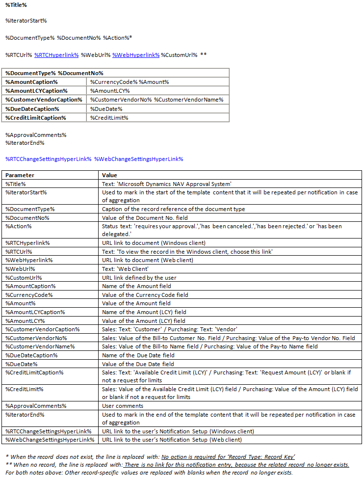
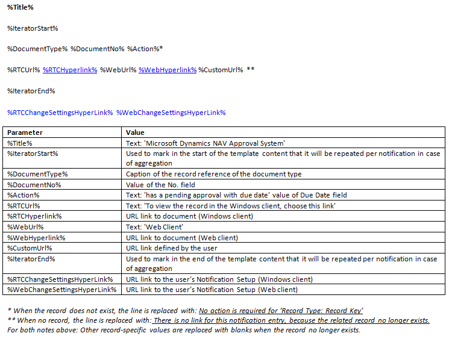

# Procedure: Berichtsjablonen beheren
Berichten worden verzonden naar werkstroomgebruikers om ze te informeren over stappen die ze moeten zetten of om ze te informeren over de status van werkstroomstappen. U stelt in wie berichten ontvangt en wanneer door goedkeuringsgebruikers, een planning van gebruikersberichten en de betrokken werkstroomantwoorden in te stellen om de ontvanger van het bericht te definiëren. Zie voor meer informatie [Werkstroomberichten instellen](across-setting-up-workflow-notifications.md).  

 Berichten zijn gebaseerd op sjablonen waarin de lay-out en inhoud van het bericht zijn vastgelegd. U kunt de inhoud van een berichtsjabloon exporteren, bewerken en vervolgens de inhoud importeren in dezelfde of een nieuwe berichtsjabloon. Dit wordt in de volgende procedures beschreven.  

 De algemene versie van [!INCLUDE[d365fin](includes/d365fin_md.md)] wordt geleverd met drie berichtsjablonen: een voor informeren over goedkeuringsverzoeken, een voor informeren over nieuwe records en een voor informeren over vervallen goedkeuringsaanvragen. De drie vooraf gedefinieerde berichtsjablonen ondersteunen **E-mail** en **Opmerking** als berichtmethode. Voor informatie over het weergeven van de inhoud van de drie berichtsjablonen raadpleegt u het onderdeel "Inhoud van de berichtsjablonen" in dit onderwerp.

## Een nieuwe berichtsjabloon maken  
1.  Klik op het pictogram , voer **Berichtsjablonen** in en klik vervolgens op de gerelateerde koppeling.  
2.  Kies in het venster **Berichtsjablonen** de actie **Nieuw** .  
3.  Vul de velden in zoals beschreven in de volgende tabel.  

    |Veld|Description|  
    |---------------------------------|---------------------------------------|  
    |**Code**|Identificeer de berichtsjabloon.|  
    |**Beschrijving**|Beschrijf de berichtsjabloon.|  
    |**Berichtmethode**|Geef aan of het bericht wordt verzonden als e-mail of als opmerking.|  
    |**Soort**|Geef het bedrijfsproces aan waarvoor het bericht wordt gebruikt.   Selecteer een van de volgende typen:   -   **Goedkeuring** geeft aan dat de sjabloon wordt gebruikt om gebruikers te informeren in goedkeuringswerkstromen. -   **Nieuwe record** geeft aan dat de sjabloon wordt gebruikt om fiatteurs te melden dat een nieuwe record, zoals een klantenkaart, hun goedkeuring nodig heeft. -   **Vervallen** geeft aan dat de sjabloon wordt gebruikt om gebruikers te melden dat goedkeuringsaanvragen vervallen zijn.|  
    |**Standaard**|Geef aan of de berichtsjabloon standaard wordt gebruikt.|  

## Een berichtsjabloon wijzigen  
1.  Klik op het pictogram , voer **Berichtsjablonen** in en klik vervolgens op de gerelateerde koppeling.  
2.  Selecteer in het venster **Berichtsjablonen** de berichtsjabloon die u wilt wijzigen.  
3.  Kies de actie **Sjablooninhoud exporteren**.  
4.  Klik in het venster **Bestand exporteren** op de knop **Opslaan**, voer de bestandsnaam in en sla het HTML-bestand in een geschikte locatie op.  
5.  Klik met de rechtermuisknop op het bestand, kies **Openen met** en kies vervolgens het desbetreffende programma.  

    > [!NOTE]  
    >  Inhoud voor berichtsjablonen van het type E-mail is in HTML-indeling. Inhoud voor berichtsjablonen van het type Opmerking is in TXT-indeling.  
6.  Bewerk de inhoud van de berichtsjabloon door parametervariabelen toe te voegen, te wijzigen of te verwijderen om de gewenste berichtinhoud te definiëren. Zie voor meer informatie het onderdeel "Inhoud van de berichtsjablonen".  

    Importeer vervolgens de aangepaste inhoud terug in dezelfde of een nieuwe berichtsjabloon.  
7.  Om de berichtsjabloon te wijzigen die u hebt geëxporteerd, selecteert u in het venster **Berichtsjablonen** de sjabloon die u in stap 2 hebt geselecteerd.  

    U kunt ook de gewijzigde sjablooninhoud in een nieuwe berichtsjabloon importeren. Hiervoor voert u de procedure "Een nieuwe berichtsjabloon maken" uit en selecteert u vervolgens de nieuwe berichtsjabloon.  
8.  Kies de actie **Sjablooninhoud importeren**.  
9. Als u een bestaande berichtsjabloon wijzigt, kiest u de knop **Ja** in het bericht over het overschrijven van de bestaande sjabloon.  
10. Kies in het venster **Selecteer een bestand om te importeren** het HTML-bestand dat u in stap 6 hebt gewijzigd, en kies vervolgens de knop **Openen**.  

De nieuwe of bestaande berichtsjabloon in het venster **Berichtsjablonen** wordt nu bijgewerkt met de gewijzigde inhoud.  

### Inhoud van de berichtsjablonen  
De drie soorten berichtsjablonen, **Nieuwe Record**, **Goedkeuring** en **Vervallen**, hebben verschillende inhoud.  

Parameterwaarden worden automatisch in berichten ingevoegd op basis van het soort berichtsjabloon.  

#### Nieuwe record  
   

#### Goedkeuring  
   

#### Achterstallig  
   

## Zie ook  
 [Werkstroomberichten instellen](across-setting-up-workflow-notifications.md)   
 [Procedure: E-mail instellen](madeira-how-setup-email.md)   
 [Procedure: Werkstroomgebruikers instellen](across-how-to-set-up-workflow-users.md)   
 [Procedure: Goedkeuringsgebruikers instellen](across-how-to-set-up-approval-users.md)   
 [Procedure: Werkstromen maken](across-how-to-create-workflows.md)   
 [Gebruik van taakwachtrijen om taken te plannen](admin-job-queues-schedule-tasks.md)   
 [Werkstroom](across-workflow.md)   

