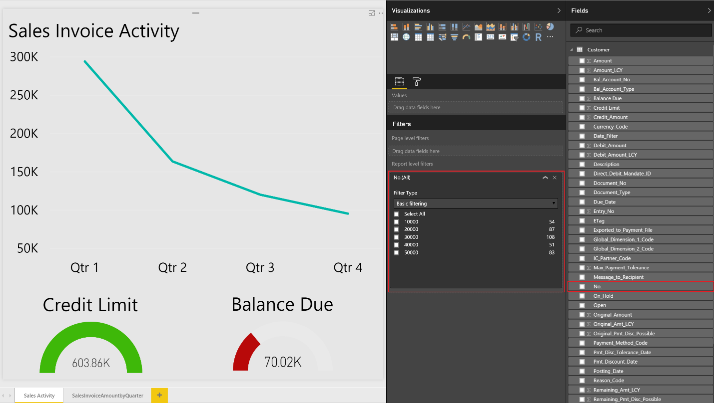

# Lijstgegevens weergeven in Power BI-rapporten in Dynamics NAV
[!INCLUDE[d365fin](includes/d365fin_md.md)] bevat een Feitenblok-besturingselement op een aantal belangrijke lijstpagina's, waarmee een aanvullend inzicht in de gegevens wordt geboden. Wanneer u tussen rijen in de lijst verplaatst, wordt het rapport bijgewerkt en voor de geselecteerde post gefilterd. U kunt aangepaste rapporten maken voor weergave in dit besturingselement, maar er zijn enkele regels die moeten worden gevolgd bij het maken van de rapporten om te zorgen voor het gewenste gedrag.  

> [!NOTE]  
>   U moet een geldig account bij [!INCLUDE[d365fin](includes/d365fin_md.md)] en Power BI hebben. Ook moet u [Power BI Desktop](https://powerbi.microsoft.com/en-us/desktop/) downloaden. Zie voor meer informatie [[!INCLUDE[d365fin](includes/d365fin_md.md)] gebruiken als Power BI-gegevensbron](across-how-use-financials-data-source-powerbi.md).  

## Rapportgegevensset
Wanneer u het rapport in Power BI Desktop maakt, geeft u de gegevensbron of webservice op die de gegevens bevat die gerelateerd zijn aan de lijst waaraan u het rapport wilt koppelen. Als u bijvoorbeeld een rapport wilt maken voor het verkoopoverzicht, moet u ervoor zorgen dat de gegevensset informatie bevat die is gerelateerd aan verkoop.  

Als u gegevens in de rapporten wilt filteren op basis van de record die is geselecteerd op de lijstpagina, moet de primaire sleutel als rapportfilter worden gebruikt. De belangrijkste sleutels moeten deel uitmaken van uw gegevensset voor een correcte filtering van de rapporten. In de meeste gevallen is de primaire sleutel voor een lijst **Nr.** in.  

## Het rapportfilter definiëren
Het rapport is nodig voor een basisrapportfilter (geen pagina of visueel filter en geen geavanceerd filter) voor een juiste filtering in het Feitenblok-besturingselement van Power BI. Het filter dat wordt doorgegeven aan het Power BI-rapport van elke lijstpagina, wordt gebaseerd op de primaire sleutel, zoals in het vorige gedeelte is beschreven.  

Als u een filter voor het rapport wilt definiëren, selecteert u de primaire sleutel in de lijst met beschikbare velden en sleept u dat veld vervolgens en zet u het neer in de sectie **Rapportfilter**.  

## Rapportgrootte en -kleur
De grootte van het rapport moet worden ingesteld op 325 bij 310 pixels. Dit is vereist voor een juiste schaling van het rapport in de beschikbare ruimte die is toegestaan door het Feitenblok-besturingselement van Power BI. Als u de grootte van het rapport wilt definiëren, plaatst u de focus buiten het rapportlay-outgebied en kiest u vervolgens het pictogram met de verfroller.

U kunt de breedte en hoogte van het rapport wijzigen door **Aangepast** in het veld **Soort** te kiezen.

Evenzo definieert u als u wilt dat de achtergrond van het rapport wordt vermengd met de achtergrondkleur van het Feitenblok-besturingselement van Power BI, een aangepaste achtergrondkleur van *E5E5E5* voor het rapport. Dit is optioneel.  

## Rapporten met meerdere pagina's
Met Power BI kunt u één rapport met meerdere pagina's maken. De visuele elementen die u wilt zien in de [!INCLUDE[d365fin](includes/d365fin_md.md)]-lijstpagina´s, moeten zich op de eerste pagina van het rapport in Power BI bevinden.  

> [!NOTE]  
>  Het feitenblok van Power BI geeft mogelijk alleen de eerste pagina van uw rapport weer. Als u andere pagina's wilt zien, moet u het rapport uitvouwen en met tabbladen onder aan het rapport navigeren naar andere pagina's.  

## Uw rapport opslaan

Wanneer u uw rapport opslaat, is het het beste dat de naam van het rapport de naam bevat van de lijstpagina waarin u het rapport wilt weergeven. Het woord *Leverancier* moet bijvoorbeeld ergens in de rapportnaam zijn opgenomen voor rapporten die u beschikbaar wilt maken voor de leverancierslijst.  

Dit is geen vereiste, maar u kunt rapporten dan sneller selecteren. Wanneer de rapportselectiepagina via een lijstpagina wordt geopend, wordt er een filter verschaft op basis van de paginanaam om de rapporten te beperken die worden weergegeven.  U kunt het filter verwijderen als u een volledige lijst met rapporten voor u beschikbaar wilt maken in Power BI.  

## Problemen oplossen
Dit gedeelte bevat een oplossing voor de meest veelvoorkomende problemen die zich kunnen voordoen wanneer u het Power BI-rapport maakt.  

**De gebruiker ziet het gewenste rapport niet op de pagina Rapport selecteren** Als u geen rapport kunt selecteren, is een mogelijke oplossing de naam van het rapport te controleren om ervoor te zorgen dat deze de naam van de lijstpagina bevat. U kunt ook het filter verwijderen als u een volledige lijst met beschikbare Power BI-rapporten wilt.  

**Het rapport is geladen, maar leeg, niet gefilterd of onjuist gefilterd** Controleer of het rapportfilter de juiste primaire sleutel bevat. In de meeste gevallen is dit het veld **Nr.**, maar in de tabel **Grootboekpost** moet u bijvoorbeeld het veld **Postnr.** gebruiken.

**Het rapport is geladen, maar het bevat de pagina die u niet hebt verwacht** Controleer of de pagina die u wilt weergeven de eerste pagina in uw rapport is.  

**Rapporten worden met ongewenste grijze randen weergegeven, zijn te klein of te groot**

Controleer of de grootte van het rapport is ingesteld op 325 x 310 pixels. Sla het rapport op en vernieuw vervolgens de lijstpagina.  

## Zie ook
[[!INCLUDE[d365fin](includes/d365fin_md.md)] gebruiken als Power BI-gegevensbron](across-how-use-financials-data-source-powerbi.md)  
[Welkom bij [!INCLUDE[d365fin_long](includes/d365fin_long_md.md)]](index.md)    
[Instellen van [!INCLUDE[d365fin](includes/d365fin_md.md)]](setup.md)    
[Financiën](finance.md)  

