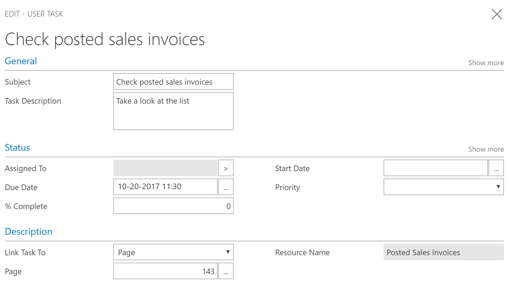

# Gebruikerstaken definiëren
In [!INCLUDE[d365fin](includes/d365fin_md.md)] kunt u taken maken die u helpen herinneren aan werk dat moet worden uitgevoerd. U kunt taken maken voor uzelf maken, maar u kunt ook taken aan anderen toewijzen of een andere taak krijgen toegewezen door iemand anders in uw organisatie.  

## Gebruikerstaken beheren
Het venster **Gebruikerstaken** bevat alle taken en u kunt gemakkelijk nieuwe taken maken en toewijzen. Wanneer u een taak maakt, kunt u de begindatum en einddatum opgeven, en u kunt in [!INCLUDE[d365fin](includes/d365fin_md.md)] een koppeling toevoegen naar het venster waar de gebruiker de taak moet uitvoeren.  

U kunt bijvoorbeeld u een taak voor uzelf maken om alle geboekte verkoopfacturen te bekijken. In dat geval koppelt u de taak een pagina 143, Geboekte verkoopfacturen.  

> [!TIP]  
>  Gebruik de opzoekfunctie in het veld **Pagina** en gebruik vervolgens het veld **Zoeken naar pagina of rapport** om de pagina te vinden die u nodig hebt. Zie [Zoeken naar een pagina of rapport](ui-search.md).  

### Gebruikerstaken oppakken
In de rolcentra Bedrijfsleider, Boekhouder en Accountant worden op een tegel de wachtende taken weergegeven die aan deze gebruiker zijn toegewezen. Als u aan een taak wilt beginnen, kiest u deze eenvoudig in het overzicht met wachtende gebruikerstaken. Op het lint wordt met **Ga naar taakitem** het venster geopend waarin u het werk kunt uitvoeren.  

Wanneer u een taak hebt voltooid, moet u deze gewoon als voltooid markeren.  

### Gebruikerstaken verwijderen
Als u met een bulkbewerking alle of bepaalde gebruikerstaken wilt verwijderen, kunt u daarvoor het rapport **Gebruikerstaken verwijderen** gebruiken. Op de aanvraagpagina kunt u filters instellen om te bepalen welke taken moeten worden verwijderd.  

## Zie ook
[Zoeken naar een pagina of rapport](ui-search.md)  

