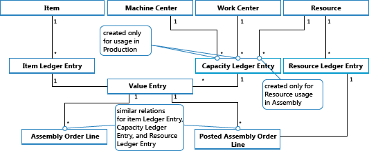
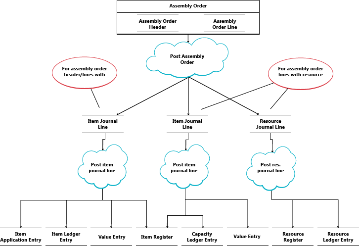
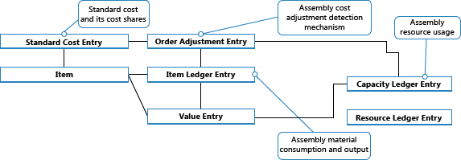
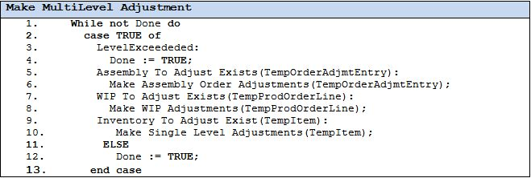

# Ontwerpdetails: AssemblageorderboekingDesign Details: Assembly Order Posting
Assemblageorderboeking wordt gebaseerd op dezelfde principes als wanneer de soortgelijke activiteiten van verkooporders en productieverbruik/-output worden geboekt.Assembly order posting is based on the same principles as when posting the similar activities of sales orders and production consumption/output. De principes worden echter gecombineerd in de zin dat assemblageorders hun eigen boeking-UI hebben, zoals die voor verkooporders, terwijl de feitelijke postboeking op de achtergrond wordt uitgevoerd als directe artikel- en resourcedagboekboekingen, zoals die voor productieverbruik, output en capaciteit.However, the principles are combined in that assembly orders have their own posting UI, like that for sales orders, while the actual entry posting happens in the background as direct item and resource journal postings, like that for production consumption, output, and capacity.  

Net als bij productieorderboeking worden de verbruikte materialen en de gebruikte resources omgezet en uitgevoerd als de component wanneer de productieorder is voltooid.Similarly to production order posting, the consumed components and the used resources are converted and output as the assembly item when the assembly order is posted. Zie [Ontwerpdetails: Productieorderboeking](design-details-production-order-posting.md) voor meer informatie.For more information, see [Design Details: Production Order Posting](design-details-production-order-posting.md). De kostenstroom voor assemblageorders is echter minder complex, met name omdat de assemblagekostenboeking slechts eenmaal plaatsvindt en daarom geen OHW-voorraad genereert.However, the cost flow for assembly orders is less complex, especially because assembly cost posting only occurs once and therefore does not generate work-in-process inventory.  

De volgende dagboekboekingen treden op tijdens assemblageorderboekingen:The following journal postings occur during assembly order posting:  

-   Het artikeldagboek boekt positieve artikelposten, die output van het assemblageartikel vertegenwoordigen, uit de assemblageorderkop.The item journal posts positive item ledger entries, representing output of the assembly item, from the assembly order header  
-   Het artikeldagboek boekt negatieve artikelposten, die verbruik van assemblagecomponenten vertegenwoordigen, uit de assemblageorderregels.The item journal posts negative item ledger entries, representing consumption of assembly components, from the assembly order lines.  
-   Het resourcedagboek boekt gebruik van assemblageresources (tijdseenheden) vanaf de assemblageorderregels.The resource journal posts usage of assembly resources (time units), from the assembly order lines.  
-   Het capaciteitsdagboek boekt waardeposten die betrekking hebben op het resourceverbruik, vanaf de assemblageorderregels.The capacity journal posts value entries relating to the resource usage, from the assembly order lines.  

Het volgende diagram bevat de structuur van artikel- en resourceposten die het gevolg zijn van assemblageorderboeking.The following diagram shows the structure of item and resource ledger entries that result from assembly order posting.  

  

> [!NOTE]  
>  Bewerkingsplaatsen en afdelingen zijn opgenomen om te illustreren dat capaciteitsposten zowel worden gemaakt vanuit productie als vanuit assemblage.Machine and work centers are included to illustrate that capacity ledger entries are created from both production and assembly.  

In het volgende diagram wordt aangegeven hoe assemblagegegevens in posten stromen tijdens het boeken:The following diagram shows how assembly data flows into ledger entries during posting:  

  

## BoekingsvolgordePosting Sequence  
De boeking van een assemblageorder vindt plaats in de volgende volgorde:The posting of an assembly order occurs in the following order:  

1.  De assemblageorderregels zijn geboekt.The assembly order lines are posted.  
2.  De assemblageorderkop is geboekt.The assembly order header is posted.  

De volgende tabel toont de volgorde van de acties.The following table outlines the sequence of actions.  

|ActieAction|DescriptionDescription|  
|------------|-----------------|  
|Boeking initialiserenInitialize Posting|1. Voer voorlopige controles uit.1.  Make preliminary checks. 2. Voeg een boekingsnummer toe en wijzig de assemblageorderkop.2.  Add posting number and modify the assembly order header. 3. Geef de assemblageorder vrij.3.  Release the assembly order.|  
|PostPost|<ol><li>Maak de geboekte assemblageorderkop.Create the posted assembly order header.</li><li>Kopieer opmerkingsregels.Copy comment lines.</li><li>Boek assemblageorderregels (verbruik):Post assembly order lines (consumption):   <ol><li>Maak een statusvenster om assemblageverbruik te berekenen.Create a status window to calculate assembly consumption.</li><li>Haal het resterende aantal op waarop de artikeldagboekregel wordt gebaseerd.Get the remaining quantity on which the item journal line will be based.</li><li>Stel de verbruikte en resterende aantallen opnieuw in.Reset the consumed and remaining quantities.</li><li>Voor assemblageorderregels van de soort Artikel:For assembly order lines of type Item:   <ol><li>Vul velden op de artikeldagboekregel in.Populate fields on the item journal line.</li><li>Breng reserveringen over naar de artikeldagboekregel.Transfer reservations to the item journal line.</li><li>Boek de artikeldagboekregel om de artikelposten te maken.Post the item journal line to create the item ledger entries.</li><li>Maak magazijndagboekregels en boek ze.Create warehouse journal lines and post them.</li></ol></li><li>Voor assemblageorderregels van de soort Resource:For assembly order lines of type Resource:   <ol><li>Vul velden op de artikeldagboekregel in.Populate fields on the item journal line.</li><li>Boek de artikeldagboekregel.Post the item journal line. Hierdoor ontstaan capaciteitsposten.This creates capacity ledger entries.</li><li>Maak en boek een resourcedagboekregel.Create and post resource journal line.</li></ol></li><li>Breng veldwaarden van de assemblageorderregel over naar een zojuist gemaakte, geboekte assemblageorderregel.Transfer field values from the assembly order line into a newly created posted assembly order line.</li></ol></li><li>Boek de assemblageorderkop (output):Post the assembly order header (output):   <ol><li>Vul velden op de artikeldagboekregel in.Populate fields on the item journal line.</li><li>Breng reserveringen over naar de artikeldagboekregel.Transfer reservations to the item journal line.</li><li>Boek de artikeldagboekregel om de artikelposten te maken.Post the item journal line to create the item ledger entries.</li><li>Maak magazijndagboekregels en boek ze.Create warehouse journal lines and post them.</li><li>Stel de assemblageaantallen en de resterende aantallen opnieuw in.Reset the assembly quantities and remaining quantities.</li></ol></li></ol>|  

> [!IMPORTANT]  
>  In tegenstelling tot productieoutput, die wordt geboekt tegen verwachte kosten, wordt assemblyuitvoer tegen de feitelijke prijs geboekt.Unlike for production output, which is posted at expected cost, assembly output is posted at actual cost.  

## KostenherwaarderingCost Adjustment  
 Zodra een assemblageorder is geboekt, wat inhoudt dat materiaal (onderdelen) en resources in een nieuw artikel worden geassembleerd, moet het mogelijk zijn om de werkelijke kosten van dat assemblageartikel en de werkelijke voorraadkosten van de betrokken onderdelen te bepalen.Once an assembly order is posted, meaning that components (material) and resources are assembled into a new item, then it should be possible to determine the actual cost of that assembly item, and the actual inventory cost of the components involved. Hiervoor worden kosten van de geboekte posten van de bron (de onderdelen en resources) naar de geboekte posten van het doel (de component) doorgestuurd.This is achieved by forwarding costs from the posted entries of the source (the components and resources) to the posted entries of the destination (the assembly item). Het doorsturen van kosten wordt uitgevoerd door het berekenen en genereren van nieuwe posten, zogenaamde herwaarderingsposten, die aan de doelposten worden gekoppeld.The forwarding of costs is done by calculating and generating new entries, called adjustment entries that become associated with the destination entries.  

 De door te sturen assemblagekosten worden gedetecteerd met het detectiemechanisme op orderniveau.The assembly costs to be forwarded are detected with the Order Level detection mechanism. Zie voor informatie over andere mechanismen voor herwaarderingsdetectie [Ontwerpdetails: Kostenwaardering](design-details-cost-adjustment.md)For information about other adjustment detection mechanisms, see [Design Details: Cost Adjustment](design-details-cost-adjustment.md).  

### De correctie detecterenDetecting the Adjustment  
De detectiefunctie op orderniveau wordt gebruikt voor conversiescenario's, productie en assemblage.The order Level detection function is used in conversion scenarios, production and assembly. De functie werkt als volgt:The function works as follows:  

-   Kostenherwaardering wordt gedetecteerd door de order te markeren telkens wanneer een materiaal/resource wordt geboekt als verbruikt/gebruikt voor de order.Cost adjustment is detected by marking the order whenever a material/resource is posted as consumed/used.  
-   Kosten wordt doorgestuurd door de kosten voor het materiaal/de resource toe te passen op de uitvoerposten die aan dezelfde order zijn gekoppeld.Cost is forwarding by applying the costs from material/resource to the output entries associated with the same order.  

De volgende afbeelding toont de structuur van de herwaarderingspost en hoe assemblagekosten worden aangepast.The following graphic shows the adjustment entry structure and how assembly costs are adjusted.  

  

### De aanpassing doorvoerenPerforming the Adjustment  
De spreiding van gedetecteerde correcties van materiaal en resourcekosten op de assemblyuitvoerposten wordt uitgevoerd door de batchverwerking **Kostprijs herwaarderen - Artikelposten**.The spreading of detected adjustments from material and resource costs onto the assembly output entries is performed by the **Adjust Cost – Item Entries** batch job. Deze bevat de functie Aanpassing op meerdere niveaus aanbrengen, die bestaat uit de volgende twee elementen:It contains the Make Multilevel Adjustment function, which consists of the following two elements:  

-   Assemblageordercorrectie aanbrengen - hiermee worden kosten van materiaal en resourcegebruik doorgestuurd naar de assemblage-uitvoerpost.Make Assembly Order Adjustment – which forwards cost from material and resource usage to the assembly output entry. Regel 5 en 6 in het algoritme hieronder zijn hiervoor verantwoordelijk.Lines 5 and 6 in the algorithm below are responsible for that.  
-   Correcties op één niveau aanbrengen - hiermee worden kosten voor afzonderlijke artikelen doorgestuurd met behulp van de waarderingsmethode ervan.Make Single Level Adjustments – which forwards costs for individual items using their costing method. Regels 9 en 10 in het algoritme hieronder zijn hiervoor verantwoordelijk.Lines 9 and 10 in the algorithm below are responsible for that.  

  

> [!NOTE]  
>  Het element voor het maken van OHW- herwaarderingen op regel 7 en 8 is verantwoordelijk voor het doorsturen van productiemateriaal en capaciteitsverbruik naar de output van onvoltooide productieorders.The Make WIP Adjustments element, in lines 7 and 8, is responsible for forwarding production material and capacity usage to the output of unfinished production orders. Dit wordt niet gebruikt bij het aanpassen van assemblageorderkosten aangezien het concept OHW niet van toepassing is op assemblage.This is not used when adjusting assembly order costs as the concept of WIP does not apply to assembly.  

Voor informatie over hoe kosten van assemblage en productie worden geboekt naar het grootboek raadpleegt u [Ontwerpdetails: voorraadboeking](design-details-inventory-posting.md).For information about how costs from assembly and production are posted to the general ledger, see [Design Details: Inventory Posting](design-details-inventory-posting.md).  

## Assemblagekosten zijn altijd werkelijkAssembly Costs are Always Actual  
 Het concept van onderhanden werk (OHW) geldt niet voor assemblageorderboeking.The concept of work in process (WIP) does not apply in assembly order posting. Assemblagekosten worden alleen geboekt als werkelijke kosten, nooit als verwachte kosten.Assembly costs are only posted as actual cost, never as expected cost. Zie [Ontwerpdetails: verwachte-kostenboeking](design-details-expected-cost-posting.md) voor meer informatie.For more information, see [Design Details: Expected Cost Posting](design-details-expected-cost-posting.md).  

Dit wordt ingeschakeld door de volgende gegevensstructuur.This is enabled by the following data structure.  

-   In het veld **Soort** op artikeldagboekregels in de tabellen **Capaciteitspost** en **Waardepost** wordt *Resource* gebruikt om posten van assemblageresources te identificeren.In the **Type** field on item journal lines, in the **Capacity Ledger Entry** and **Value Entry** tables, *Resource* is used to identify assembly resource entries.  
-   In het veld **Artikelboekingssoort** op artikeldagboekregels in de tabellen **Capaciteitspost** en **Waardepost** worden *Assemblage-uitvoer* en *Assemblageverbruik* gebruikt om respectievelijk de artikelposten van assemblage-uitvoer en de posten van verbruikte assemblagecomponenten te identificeren.In the **Item Ledger Entry Type** field on item journal lines, in the **Capacity Ledger Entry** and **Value Entry** tables, *Assembly Output* and *Assembly Consumption* are used to identify the output assembly item entries and the consumed assembly component entries respectively.  

Daarnaast worden boekingsgroepsvelden in de assemblageorderkop en de assemblageorderregels standaard als volgt ingevuld.In addition, posting group fields on the assembly order header and assembly order lines are populated by default as follows.  

|EntiteitEntity|SoortType|BoekingsgroepPosting Group|Prod.-boekingsgroepGen. Prod. Posting Group|  
|------------|----------|-------------------|------------------------------|  
|AssemblageorderkopAssembly Order Header|ArtikelItem|VoorraadboekingsgroepInventory Posting Group|Prod.-boekingsgroepGen. Prod. Posting Group|  
|AssemblageorderregelAssembly Order Line|ArtikelItem|VoorraadboekingsgroepInventory Posting Group|Prod.-boekingsgroepGen. Prod. Posting Group|  
|AssemblageorderregelAssembly Order Line|ResourceResource||Prod.-boekingsgroepGen. Prod. Posting Group|  

Alleen werkelijke kosten worden geboekt naar het grootboek en er worden geen interimrekeningen gevuld vanuit assemblageorderboeking.Accordingly, only actual costs are posted to the general ledger, and no interim accounts are populated from assembly order posting. Zie voor meer informatie [Ontwerpdetails: rekeningen in het grootboek](design-details-accounts-in-the-general-ledger.md).For more information, see [Design Details: Accounts in the General Ledger](design-details-accounts-in-the-general-ledger.md)  

## Op order assemblerenAssemble to Order  
De artikelpost die het resultaat is van het boeken van een op-order-assembleren-verkoop wordt vast toegepast op de bijbehorende artikelpost voor de assemblageuitvoer.The item ledger entry that results from posting an assemble-to-order sale is fixed applied to the related item ledger entry for the assembly output. Dienovereenkomstig, worden de kosten van een op-order-assembleren-verkoop afgeleid van de assemblageorder waaraan deze verkoop is gekoppeld.Accordingly, the cost of an assemble-to-order sale is derived from the assembly order that it was linked to.  

Artikelposten van de soort Verkoop die het gevolg zijn van het boeken van op-order-assembleren aantallen, worden gemarkeerd met **Ja** in het veld **Op order assembleren**.Item ledger entries of type Sale that result from posting assemble-to-order quantities are marked with **Yes** in the **Assemble to Order** field.  

Bij het boeken van verkooporderregels waarbij een gedeelte afkomstig is uit voorraad en een ander gedeelte een op-order-assembleren aantal is, worden afzonderlijke artikelposten gemaakt, één voor het voorraadaantal en één voor het op-order-assembleren aantal.Posting sales order lines where a part is inventory quantity and another part is assemble-to-order quantity results in separate item ledger entries, one for the inventory quantity and one for the assemble-to-order quantity.  

## Zie ookSee Also  
 [Ontwerpdetails: Voorraadwaardering](design-details-inventory-costing.md) [Design Details: Inventory Costing](design-details-inventory-costing.md)   
 [Ontwerpdetails: Productieorderboeking](design-details-production-order-posting.md) [Design Details: Production Order Posting](design-details-production-order-posting.md)   
 [Ontwerpdetails: WaarderingsmethodenDesign Details: Costing Methods](design-details-costing-methods.md)  
 [Voorraadkosten beherenManaging Inventory Costs](finance-manage-inventory-costs.md)  
 [FinanciënFinance](finance.md)  
 [Werken met [!INCLUDE[d365fin](includes/d365fin_md.md)]](ui-work-product.md)[Working with [!INCLUDE[d365fin](includes/d365fin_md.md)]](ui-work-product.md)  

