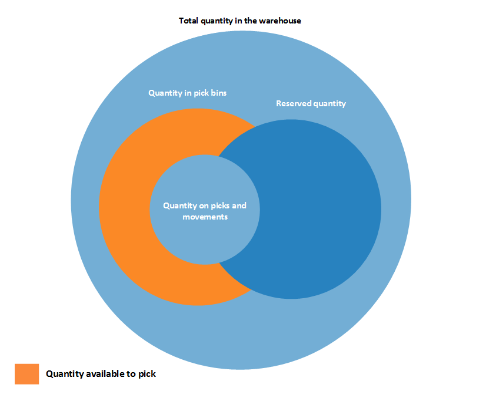
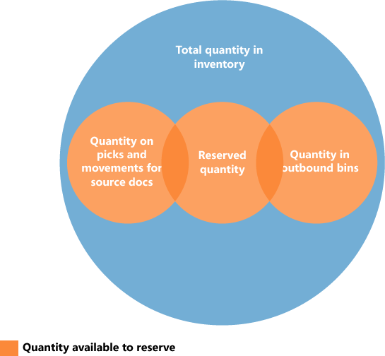

# Ontwerpdetails: Beschikbaarheid in het magazijnDesign Details: Availability in the Warehouse
Het systeem moet een constante controle op artikelbeschikbaarheid in het magazijn hebben, zodat uitgaande orders efficiënt kunnen stromen en optimale leveringen kunnen worden geboden.The system must keep a constant control of item availability in the warehouse, so that outbound orders can flow efficiently and provide optimal deliveries.  

 De beschikbaarheid varieert afhankelijk van toewijzingen op het niveau van de opslaglocatie, wanneer magazijnactiviteiten optreden zoals picks en verplaatsingen en wanneer het voorraadreserveringssysteem beperkingen oplegt.Availability varies depending on allocations at the bin level when warehouse activities such as picks and movements occur and when the inventory reservation system imposes restrictions to comply with. Een tamelijk complex algoritme verifieert of aan alle voorwaarden is voldaan voordat aantallen worden toegewezen aan picks voor uitgaande stromen.A rather complex algorithm verifies that all conditions are met before allocating quantities to picks for outbound flows.  

## Inhoud van opslaglocatie en reserveringenBin Content and Reservations  
 In elke installatie van magazijnbeheer bestaan artikelaantallen als magazijnposten, in het magazijntoepassingsgebied, en als artikelposten, in het voorraadtoepassingsgebied.In any installation of warehouse management, item quantities exist both as warehouse entries, in the Warehouse application area, and as item ledger entries, in the Inventory application area. Deze twee boekingssoorten bevatten verschillende informatie over waar artikelen bestaan en of ze beschikbaar zijn.These two entry types contain different information about where items exist and whether they are available. Met magazijnposten wordt de beschikbaarheid van een artikel per (soort) opslaglocatie gedefinieerd, wat opslaglocatie-inhoud wordt genoemd.Warehouse entries define an item’s availability by bin and bin type, which is called bin content. Artikelposten definiëren de beschikbaarheid van een artikel op basis van de reservering hiervan voor uitgaande documenten.Item ledger entries define an item’s availability by its reservation to outbound documents.  

 Er bestaan speciale functies in het algoritme voor picken om het aantal te berekenen dat kan worden gepickt wanneer de opslaglocatie-inhoud wordt gekoppeld met reserveringen.Special functionality in the picking algorithm exists to calculate the quantity that is available to pick when bin content is coupled with reservations.  

## Beschikbaar aantal voor pickenQuantity Available to Pick  
 Wanneer het pickalgoritme bijvoorbeeld geen rekening houdt met artikelaantallen die zijn gereserveerd voor een wachtende verkooporderverzending, kunnen die artikelen worden gepickt voor een andere verkooporder die eerder wordt verzonden, wat voorkomt dat aan de eerste verkoop wordt voldaan.If, for example, the picking algorithm does not consider item quantities that are reserved for a pending sales order shipment, then those items might be picked for another sales order that is shipped earlier, which prevents the first sales from being fulfilled. Om deze situatie te voorkomen, wordt met het algoritme voor picken aantallen afgetrokken die zijn gereserveerd voor andere uitgaande documenten, aantallen op bestaande pickdocumenten, en aantallen die zijn gepickt maar nog niet verzonden of verbruikt.To avoid this situation, the picking algorithm subtracts quantities that are reserved for other outbound documents, quantities on existing pick documents, and quantities that are picked but not yet shipped or consumed.  

 Het resultaat wordt weergegeven in het veld **Beschikb. te picken aantal** in het venster **Pick Worksheet**, waar het veld dynamisch wordt berekend.The result is displayed in the **Available Qty. to Pick** field in the **Pick Worksheet** window, where the field is calculated dynamically. De waarde wordt ook berekend wanneer gebruikers magazijnpicks direct voor uitgaande documenten maken.The value is also calculated when users create warehouse picks directly for outbound documents. Dergelijke uitgaande documenten kunnen verkooporders, productieverbruik of uitgaande transfers zijn, waar het resultaat wordt weergegeven in de bijbehorende velden met aantallen, zoals **Te verwerken aantal**.Such outbound documents could be sales orders, production consumption, or outbound transfers, where the result is reflected in the related quantity fields, such as **Qty. to Handle**.  

> [!NOTE]  
>  Voor wat betreft de prioriteit van reserveringen wordt het te reserveren aantal afgetrokken van het aantal dat beschikbaar is voor picken.Concerning the priority of reservations, the quantity to reserve is subtracted from the quantity available to pick. Als het beschikbare aantal in pickopslaglocaties bijvoorbeeld 5 eenheden is, maar 100 eenheden zich in opslaglocaties bevinden en u probeert meer dan 5 eenheden voor een andere order te reserveren, wordt een foutbericht weergegeven omdat het extra aantal in pickopslaglocaties beschikbaar moet zijn.For example, if the quantity available in pick bins is 5 units, but 100 units are in put-away bins, then when you try to reserve more than 5 units for another order, an error message is displayed because the additional quantity must be available in pick bins.  

### Het aantal berekenen dat beschikbaar is voor pickenCalculating the Quantity Available to Pick  
 Het aantal dat beschikbaar is voor picken, wordt als volgt berekend:The quantity available to pick is calculated as follows:  

 beschikbaar aantal om te picken = aantal in pickopslaglocaties - aantal in picks en verplaatsingen – (gereserveerd aantal in pickopslaglocaties + gereserveerd aantal in picks en verplaatsingen)quantity available to pick = quantity in pick bins - quantity on picks and movements – (reserved quantity in pick bins + reserved quantity on picks and movements)  

 Het volgende diagram bevat de verschillende elementen van de berekening.The following diagram shows the different elements of the calculation.  

   

## Beschikbaar aantal voor reserverenQuantity Available to Reserve  
 Omdat de concepten opslaglocatie en reservering naast elkaar bestaan, moet het aantal artikelen dat beschikbaar is om te reserveren, worden afgestemd met toewijzingen aan uitgaande magazijndocumenten.Because the concepts of bin content and reservation co-exist, the quantity of items that are available to reserve must be aligned with allocations to outbound warehouse documents.  

 Het zou mogelijk moeten zijn om alle artikelen in voorraad te reserveren, met uitzondering van artikelen waarvoor uitgaande verwerking is gestart.It should be possible to reserve all items in inventory, except those that have started outbound processing. Het aantal dat kan worden gereserveerd, wordt gedefinieerd als het aantal in alle documenten en alle typen opslaglocaties, behalve de volgende uitgaande aantallen:Accordingly, the quantity that is available to reserve is defined as the quantity on all documents and all bin types, except the following outbound quantities:  

-   Aantal in niet-geregistreerde pickdocumentenQuantity on unregistered pick documents  
-   Aantal in verzendopslaglocatiesQuantity in shipment bins  
-   Aantal in naar-productieopslaglocatiesQuantity in to-production bins  
-   Aantal in grijpvoorraadlocatiesQuantity in open shop floor bins  
-   Aantal in naar-assemblageopslaglocatiesQuantity in to-assembly bins  
-   Aantal in correctieopslaglocatiesQuantity in adjustment bins  

 Het resultaat wordt weergegeven in het veld **Totaal beschikbaar aantal** in het venster **Reservation**.The result is displayed in the **Total Available Quantity** field in the **Reservation** window.  

 Op een reserveringsregel wordt het aantal dat niet kan worden gereserveerd omdat het in het magazijn is toegewezen, weergegeven in het veld **Aant. toegewezen in magazijn** in het venster **Reservering**.On a reservation line, the quantity that cannot be reserved, because it is allocated in the warehouse, is displayed in the **Qty. Allocated in Warehouse** field in the **Reservation** window.  

### Het aantal berekenen dat beschikbaar is voor reserveringCalculating the Quantity Available to Reserve  
 Het aantal dat beschikbaar is voor reserveringen, wordt als volgt berekend:The quantity available to reserve is calculated as follows:  

 beschikbaar aantal om te reserveren = totaal aantal in voorraad - aantal in picks en verplaatsingen voor brondocumenten - gereserveerd aantal - aantal in uitgaande opslaglocatiesquantity available to reserve = total quantity in inventory - quantity on picks and movements for source documents - reserved quantity - quantity in outbound bins  

 Het volgende diagram bevat de verschillende elementen van de berekening.The following diagram shows the different elements of the calculation.  

   

## Zie ookSee Also  
 [Ontwerpdetails: MagazijnbeheerDesign Details: Warehouse Management](design-details-warehouse-management.md)

