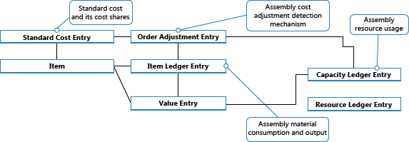

# Ontwerpdetails: KostenwaarderingDesign Details: Cost Adjustment
Het belangrijkste doel van kostenherwaardering is wijzigingen in kosten van kostenbronnen door te sturen naar kostenontvangers, volgens de waarderingsmethode van een artikel, om de juiste voorraadwaardering te bieden.The main purpose of cost adjustment is to forward cost changes from cost sources to cost recipients, according to an item’s costing method, to provide correct inventory valuation.  

Een artikel kan als verkoop worden gefactureerd voordat het als inkoop wordt gefactureerd, zodat de vastgelegde voorraadwaarde van de verkoop niet overeenkomt met de werkelijke inkoopkosten.An item can be sales invoiced before it has been purchase invoiced, so that the recorded inventory value of the sale does not match the actual purchase cost. Kostenherwaardering werkt de kosten van verkochte goederen (KPV) bij voor historische verkoopkosten om te zorgen dat ze overeenkomen met de inkomende transacties waarmee ze worden vereffend.Cost adjustment updates the cost of goods sold (COGS) for historic sales entries to ensure that they match the costs of the inbound transactions to which they are applied. Zie [Ontwerpdetails: artikelvereffening](design-details-item-application.md) voor meer informatie.For more information, see [Design Details: Item Application](design-details-item-application.md).  

Hierna volgen secundaire doelen, of functies, van kostenherwaardering:The following are secondary purposes, or functions, of cost adjustment:  

* Gereedgemelde productieorders factureren:Invoice finished production orders:  

    * Wijzig de status van waardeposten van **Verwacht** in **Werkelijk**.Change the status of value entries from **Expected** to **Actual**.  
    * Wis OHW-rekeningen.Clear WIP accounts. Zie [Ontwerpdetails: Productieorderboeking](design-details-production-order-posting.md) voor meer informatie.For more information, see [Design Details: Production Order Posting](design-details-production-order-posting.md).  
    * Verschil boeken.Post variance. Zie voor meer informatie [Ontwerpdetails: Verschil](design-details-variance.md).For more information, see [Design Details: Variance](design-details-variance.md).  

* Werk de kostprijs op de artikelkaart bij.Update the unit cost on the item card.  

Voorraadkosten moeten worden bijgewerkt als de gerelateerde waardeposten kunnen worden afgestemd met het grootboek.Inventory costs must be adjusted before the related value entries can be reconciled with the general ledger. Zie voor meer informatie [Ontwerpdetails: reconciliatie met het grootboek](design-details-reconciliation-with-the-general-ledger.md).For more information, see [Design Details: Reconciliation with the General Ledger](design-details-reconciliation-with-the-general-ledger.md).  

## De correctie detecterenDetecting the Adjustment  
De taak van het detecteren of kostenwaardering moet worden uitgevoerd, wordt hoofdzakelijk uitgevoerd door de routine Artikeldagboek. - Regel boeken. De taak van het berekenen en genereren van kostenherwaarderingsposten wordt uitgevoerd door de batchverwerking **Kostprijs herwaarderen - Artikelposten**.The task of detecting if cost adjustment should occur is primarily performed by the Item Jnl.-Post Line routine, while the task of calculating and generating cost adjustment entries is performed by the **Adjust Cost – Item Entries** batch job.  

Voor het doorsturen van kosten bepaalt het detectiemechanisme welke bronnen zijn gewijzigd wat betreft kosten en naar welke bestemming deze kosten moeten worden doorgestuurd.To be able to forward costs, the detection mechanism determines which sources have changed in costs and to which destination these costs should be forwarded. Er zijn de volgende drie detectiefuncties in [!INCLUDE[d365fin](includes/d365fin_md.md)]:The following three detection functions exist in [!INCLUDE[d365fin](includes/d365fin_md.md)]:  

* ArtikelvereffeningspostItem Application Entry  
* Invoerpunt gemiddelde kostprijscorrectieAverage Cost Adjustment Entry Point  
* OrderniveauOrder Level  

### ArtikelvereffeningspostItem Application Entry  
Deze detectiefunctie wordt gebruikt voor artikelen die de waarderingsmethoden FIFO, LIFO, Standaard en Specifiek gebruiken en voor vaste vereffeningenscenario's.This detection function is used for items that use FIFO, LIFO, Standard, and Specific costing methods and for fixed applications scenarios. De functie werkt als volgt:The function works as follows:  

* Kostenherwaardering wordt gedetecteerd door de bronartikelposten te markeren als *Vereff. post herwaarderen* wanneer een artikelpost of waardepost wordt geboekt.Cost adjustment is detected by marking the source item ledger entries as *Applied Entry to Adjust* whenever an item ledger entry or value entry is posted.  
* Kosten worden doorgestuurd volgens de ketens van de kosten die zijn vastgelegd in de tabel **Artikelvereffeningspost**.Cost is forwarded according to the cost chains that are recorded in the **Item Application Entry** table.  

### Invoerpunt gemiddelde kostprijscorrectieAverage Cost Adjustment Entry Point  
Deze detectiefunctie wordt gebruikt voor artikelen die de waarderingsmethode Gemiddeld gebruiken.This detection function is used for items that use the Average costing method. De functie werkt als volgt:The function works as follows:  

* Kostenherwaardering wordt gedetecteerd door een record in de tabel **Gem. kostprijsaanpassing invoerhaven** te markeren wanneer een waardepost wordt geboekt.Cost adjustment is detected by marking a record in the **Avg. Cost Adjmt. Entry Point** table whenever a value entry is posted.  
* Kosten wordt doorgestuurd door de kosten toe te passen op waardeposten met een latere waarderingsdatum.Cost is forwarded by applying the costs to value entries with a later valuation date.  

### OrderniveauOrder Level  
Deze detectiefunctie wordt gebruikt voor conversiescenario's, productie en assemblage.This detection function is used in conversion scenarios, production and assembly. De functie werkt als volgt:The function works as follows:  

* Kostenherwaardering wordt gedetecteerd door de order te markeren telkens wanneer een materiaal/resource wordt geboekt als verbruikt/gebruikt voor de order.Cost adjustment is detected by marking the order whenever a material/resource is posted as consumed/used.  
* Kosten wordt doorgestuurd door de kosten voor het materiaal/de resource toe te passen op de uitvoerposten die aan dezelfde order zijn gekoppeld.Cost is forwarding by applying the costs from material/resource to the output entries associated with the same order.  

De functie op orderniveau wordt gebruikt om correcties in assemblageboekingen te detecteren.The Order Level function is used to detect adjustments in assembly posting. De volgende afbeelding toont de structuur van de herwaarderingspost:The following graphic shows the adjustment entry structure:  

  

Zie [Ontwerpdetails: assemblageorderboeking](design-details-assembly-order-posting.md) voor meer informatie.For more information, see [Design Details: Assembly Order Posting](design-details-assembly-order-posting.md).  

## Handmatige versus automatische kostenwaarderingManual versus Automatic Cost Adjustment  
Kostenherwaardering kan op twee manieren worden uitgevoerd:Cost adjustment can be performed in two ways:  

* Handmatig door de batchverwerking **Kostprijs herwaarderen - Artikelposten** uit te voeren.Manually, by running the **Adjust Cost - Item Entries** batch job. U kunt deze batchverwerking uitvoeren voor alle artikelen of alleen voor bepaalde artikelen of artikelcategorieën.You can run this batch job either for all items or for only certain items or item categories. Met deze batchverwerking wordt een kostenherwaardering uitgevoerd voor de artikelen op voorraad waarvoor een inkomende transactie is gemaakt, zoals een aankoop.This batch job runs a cost adjustment for the items in inventory for which an inbound transaction has been made, such as a purchase. Voor artikelen die de gemiddelde waarderingsmethode gebruiken, maakt de batchverwerking ook een correctie als uitgaande transacties worden gemaakt.For items that use the average costing method, the batch job also makes an adjustment if any outbound transactions are created.  
* Automatisch, door telkens kosten aan te passen wanneer u een voorraadtransactie boekt en wanneer u een productieorder beëindigt.Automatically, by adjusting costs every time that you post an inventory transaction, and when you finish a production order. De kostenherwaardering wordt alleen uitgevoerd voor specifieke artikel(en) die worden beïnvloed door het boeken.The cost adjustment is only run for the specific item or items affected by the posting. Dit wordt ingesteld wanneer u het selectievakje **Automatische kostenwaardering** in het venster **Voorraadinstelling** inschakelt.This is set up when you select the **Automatic Cost Adjustment** check box in the **Inventory Setup** window.  

Het is goed om de kostenwaardering automatisch uit te voeren wanneer u boekt, omdat eenheidskosten vaker worden bijgewerkt en daarom accurater zijn.It is good practice to run the cost adjustment automatically when you post because unit costs are more frequently updated and therefore more accurate. Het nadeel is dat de prestaties van de database kunnen worden beïnvloed door de kostenherwaardering zo vaak uit te voeren.The disadvantage is that the performance of the database can be affected by running the cost adjustment so often.  

Omdat het belangrijk is de kostprijs van een artikel bijgewerkt te houden, wordt het aangeraden de batchverwerking **Kostprijs herwaarderen - Artikelposten** zo vaak mogelijk gedurende vrije uren uit te voeren.Because it is important to keep the unit cost of an item up to date, it is recommend that you run the **Adjust Cost - Item Entries** batch job as often as possible, during nonworking hours. Of u gebruikt automatische kostenwaardering.Alternatively, use automatic cost adjustment. Hierdoor wordt gezorgd dat de kostprijs dagelijks wordt bijgewerkt voor artikelen.This ensures that the unit cost is updated for items daily.  

Ongeacht of u kostenwaardering handmatig of automatisch uitvoert, het waarderingsproces en de gevolgen ervan zijn hetzelfde.Regardless if you run the cost adjustment manually or automatically, the adjustment process and its consequences are the same. [!INCLUDE[d365fin](includes/d365fin_md.md)] berekent de waarde van de inkomende transactie en stuurt die kosten door naar uitgaande transacties, zoals verkopen of verbruik, die met de inkomende transactie zijn vereffend. calculates the value of the inbound transaction and forwards that cost to any outbound transactions, such as sales or consumptions, which have been applied to the inbound transaction. Door de kostenherwaardering worden waardeposten gemaakt die correctiebedragen bevatten en bedragen die afrondingen compenseren.The cost adjustment creates value entries that contain adjustment amounts and amounts that compensate for rounding.  

De nieuwe waardeposten voor herwaardering en afronding hebben de boekingsdatum van de bijbehorende factuur.The new adjustment and rounding value entries have the posting date of the related invoice. Uitzonderingen zijn als de waardeposten in een afgesloten voorraadperiode of boekhoudperiode vallen of als de boekingsdatum eerder is dan de datum in het veld **Boeken toegest. vanaf** in het venster **Grootboekinstellingen**.Exceptions are if the value entries fall in a closed accounting period or inventory period or if the posting date is earlier than the date in the **Allow Posting From** field in the **General Ledger Setup** window. Als dit gebeurt, wordt door de batchverwerking de boekingsdatum toegewezen als de eerste datum van de volgende open periode.If this occurs, the batch job assigns the posting date as the first date of the next open period.  

## Batchverwerking Voorraadwaarde (Werk.-kosten)Adjust Cost - Item Entries Batch Job  
Wanneer u de batchverwerking **Kostprijs herwaarderen - Artikelposten** uitvoert, hebt u de mogelijkheid de batchverwerking voor alle artikelen of alleen voor bepaalde artikelen of categorieën uit te voeren.When you run the **Adjust Cost - Item Entries** batch job, you have the option to run the batch job for all items or for only certain items or categories.  

> [!NOTE]  
>  We adviseren altijd de batchverwerking uit te voeren voor alle artikelen en de filteroptie alleen te gebruiken om de uitvoeringstijd van de batchverwerking te beperken of de kosten van een bepaald artikel te corrigeren.We recommend that you always run the batch job for all items and only use the filtering option to reduce the runtime of the batch job, or to fix the cost of a certain item.  

### OpmerkingExample  
In het volgende voorbeeld wordt getoond dat u een aangeschaft artikel boekt als ontvangen en gefactureerd op 01-01-20.The following example shows if you post a purchased item as received and invoiced on 01-01-20. U boekt het verkochte artikel later als verzonden en gefactureerd op 15-01-20.You later post the sold item as shipped and invoiced on 01-15-20. Vervolgens voert u de batchverwerkingen **Kostprijs herwaarderen - Artikelposten** en **Voorraadwaarde boeken** uit.Then, you run the **Adjust Cost - Item Entries** and **Post Inventory Cost to G/L** batch jobs. De volgende posten worden gemaakt.The following entries are created.  

**Waardeposten****Value Entries**  

|BoekingsdatumPosting Date|ArtikelboekingssoortItem Ledger Entry Type|Tot. werk. kostenCost Amount (Actual)|Vrd.-waarde geboektCost Posted to G/L|Geboekt aantalInvoiced Quantity|VolgnummerEntry No.|  
|------------------|----------------------------|----------------------------|-------------------------|-----------------------|---------------|  
|01-01-2001-01-20|InkoopPurchase|10.0010.00|10.0010.00|11|11|  
|15-01-2001-15-20|VerkoopSale|-10,00-10.00|-10,00-10.00|-1-1|22|  

**Relatieposten in het grootboek - Relatietabel artikelposten****Relation Entries in the G/L – Item Ledger Relation Table**  

|Grootboekpostnr.G/L Entry No.|Waardepostnr.Value Entry No.|Grootboekjournaalnr.G/L Register No.|  
|--------------------|---------------------|-----------------------|  
|11|11|11|  
|22|11|11|  
|33|22|11|  
|44|22|11|  

**Grootboekposten****General Ledger Entries**  

|BoekingsdatumPosting Date|GrootboekrekeningG/L Account|Rekeningnr. (En-US demo)Account No. (En-US Demo)|BedragAmount|VolgnummerEntry No.|  
|------------------|------------------|---------------------------------|------------|---------------|  
|01-01-2001-01-20|[Voorraadrekening][Inventory Account]|21302130|10.0010.00|11|  
|01-01-2001-01-20|[Vereffeningsrekening directe kosten][Direct Cost Applied Account]|72917291|-10,00-10.00|22|  
|15-01-2001-15-20|[Voorraadrekening][Inventory Account]|21302130|-10,00-10.00|33|  
|15-01-2001-15-20|[KPV-rekening][COGS Account]|72907290|10.0010.00|44|  

Later boekt u een gerelateerde inkoopartikeltoeslag voor 2,00 LV, gefactureerd op 02-10-20.Later, you post a related purchase item charge for 2.00 LCY invoiced on 02-10-20. U voert de batchverwerking **Kostprijs herwaarderen - Artikelposten** uit en voert vervolgens de batchverwerking **Voorraadwaarde boeken** uit.You run the **Adjust Cost - Item Entries** batch job and then run the **Post Inventory Cost to G/L** batch job. De batchverwerking voor het herwaarderen van de kosten past de kosten van de verkoop dienovereenkomstig aan met 2,00 LV en de batchverwerking **Voorraadwaarde boeken** boekt de nieuwe waardeposten in het grootboek.The cost adjustment batch job adjusts the cost of the sale by -2.00 LCY accordingly, and the **Post Inventory Cost to G/L** batch job posts the new value entries to the general ledger. Dit is het resultaat.The result is as follows.  

**Waardeposten****Value Entries**  

|BoekingsdatumPosting Date|ArtikelboekingssoortItem Ledger Entry Type|Tot. werk. kostenCost Amount (Actual)|Vrd.-waarde geboektCost Posted to G/L|Geboekt aantalInvoiced Quantity|HerwaarderingAdjustment|VolgnummerEntry No.|  
|------------------|----------------------------|----------------------------|-------------------------|-----------------------|----------------|---------------|  
|10-02-2002-10-20|InkoopPurchase|2.002.00|2.002.00|00|NeeNo|33|  
|15-01-2001-15-20|VerkoopSale|-2,00-2.00|-2,00-2.00|00|JaYes|44|  

**Relatieposten in het grootboek - Relatietabel artikelposten****Relation Entries in the G/L – Item Ledger Relation Table**  

|Grootboekpostnr.G/L Entry No.|Waardepostnr.Value Entry No.|Grootboekjournaalnr.G/L Register No.|  
|--------------------|---------------------|-----------------------|  
|55|33|22|  
|66|33|22|  
|77|44|22|  
|88|44|22|  

**Grootboekposten****General Ledger Entries**  

|BoekingsdatumPosting Date|GrootboekrekeningG/L Account|Rekeningnr. (En-US demo)Account No. (En-US Demo)||BedragAmount|VolgnummerEntry No.|  
|------------------|------------------|---------------------------------|-|------------|---------------|  
|10-02-2002-10-20|[Voorraadrekening][Inventory Account]|21302130||2.002.00|55|  
|10-02-2002-10-20|[Vereffeningsrekening directe kosten][Direct Cost Applied Account]|72917291||-2,00-2.00|66|  
|15-01-2001-15-20|[Voorraadrekening][Inventory Account]|21302130||-2,00-2.00|77|  
|15-01-2001-15-20|[KPV-rekening][COGS Account]|72907290||2.002.00|88|  

## Automatische kostenwaarderingAutomatic Cost Adjustment  
Als u kostenwaardering wilt instellen die automatisch wordt uitgevoerd wanneer u een voorraadtransactie boekt, gebruikt u het veld **Automatische kostenwaardering** in het venster **Voorraadinstelling**.To set up cost adjustment to run automatically when you post an inventory transaction, use the **Automatic Cost Adjustment** field in the **Inventory Setup** window. Dit veld biedt u de mogelijkheid te selecteren hoe lang vóór de huidige werkdatum automatische kostenwaardering mag worden uitgevoerd.This field enables you to select how far back in time from the current work date that you want automatic cost adjustment to be performed. De volgende opties zijn mogelijk.The following options exist.  

|OptieOption|DescriptionDescription|  
|----------------------------------|---------------------------------------|  
|NooitNever|De kostprijs wordt niet geherwaardeerd wanneer u boekt.Costs are not adjusted when you post.|  
|DagDay|De kostprijs wordt geherwaardeerd als de boeking binnen één dag vóór de werkdatum plaatsvindt.Costs are adjusted if posting occurs within one day from the work date.|  
|WeekWeek|De kostprijs wordt geherwaardeerd als de boeking binnen een week vóór de werkdatum plaatsvindt.Costs are adjusted if posting occurs within one week from the work date.|  
|MaandMonth|De kostprijs wordt geherwaardeerd als de boeking binnen een maand vóór de werkdatum plaatsvindt.Costs are adjusted if posting occurs within one month from the work date.|  
|KwartaalQuarter|De kostprijs wordt geherwaardeerd als de boeking binnen een kwartaal vóór de werkdatum plaatsvindt.Costs are adjusted if posting occurs within one quarter from the work date.|  
|jaarYear|De kostprijs wordt geherwaardeerd als de boeking binnen een jaar vóór de werkdatum plaatsvindt.Costs are adjusted if posting occurs within one year from the work date.|  
|AltijdAlways|De kostprijs wordt altijd geherwaardeerd wanneer u boekt, ongeacht de boekingsdatum.Costs are always adjusted when you post, regardless of the posting date.|  

De keuze die u in het veld **Automatische kostenwaardering** maakt is belangrijk voor de prestaties en nauwkeurigheid van de kosten.The selection that you make in the **Automatic Cost Adjustment** field is important for performance and the accuracy of your costs. Kortere perioden, bijvoorbeeld **Dag** of **Week**, hebben invloed op systeemprestaties omdat hiermee de strengere vereiste geldt dat alleen kosten die op de laatste dag of in de laatste week zijn geboekt, automatisch kunnen worden aangepast.Shorter time periods, such as **Day** or **Week**, affect system performance less, because they provide the stricter requirement that only costs posted in the last day or week can be automatically adjusted. Dit betekent dat de automatische kostenwaardering niet zo frequent wordt uitgevoerd, wat invloed heeft op systeemprestaties.This means that the automatic cost adjustment does not run as frequently and therefore affects system performance less. Dit betekent echter ook dat de kostprijs minder nauwkeurig kan zijn.However, it also means that unit costs may be less accurate.  

### OpmerkingExample  
In het volgende voorbeeld wordt een automatisch kostenherwaarderingscenario getoond:The following example shows an automatic cost adjustment scenario:  

* Op 10 januari boekt u een ingekocht artikel als ontvangen en gefactureerd.On January 10, you post a purchased item as received and invoiced.  
* Op 15 januari boekt u een verkooporder voor het artikel als verzonden en gefactureerd.On January 15, you post a sales order for the item as shipped and invoiced.
* Op 5 februari ontvangt u een factuur voor verzendkosten op de oorspronkelijke inkoop.On February 5, you receive an invoice for a freight charge on the original purchase. U boekt deze verzendkosten, vereffent deze met de oorspronkelijke inkoopfactuur, waardoor de kosten van de oorspronkelijke aankoop worden verhoogd.You post this freight charge, applying it to the original purchase invoice, which increases the cost of the original purchase.  

Als u de automatische kostenwaardering hebt ingesteld om toe te passen op boekingen die plaatsvinden binnen een maand of een kwartaal vanaf de huidige werkdatum, wordt de automatische kostprijsaanpassing uitgevoerd, en worden de kosten van de inkoop naar de verkoop doorgestuurd.If you have set up the automatic cost adjustment to apply to postings that occur within a month or a quarter from the current work date, then the automatic cost adjustment runs and forwards the cost of the purchase to the sale.  

Als u automatische kostenwaardering hebt ingesteld om toe te passen op boekingen die plaatsvinden binnen een dag of een week vanaf de huidige werkdatum, wordt de automatische kostprijsaanpassing niet uitgevoerd, en worden de kosten van de inkoop niet naar de verkoop doorgestuurd totdat u de batchverwerking **Kostprijs herwaarderen - Artikelposten** uitvoert.If you have set up the automatic cost adjustment to apply to postings that occur within a day or a week from the current work date, then the automatic cost adjustment does not run, and the cost of the purchase is not forwarded to the sale until you run the **Adjust Cost - Item Entries** batch job.  

## Zie ookSee Also
[Procedure: Artikelkosten herwaarderen](inventory-how-adjust-item-costs.md) [How to: Adjust Item Costs](inventory-how-adjust-item-costs.md)   
[Ontwerpdetails: Voorraadwaardering](design-details-inventory-costing.md) [Design Details: Inventory Costing](design-details-inventory-costing.md)   
[Ontwerpdetails: Reconciliatie met het grootboek](design-details-reconciliation-with-the-general-ledger.md) [Design Details: Reconciliation with the General Ledger](design-details-reconciliation-with-the-general-ledger.md)   
[Ontwerpdetails: Voorraadboeking](design-details-inventory-posting.md) [Design Details: Inventory Posting](design-details-inventory-posting.md)   
[Ontwerpdetails: Verschil](design-details-variance.md) [Design Details: Variance](design-details-variance.md)   
[Ontwerpdetails: Assemblageorderboeking](design-details-assembly-order-posting.md) [Design Details: Assembly Order Posting](design-details-assembly-order-posting.md)   
[Ontwerpdetails: Productieorderboeking](design-details-production-order-posting.md)
[Voorraadkosten beheren](finance-manage-inventory-costs.md)[Design Details: Production Order Posting](design-details-production-order-posting.md)
[Managing Inventory Costs](finance-manage-inventory-costs.md)  
[FinanciënFinance](finance.md)  
[Werken met [!INCLUDE[d365fin](includes/d365fin_md.md)]](ui-work-product.md)[Working with [!INCLUDE[d365fin](includes/d365fin_md.md)]](ui-work-product.md)  

