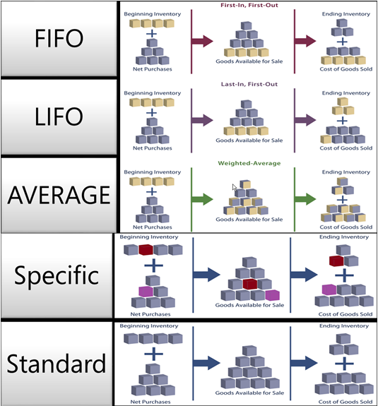

# Ontwerpdetails: Waarderingsmethoden
De waarderingsmethode bepaalt of een werkelijke of gebudgetteerde waarde wordt gekapitaliseerd en gebruikt in de kostenberekening. Samen met de boekingsdatum en de volgorde wordt door de waarderingsmethode ook bepaald hoe de kostenstroom wordt vastgelegd. De volgende methoden worden ondersteund in [!INCLUDE[d365fin](includes/d365fin_md.md)]:  

|Waarderingsmethode|Description|Gebruik|  
|--------------------|---------------------------------------|-----------------|  
|FIFO|De kostprijs van een artikel is de werkelijke waarde van de ontvangst van het artikel dat met de FIFO-regel is geselecteerd.   In voorraadwaardering wordt verondersteld dat de artikelen die als eerste in voorraad worden geplaatst, als eerst worden verkocht.|In ondernemingsomgevingen waar de productkosten stabiel zijn.   (Wanneer de prijzen stijgen, wordt in de balans een grotere waarde weergegeven. Dit betekent dat de belastingschulden toenemen, maar de creditscores en de mogelijkheid om contanten te lenen beter worden.)   Voor artikelen met een beperkte houdbaarheid, omdat de oudste goederen moeten worden verkocht voordat ze hun uiterste houdbaarheidsdatum overschrijden.|  
|LIFO|De kostprijs van een artikel is de werkelijke waarde van de ontvangst van het artikel dat met de LIFO-regel is geselecteerd.   In voorraadwaardering wordt verondersteld dat de artikelen die als laatste in voorraad worden geplaatst, als eerst worden verkocht.|Verboden in veel landen/regio's, aangezien het kan worden gebruikt voor het drukken van winst.   (Wanneer de prijzen stijgen, vermindert de waarde op de resultatenrekening. Dit betekent dat de belastingschulden verminderen, maar de mogelijkheid om contanten te lenen verslechtert.)|  
|Gemiddelde|De kostprijs van een artikel wordt berekend als de gemiddelde kostprijs op elk tijdstip na de inkoop.   Voor voorraadwaardering wordt aangenomen dat alle voorraden tegelijkertijd zijn verkocht.|In ondernemingsomgevingen waar de productkosten instabiel zijn.   Wanneer voorraden worden gestapeld of samengevoegd en niet kunnen worden onderscheiden, zoals chemische producten.|  
|Specifiek|De kostprijs van een artikel bestaat uit de exacte kosten waarmee de betreffende eenheid is ontvangen.|In productie of handel van gemakkelijk identificeerbare artikelen met tamelijk hoge kostprijs.   Voor artikelen die onder wetgeving vallen.   Voor artikelen met serienummers.|  
|Vast|De kostprijs van een artikel is vooraf ingesteld op basis van de geschatte prijs.   Wanneer de werkelijke kosten later gerealiseerd zijn, moet de vaste verrekenprijs aan de werkelijke aangepast worden door verschilwaarden.|Waar kostenbeheersing essentieel is.   In herhaalde productie, om de directe materiaal-, arbeids- en productieoverheadkosten te waarderen.   Waar er discipline en personeel zijn om normen na te volgen.|  

 De volgende afbeelding toont hoe de kosten door de voorraad stromen voor elke waarderingsmethode.  

   

 Waarderingsmethoden verschillen in de manier waarop ze voorraadafnamen waarderen en of ze werkelijke kosten of standaardkosten gebruiken als de waarderingsbasis. In de volgende tabel worden de verschillende kenmerken toegelicht. (De LIFO-methode is uitgesloten, omdat deze erg lijkt op de FIFO-methode.)  

||FIFO|Gemiddelde|Vast|Specifiek|  
|-|----------|-------------|--------------|--------------|  
|Algemeen kenmerk|Gemakkelijk te begrijpen|Gebaseerd op periodeopties: **Dag**/**Week**/**Maand**/**Kwartaal**/**Boekingsperiode**.   Kan worden berekend per artikel of per artikel/vestiging/variant.|Gemakkelijk te gebruiken, maar vereist gekwalificeerd onderhoud|Hiervoor is artikeltracering vereist op zowel inkomende als uitgaande transacties.   Meestal gebruikt voor artikelen met een serienummer.|  
|Vereffening/Herwaardering|Vereffening houdt **het resterende aantal** bij.   De correctie stuurt kosten door op basis van aantalvereffening.|Vereffening houdt het **resterende aantal** bij.   De kosten worden berekend en doorgegeven op de **waarderingsdatum**.|Vereffening houdt het **resterende aantal** bij.   Vereffening wordt gebaseerd op FIFO.|Alle vereffeningen zijn vast.|  
|Herwaardering|Hiermee worden alleen gefactureerde aantallen geherwaardeerd.   Kan per artikel of per artikelpost worden gedaan.   Kan terug in de tijd worden uitgevoerd.|Hiermee worden alleen gefactureerde aantallen geherwaardeerd.   Kan alleen per artikel worden gedaan.   Kan terug in de tijd worden uitgevoerd.|Hiermee worden gefactureerde en niet-gefactureerde aantallen geherwaardeerd.   Kan per artikel of per artikelpost worden gedaan.   Kan terug in de tijd worden uitgevoerd.|Hiermee worden alleen gefactureerde aantallen geherwaardeerd.   Kan per artikel of per artikelpost worden gedaan.   Kan terug in de tijd worden uitgevoerd.|  
|Diversen|Als u een negatieve voorraadmutatie antidateert, worden de bestaande posten NIET opnieuw toegepast om een juiste FIFO-kostenstroom te bieden.|Als u een negatieve of een positieve voorraadmutatie antidateert, worden de gemiddelde kosten opnieuw berekend en worden alle betrokken posten aangepast.   Als u de periode of het type berekening wijzigt, moeten alle betrokken posten worden aangepast.|Gebruik het venster **Standaardvoorstel** om de vaste verrekenprijs regelmatig bij te werken en te berekenen.   Wordt NIET ondersteund per SKU.   Er bestaan geen historische records voor standaardkosten.|U kunt specifieke artikeltracering gebruiken zonder de waarderingsmethode Specifiek te gebruiken. De kosten volgen NIET het lotnummer, maar de kostenveronderstelling van de geselecteerde waarderingsmethode.|  

## Opmerking  
 In deze sectie worden voorbeelden gegeven van hoe verschillende waarderingsmethoden invloed hebben op de voorraadwaarde.  

 De volgende tabel toont de positieve en negatieve voorraadmutaties waarop de voorbeelden zijn gebaseerd.  

|Boekingsdatum|Aantal|Volgnummer|  
|------------------|--------------|---------------|  
|01-01-20|1|1|  
|01-01-20|1|2|  
|01-01-20|1|3|  
|01-02-20|-1|4|  
|01-03-20|-1|5|  
|01-04-20|-1|6|  

> [!NOTE]  
>  Het resulterende aantal op voorraad is nul. Daarom moet de voorraadwaarde ook nul zijn, ongeacht de waarderingsmethode.  

### Het effect van waarderingsmethoden op de waardering van positieve voorraadmutaties  
 **FIFO**/**LIFO**/**Gemiddelde**/**Specifiek**  

 Voor artikelen met waarderingsmethoden die werkelijke kosten als de waarderingsbasis gebruiken (**FIFO**, **LIFO**, **Gemiddelde** of **Specifiek**), worden positieve voorraadmutaties gewaardeerd tegen de aanschafkosten van het artikel.  

 De volgende tabel toont hoe positieve voorraadmutaties wordt gewaardeerd voor alle waarderingsmethoden behalve **Standaard**.  

|Boekingsdatum|Aantal|Tot. werk. kosten|Volgnummer|  
|------------------|--------------|----------------------------|---------------|  
|01-01-20|1|10.00|1|  
|01-01-20|1|20.00|2|  
|01-01-20|1|30,00|3|  

 **Standaard**  

 Voor artikelen waarvoor de waarderingsmethode **Standaard** wordt gebruikt, worden positieve voorraadmutaties gewaardeerd tegen de huidige vaste verrekenprijs van het artikel.  

 De volgende tabel toont hoe positieve voorraadmutaties wordt gewaardeerd voor de waarderingsmethode **Standaard**.  

|Boekingsdatum|Aantal|Tot. werk. kosten|Volgnummer|  
|------------------|--------------|----------------------------|---------------|  
|01-01-20|1|15.00|1|  
|01-01-20|1|15.00|2|  
|01-01-20|1|15.00|3|  

### Het effect van waarderingsmethoden op de waardering van negatieve voorraadmutaties  
 **FIFO**  

 Voor artikelen die de waarderingsmethode **FIFO** gebruiken, worden artikelen die als eerste zijn ingekocht, altijd als eerste verkocht (volgnummers 3, 2, 1 in dit voorbeeld.) Negatieve voorraadmutaties worden gewaardeerd doordat de waarde wordt genomen van de eerste positieve voorraadmutatie.  

 De KPV wordt berekend met de waarde van de eerste voorraadaanwinsten.  

 De volgende tabel toont hoe negatieve voorraadmutaties wordt gewaardeerd voor de waarderingsmethode **FIFO**.  

|Boekingsdatum|Aantal|Tot. werk. kosten|Volgnummer|  
|------------------|--------------|----------------------------|---------------|  
|01-02-20|-1|-10,00|4|  
|01-03-20|-1|-20,00|5|  
|01-04-20|-1|-30,00|6|  

 **LIFO**  

 Voor artikelen die de waarderingsmethode **LIFO** gebruiken, worden artikelen die het meest recentelijk zijn ingekocht, altijd als eerste verkocht (volgnummers 3, 2, 1 in dit voorbeeld.) Negatieve voorraadmutaties worden gewaardeerd doordat de waarde wordt genomen van de laatste positieve voorraadmutatie.  

 De KPV wordt berekend met de waarde van de meest recente voorraadaanwinsten.  

 De volgende tabel toont hoe negatieve voorraadmutaties wordt gewaardeerd voor de waarderingsmethode **LIFO**.  

|Boekingsdatum|Aantal|Tot. werk. kosten|Volgnummer|  
|------------------|--------------|----------------------------|---------------|  
|01-02-20|-1|-30,00|4|  
|01-03-20|-1|-20,00|5|  
|01-04-20|-1|-10,00|6|  

 **Gemiddelde**  

 Voor artikelen waarvoor de waarderingsmethode **Gemiddeld** wordt gebruikt, wordt een negatieve voorraadmutatie gewaardeerd tegen het gewogen gemiddelde van de resterende voorraad op de laatste dag van de gemiddelde prijsperiode waarin de negatieve mutatie is geboekt. Zie [Ontwerpdetails: kostenwaardering](design-details-average-cost.md) voor meer informatie.  

 De volgende tabel toont hoe negatieve voorraadmutaties wordt gewaardeerd voor de waarderingsmethode **Gemiddeld**.  

|Boekingsdatum|Aantal|Tot. werk. kosten|Volgnummer|  
|------------------|--------------|----------------------------|---------------|  
|01-02-20|-1|-20,00|4|  
|01-03-20|-1|-20,00|5|  
|01-04-20|-1|-20,00|6|  

 **Standaard**  

 Voor artikelen die de waarderingsmethode **Standaard** gebruiken, worden negatieve voorraadmutaties gewaardeerd zoals bij de waarderingsmethode **FIFO**, behalve dat waardering wordt gebaseerd op standaardkosten , niet op de werkelijke kosten.  

 De volgende tabel toont hoe negatieve voorraadmutaties wordt gewaardeerd voor de waarderingsmethode **Standaard**.  

|Boekingsdatum|Aantal|Tot. werk. kosten|Volgnummer|  
|------------------|--------------|----------------------------|---------------|  
|01-02-20|-1|-15,00|4|  
|01-03-20|-1|-15,00|5|  
|01-04-20|-1|-15,00|6|  

 **Specifiek**  

 Met waarderingsmethoden wordt een veronderstelling gemaakt over hoe de kosten van een positieve naar een negatieve voorraadmutatie stromen. Als er echter accuratere informatie beschikbaar is over de kostenstroom, kunt u van dit principe afwijken door een vaste vereffening tussen posten te maken. Een vaste vereffening leidt tot een koppeling tussen een negatieve voorraadmutatie en een specifieke positieve voorraadmutatie en stuurt de kostenstroom dienovereenkomstig.  

 Voor artikelen die de waarderingsmethode **Specifiek** gebruiken, wordt de negatieve voorraadmutatie gewaardeerd op basis van de positieve voorraadmutatie waar deze aan is gekoppeld door de vaste vereffening.  

 De volgende tabel toont hoe negatieve voorraadmutaties wordt gewaardeerd voor de waarderingsmethode **Specifiek**.  

|Boekingsdatum|Aantal|Tot. werk. kosten|Vereffenen met post|Volgnummer|  
|------------------|--------------|----------------------------|-----------------------|---------------|  
|01-02-20|-1|-20,00|**2**|4|  
|01-03-20|-1|-10,00|**1**|5|  
|01-04-20|-1|-30,00|**3**|6|  

## Zie ook  
 [Ontwerpdetails: Voorraadwaardering](design-details-inventory-costing.md)   
 [Ontwerpdetails: Verschil](design-details-variance.md)   
 [Ontwerpdetails: Gemiddelde kostprijs](design-details-average-cost.md)   
 [Ontwerpdetails: Artikelvereffening](design-details-item-application.md) [Voorraadkosten beheren](finance-manage-inventory-costs.md)  
 [Financiën](finance.md)  
 [Werken met [!INCLUDE[d365fin](includes/d365fin_md.md)]](ui-work-product.md)  

