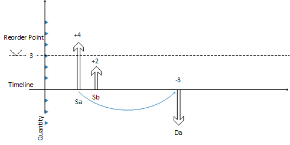

# Ontwerpdetails: Het verwachte voorraadniveau en het bestelpunt controleren
Voorraad is een soort aanbod, maar voor voorraadplanning maakt het planningssysteem onderscheid tussen twee voorraadniveaus:  

* Geplande voorraad  
* Geplande beschikbare voorraad  

## Geschatte inventaris  
In eerste instantie is verwachte voorraad het aantal van de brutovoorraad, inclusief aanbod en vraag in het verleden, ook indien niet geboekt, wanneer het planningsproces wordt gestart. In de toekomst wordt dit een schommelend gepland voorraadniveau dat wordt onderhouden door bruto aantallen van toekomstige vraag en aanbod omdat deze worden geïntroduceerd op het tijdpad (gereserveerd of op een andere manier toegewezen).  

De geplande voorraad wordt gebruikt door het planningssysteem om het bestelpunt te controleren en het bestelaantal te bepalen wanneer het bestelbeleid Maximum aantal wordt gebruikt.  

## Geplande beschikbare voorraad  
De geplande beschikbare voorraad is het deel van de geplande voorraad dat op een bepaald moment beschikbaar is om aan de vraag te voldoen. De geplande beschikbare voorraad wordt gebruikt door de planningsengine voor het controleren van de veiligheidsvoorraad.  

De geplande beschikbare voorraad wordt gebruikt door het planningssysteem om de veiligheidsvoorraad te controleren, aangezien de veiligheidsvoorraad altijd beschikbaar moet zijn om te voldoen aan onverwachte vraag.  

## Tijdsintervallen  
Een strakke controle over de verwachte voorraad hebben, is van cruciaal belang om te detecteren wanneer het bestelpunt wordt bereikt of overschreden en om het juiste orderaantal te berekenen wanneer het bestelbeleid Maximum aantal wordt gebruikt.  

Zoals eerder gezegd, wordt het verwachte voorraadniveau berekend aan het begin van de planningsperiode. Het een brutoniveau is dat geen rekening houdt met reserveringen en soortgelijke toewijzingen. Om dit voorraadniveau te controleren tijdens de planningsreeks, controleert het systeem de samengevoegde wijzigingen gedurende een periode, een tijdsinterval. Het systeem zorgt dat het tijdsinterval ten minste één dag is, aangezien dit de nauwkeurigste tijdseenheid is voor een vraag- of voorzieningsgebeurtenis.  

## Het verwachte voorraadniveau bepalen  
In de volgende reeks wordt beschreven hoe het voorspelde voorraadniveau wordt bepaald:  

* Wanneer een voorzieningsgebeurtenis, zoals een inkooporder, totaal is gepland, wordt hiermee de geplande voorraad verhoogd op de vervaldatum.  
* Wanneer aan een vraaggebeurtenis volledig is voldaan, wordt de geplande voorraad niet direct verminderd. In plaats hiervan wordt een afnameaanmaning geboekt. Dat is een interne record die de datum en het aantal bevat van de bijdrage aan de verwachte voorraad.  
* Wanneer een volgende voorzieningsgebeurtenis wordt gepland en op het tijdpad wordt geplaatst, worden de geboekte afnameaanmaningen een voor een onderzocht tot aan de geplande datum van de voorziening tijdens het bijwerken van de geplande voorraad. Tijdens dit proces kan het bestelpuntniveau van de interne toenameherinnering worden bereikt of overschreden.  
* Als een nieuwe voorzieningenorder wordt geïntroduceerd, controleert het systeem of het vóór de huidige voorziening wordt ingevoerd. Als dat zo is, wordt de nieuwe voorziening de huidige voorziening en begint de vereffeningsprocedure opnieuw.  

Hierna wordt een grafische illustratie van dit principe getoond:  

  

1. Voorziening **Sa** van 4 (vast) sluit vraag **Da** van -3 af.  
2. CloseDemand: Maak een afnameaanmaning van -3 (niet weergegeven).  
3. Voorziening **Sa** is afgesloten met een overschot van 1 (er bestaat geen vraag meer).  

     Hiermee wordt het geplande voorraadniveau verhoogd naar +4, terwijl de geplande **beschikbare** voorraad -1 wordt.  

4. De volgende voorziening **Sb** van 2 (een andere order) is al ingesteld op de tijdlijn.  
5. Er wordt gecontroleerd of er afnameaanmaningen zijn voorafgaand aan **Sb** (die zijn er niet, dus er wordt geen actie ondernomen.)  
6. Het systeem sluit voorziening **Sb** (er bestaat geen vraag meer) door A: het te verlagen tot 0 (annuleren), of B: het te laten zoals het is.  

     Hiermee wordt het voorspelde voorraadniveau verhoogd (A: +0 => +4 of B: +2 = +6).  

7. Er wordt een laatste controle gedaan: zijn er eventuele afnameaanmaningen? Ja, er is één op de datum van **Da**.  
8. Het systeem voegt de afnameherinnering -3 toe aan het verwachte voorraadniveau, hetzij A: +4 -3 = 1 of B: +6 -3 = +3.  
9. In het geval van A maakt het systeem een voorwaarts geplande order die begint op de datum **Da**.  

     In het geval van B, wordt het bestelpunt bereikt en wordt een nieuwe order gemaakt.  

## Zie ook  
[Ontwerpdetails: Bestelbeleid](design-details-reordering-policies.md)   
[Ontwerpdetails: Planningsparameters](design-details-planning-parameters.md)   
[Ontwerpdetails: Bestelbeleid verwerken](design-details-handling-reordering-policies.md)   
[Ontwerpdetails: Voorraadplanning](design-details-supply-planning.md)

