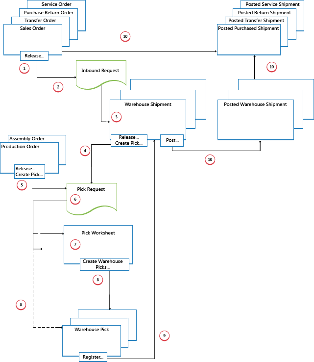

# Ontwerpdetails: Uitgaande magazijnstroom
De uitgaande stroom in het magazijn begint met een aanvraag vanuit vrijgegeven brondocumenten om de artikelen uit de magazijnvestiging te halen, ofwel om te worden verzonden naar een externe partij of naar een andere bedrijfsvestiging. Vanuit het opslaggebied worden magazijnactiviteiten uitgevoerd op verschillende complexiteitsniveaus om de artikelen naar de verzenddoks te brengen.  

 Elk artikel wordt geïdentificeerd en aan een corresponderend inkomend brondocument gekoppeld. Er zijn de volgende uitgaande brondocumenten:  

- Verkooporder  
- Uitgaande transferorder  
- Inkoopretourorder  
- Serviceorder  

Bovendien bestaan de volgende interne brondocumenten die fungeren als uitgaande bronnen:  

- Productieorder met materiaalbehoefte  
- Assemblageorder met materiaalbehoefte  

 De laatste twee documenten vertegenwoordigen uitgaande stromen van het magazijn naar interne bewerkingsgebieden. Voor meer informatie over magazijnverwerking voor interne inkomende en uitgaande processen raadpleegt u [Ontwerpdetails: Inkomende magazijnstromen](design-details-internal-warehouse-flows.md)..  

 Processen en UI-documenten in uitgaande magazijnstromen zijn verschillend voor standaard- en geavanceerde magazijnconfiguraties. Het belangrijkste verschil is dat de activiteiten per order worden uitgevoerd in standaardmagazijnconfiguraties en dat ze worden samengevoegd voor meerdere orders in geavanceerde magazijnconfiguraties. Zie voor meer informatie over de verschillende niveaus van de magazijncomplexiteit [Ontwerpdetails: Magazijnoverzicht](design-details-warehouse-setup.md).  

 In [!INCLUDE[d365fin](includes/d365fin_md.md)] kunnen uitgaande processen voor picken en verzending op vier manieren worden uitgevoerd met verschillende functionaliteiten, afhankelijk van het complexiteitsniveau van het magazijn.  

|Methode|Inkomend proces|Opslaglocaties|Magazijnpicks|Verzendingen|Complexiteitsniveau (zie [Ontwerpdetails: Magazijninstelling](design-details-warehouse-setup.md))|  
|------------|---------------------|----------|-----------|---------------|--------------------------------------------------------------------------------------------------------------------|  
|A|Picken en verzending van de orderregel boeken|X|||2|  
|B|Picken en verzending van een voorraadpickdocument boeken||X||3|  
|L|Picken en verzending van een magazijnverzendingdocument boeken|||X|5-4-6|  
|D|Picken van een magazijnpickdocument en verzending van een magazijnverzendingdocument boeken||X|X|5-4-6|  

 Zie voor meer informatie [Ontwerpdetails: Uitgaande magazijnstroom]().  

 Het selecteren van een aanpak hangt af van de toegestane praktijken van het bedrijf en het niveau van de organisatorische complexiteit. In een per-order omgeving met duidelijke processen en een eenvoudige opslaglocatiestructuur is methode A, picken en verzenden vanaf de orderregel, geschikt. In andere op-order bedrijven waar artikelen voor één orderregel kunnen komen uit meerdere opslaglocaties of waar magazijnmedewerkers niet met orderdocumenten kunnen werken, is het gebruik van aparte pickdocumenten geschikt. Dat is methode B. Als de pick- en verzendprocessen van een bedrijf het verwerken van meerdere orders betreffen en dus meer controle en overzicht nodig is, kan het bedrijf ervoor kiezen een magazijnverzenddocument en een magazijnpickdocument te gebruiken om de pick- en verzendtaken te scheiden. Dat zijn methode C en D.  

 Bij methode A, B en C worden de acties picken en verzenden in één stap gecombineerd wanneer het corresponderende document als verzonden wordt geboekt. Bij methode D wordt eerst de pick geregistreerd en wordt de verzending vervolgens op een later moment geboekt vanuit een ander document.  

## Standaardmagazijnconfiguraties  
 In het volgende diagram worden de uitgaande magazijnstromen aangegeven op documentsoort in standaardmagazijnconfiguraties. De nummers in het diagram komen overeen met de stappen in de gedeelten na het diagram.  

   

### 1: Brondocument vrijgeven/Voorraadpick of verplaatsing maken  
 Wanneer een gebruiker die verantwoordelijk is voor brondocumenten, zoals een verkooporderverwerker of productieplanner, gereed is voor de uitgaande magazijnactiviteit, kan hij of zij het brondocument vrijgeven als teken voor magazijnmedewerkers dat verkochte artikelen of onderdelen kunnen worden gepickt en in de opgegeven opslaglocaties kunnen worden geplaatst. De gebruiker kan als alternatief ook pick- of verplaatsingsdocumenten voor voorraad maken voor de afzonderlijke orderregels met push-functionaliteit, op basis van opgegeven opslaglocaties en te verwerken aantallen.  

> [!NOTE]  
>  Voorraadverplaatsingen worden gebruikt om artikelen te verplaatsen naar interne bewerkingsgebieden in standaardmagazijnconfiguraties, op basis van brondocumenten of op ad-hocbasis.  

### 2: Uitgaand verzoek maken  
 Wanneer het uitgaande brondocument wordt vrijgegeven, wordt automatisch een uitgaand magazijnverzoek gemaakt. Deze bevat verwijzingen naar het brondocumenttype en -aantal en is niet zichtbaar voor de gebruiker.  

### 3: Voorraadpick of -verplaatsing maken  
 In het venster **Voorraadpick** or **Voorraadverplaatsing** haalt de magazijnmedewerker door middel van pulling de wachtende brondocumentregels op, op basis van uitgaande magazijnverzoeken. De voorraadpickregels kunnen ook al door pushing zijn gemaakt door de gebruiker die verantwoordelijk is voor het brondocument.  

### 4: Voorraadpick boeken of Voorraadverplaatsing registreren  
 Op elke regel voor artikelen die gedeeltelijk of volledig zijn gepickt of verplaatst, vult de magazijnmedewerker het veld **Aantal** in en boekt deze vervolgens de voorraadpick of registreert deze de voorraadverplaatsing. Brondocumenten met betrekking tot de voorraadpick worden geboekt als verzonden of verbruikt. Brondocumenten met betrekking tot voorraadverplaatsingen worden niet geboekt.  

 Voor voorraadpicks worden negatieve artikelposten gemaakt, worden magazijnposten gemaakt en wordt het pickverzoek verwijderd als het volledig is verwerkt. Het veld **Verzonden aantal** in het uitgaande brondocument wordt bijvoorbeeld bijgewerkt. Er wordt een geboekt verzendingsdocument gemaakt voor bijvoorbeeld de verkooporder en de verzonden artikelen.  

## Geavanceerde magazijnconfiguraties  
 In het volgende diagram wordt de uitgaande magazijnstroom aangegeven op documentsoort in geavanceerde magazijnconfiguraties. De nummers in het diagram komen overeen met de stappen in de gedeelten na het diagram.  

   

### 1: Brondocument vrijgeven  
 Wanneer een gebruiker die verantwoordelijk is voor brondocumenten, zoals een verkooporderverwerker of productieplanner, gereed is voor de uitgaande magazijnactiviteit, kan hij of zij het brondocument vrijgeven als teken voor magazijnmedewerkers dat verkochte artikelen of onderdelen kunnen worden gepickt en in de opgegeven opslaglocaties kunnen worden geplaatst.  

### 2: Uitgaand verzoek maken  
 Wanneer het inkomende brondocument wordt vrijgegeven, wordt automatisch een uitgaand magazijnverzoek gemaakt. Deze bevat verwijzingen naar het brondocumenttype en -aantal en is niet zichtbaar voor de gebruiker.  

### 3: Magazijnverzending maken  
 In het venster **Mag. -verzending** haalt de verantwoordelijke verzendingsmedewerker de wachtende brondocumentregels op, op basis van het uitgaande magazijnverzoek. Verschillende brondocumentregels kunnen worden gecombineerd in één magazijnverzenddocument.  

### 4: Verzending vrijgeven/Magazijnpick maken  
 De verantwoordelijke verzendingsmedewerker geeft de magazijnverzending vrij, zodat de magazijnmedewerkers magazijnpicks voor de betreffende verzending kunnen maken of coördineren.  

 Of de gebruiker maakt door pushing magazijnpickdocumenten voor afzonderlijke verzendingsregels, op basis van te verwerken opgegeven opslaglocaties en aantallen.  

### 5: Interne bewerking vrijgeven/Magazijnpick maken  
 De gebruiker die verantwoordelijk is voor interne bewerkingen, geeft een intern brondocument vrij, zoals een productie- en assemblageorder, zodat magazijnmedewerkers magazijnpicks kunnen maken of coördineren voor de betreffende interne bewerking.  

 Of de gebruiker maakt door pushing magazijnpickdocumenten voor de afzonderlijke productie- of assemblageorder, op basis van te verwerken opgegeven opslaglocaties en aantallen.  

### 6: Pickverzoek maken  
 Wanneer het uitgaande brondocument wordt vrijgegeven, wordt automatisch een magazijnpickverzoek gemaakt. Deze bevat verwijzingen naar het brondocumenttype en -aantal en is niet zichtbaar voor de gebruiker. Afhankelijk van de instellingen, leidt verbruik vanuit een productie- en assemblageorder ook tot een pickverzoek om het benodigde materiaal uit voorraad te picken.  

### 7: Pickvoorstelregels genereren  
 De gebruiker die verantwoordelijk is voor het coördineren van picks, haalt magazijnpickregels op in het **Pickvoorstel**, op basis van pickverzoeken van magazijnverzendingen of interne bewerkingen met materiaalverbruik. De gebruiker selecteert de te picken regels en bereidt de picks voor door op te geven uit welke opslaglocaties moeten worden gepickt, naar welke opslaglocaties moet worden geplaatst en hoeveel eenheden moeten worden verwerkt. De opslaglocaties kunnen door de instelling van de magazijnvestiging of bewerkingresource vooraf worden gedefinieerd.  

 De gebruiker geeft orderverzamelmethoden op voor optimaal gebruik van magazijnverwerking en gebruikt vervolgens een functie om de corresponderende magazijnpickdocumenten te maken, die zijn toegewezen aan andere magazijnmedewerkers die magazijnpicks uitvoeren. Wanneer de magazijnpicks volledig zijn toegewezen, worden de regels in het venster **Pickvoorstel** verwijderd.  

### 8: Magazijnpickdocumenten maken  
 De magazijnmedewerker die picks uitvoert, maakt een magazijnpickdocument met pull-functionaliteit, op basis van het vrijgegeven brondocument. Of het magazijnpickdocument wordt door pushing gemaakt en toegewezen aan de magazijnmedewerker.  

### 9: Magazijnpick registreren  
 Op elke regel voor artikelen die gedeeltelijk of volledig zijn gepickt, vult de magazijnmedewerker het veld **Aantal** in het venster **Magazijnpick** in en registreert deze vervolgens de magazijnpick.  

 Magazijnposten worden gemaakt en de magazijnpickregels worden verwijderd, als deze volledig zijn verwerkt. Het magazijnpickdocument blijft geopend totdat het totale aantal van de gerelateerde magazijnverzending is geregistreerd. Het veld **Gepickt aantal** op de magazijnverzendregels wordt dan overeenkomstig bijgewerkt.  

### 10: Magazijnverzending boeken  
 Wanneer alle artikelen in het magazijnverzendingdocument zijn geregistreerd als gepickt naar de opgegeven verzendingopslaglocaties, boekt de verantwoordelijke verzendingsmedewerker de magazijnverzending. Er worden negatieve artikelposten gemaakt. Het veld **Verzonden aantal** in het uitgaande brondocument wordt bijvoorbeeld bijgewerkt.  

## Zie ook  
 [Ontwerpdetails: Magazijnbeheer](design-details-warehouse-management.md)

