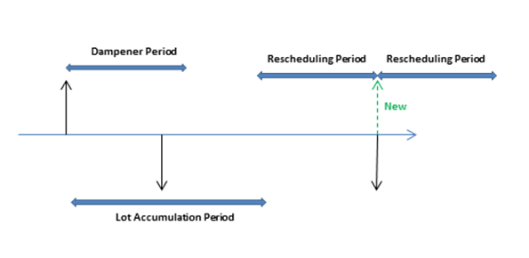
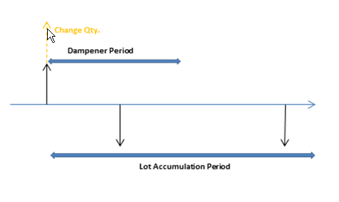

# Ontwerpdetails: Planningsparameters
Dit onderwerp beschrijft de verschillende planningsparameters die u kunt gebruiken in [!INCLUDE[d365fin](includes/d365fin_md.md)].  

De manier waarop het planningssysteem de artikelvoorziening controleert, wordt bepaald door verschillende instellingen op de artikelkaart of SKU, en de configuratie van productie-instellingen. De volgende tabel toont hoe deze parameters worden gebruikt voor de planning.  

|Doel|Parameter|  
|-------------|---------------|  
|Definiëren of het artikel moet worden gepland|Bestelbeleid = leeg|  
|Definiëren wanneer moet worden besteld|Tijdsinterval   Bestelpunt   Veiligheidstijd|  
|Definiëren hoeveel moet worden besteld|Veiligheidsvoorraad   Bestelbeleid:   -   Vast bestelaantal plus bestelaantal -   Maximum aantal plus Maximale voorraad -   Order -   Lot-voor-lot|  
|Optimaliseren wanneer en hoe u bestelt|Herplanningsperiode   Lotaccumulatieperiode   Dempingsperiode|  
|De voorzieningenorders wijzigen|Min. bestelaantal   Max. bestelaantal   Vaste lotgrootte|  
|Het geplande artikel beperken|Productiebeleid:   -   Op voorraad produceren -   Op order produceren|  

## Definiëren of het artikel wordt gepland  
Als u een artikel/SKU in het planningsproces wilt opnemen, moet het een bestelbeleid hebben. Anders moet het handmatig worden gepland, bijvoorbeeld met de functie Orderplanning.  

## Definiëren wanneer moet worden besteld  
Voorstellen voor opnieuw bestellen worden normaal gesproken alleen vrijgegeven wanneer de verwachte beschikbare hoeveelheid op of onder een bepaalde hoeveelheid komt. Dit aantal wordt bepaald door het bestelpunt. Anders wordt het nul. Nul kan worden aangepast door een veiligheidsvoorraad in te voeren. Als de gebruiker een veiligheidstijd heeft opgegeven, wordt het voorstel gedaan in de periode vóór de vereiste vervaldatum.  

Het veld **Tijdsinterval** wordt gebruikt door bestelpuntbeleid (**Vast bestelaantal** en **Maximum aantal**) waarbij het voorraadniveau wordt gecontroleerd na elk tijdsinterval. Het eerste tijdsinterval begint op de begindatum van de planning.  

> [!NOTE]  
>  Bij de berekening van tijdsperioden negeert het planningssysteem werkagenda's die zijn gedefinieerd in het veld **Basisagendacode** in de vensters **Bedrijfsgegevens** en **Vestiging**.  

De standaardveiligheidstijd in het venster **Productie-instellingen** moet worden ingesteld op ten minste één dag. De vervaldatum van de vraag kan bekend zijn, maar niet de vervaltijd. Er wordt terug in de tijd gepland om te voldoen aan de brutovraag. Als er geen veiligheidstijd is gedefinieerd, kunnen de goederen te laat arriveren om te voldoen aan de vraag.  

Drie aanvullende bestelperiodevelden, **Herplanningsperiode**, **Lotaccumulatieperiode** en **Dempingsperiode**, spelen ook een rol bij de definitie van wanneer moet worden herbesteld. Zie voor meer informatie de sectie Optimaliseren wanneer en hoe u bestelt.  

## Definiëren hoeveel moet worden besteld  
Als het planningssysteem de noodzaak voor een bestelling detecteert, wordt het geselecteerde bestelbeleid gebruikt om te bepalen wanneer en hoeveel moet worden besteld.  

Het planningssysteem volgt, onafhankelijk van het bestelbeleid, meestal deze logica:  

1. Het aantal van het ordervoorstel wordt berekend om te voldoen aan het opgegeven minimumvoorraadniveau van het artikel, doorgaans de veiligheidsvoorraad. Als er niets is opgegeven, wordt het minimumvoorraadniveau nul.  
2. Als de verwachte beschikbare voorraad onder het veiligheidsvoorraadaantal ligt, wordt een achterwaarts geplande voorzieningenorder voorgesteld. Met het orderaantal wordt ten minste de veiligheidsvoorraad gevuld, en het kan worden verhoogd met de brutovraag binnen het tijdsinterval, met het bestelbeleid en met de bestelvelden.  
3. Als de verwachte voorraad op of onder het bestelpunt ligt (berekend vanaf gecombineerde wijzigingen binnen het tijdsinterval) en boven het veiligheidsvoorraadaantal, wordt een voorwaarts geplande uitzonderingorder voorgesteld. De brutovraag waaraan moet worden voldaan en het bestelbeleid bepalen het orderaantal. Het orderaantal is minstens gelijk aan het bestelpunt.  
4. Als er meer brutovraag vervalt vóór de einddatum van het voorwaarts geplande ordervoorstel en de huidige berekende verwachte beschikbare voorraad door deze vraag onder het veiligheidsvoorraadaantal komt, wordt het orderaantal verhoogd om het tekort te dekken. De voorgestelde voorzieningenorder wordt vervolgens achterwaarts gepland vanaf de vervaldatum voor de brutovraag die de veiligheidsvoorraad zou hebben overschreden.  
5. Als het veld **Tijdsinterval** niet is ingevuld, wordt alleen de brutovraag op dezelfde vervaldatum toegevoegd.  

     De volgende bestelperiodevelden spelen ook een rol bij het bepalen hoeveel moet worden herbesteld: **Herplanningsperiode**, **Lotaccumulatieperiode** en **Dempingsperiode**. Zie voor meer informatie de sectie Optimaliseren wanneer en hoe u bestelt.  

### Bestelbeleid  
Het volgende bestelbeleid heeft invloed op het aantal dat wordt besteld.  

|Bestelbeleid|Description|  
|-----------------------|---------------------------------------|  
|**Vast bestelaantal**|Het orderaantal zal minimaal gelijk zijn aan het bestelaantal. Het kan worden verhoogd om aan de vraag of het gewenste voorraadniveau te voldoen. Dit bestelbeleid wordt gewoonlijk gebruikt met een bestelpunt.|  
|**Maximum aantal**|Het orderaantal wordt berekend om te voldoen aan de maximale voorraad. Als aantalbepalingen worden gebruikt, kan de maximale voorraad worden overschreden. We adviseren het tijdsinterval niet samen met het maximumaantal te gebruiken. Het tijdsinterval wordt meestal genegeerd. Dit bestelbeleid wordt gewoonlijk gebruikt met een bestelpunt.|  
|**Order**|Het orderaantal wordt berekend om aan elke vraaggebeurtenis te voldoen en de vraag-voorzieningcombinatie blijft gekoppeld tot aan het uitvoeren. Er wordt geen rekening gehouden met planningsparameters.|  
|**Lot-for-Lot**|Het aantal wordt berekend om te voldoen aan de som van de vraag die vervalt in het tijdsinterval.|  

##  Optimaliseren wanneer en hoe u bestelt  
Om een rationeel voorzieningenplan te verkrijgen, stemt een planner planningsparameters af om voorstellen voor herplanning te beperken, vraag samen te voegen (dynamisch bestelaantal), of onbelangrijke planningsacties te voorkomen. De volgende bestelperiodevelden helpen te optimaliseren wanneer en hoeveel moet worden besteld.  

|Veld|Description|  
|---------------------------------|---------------------------------------|  
|**Herplanningsperiode**|Dit veld wordt gebruikt om te bepalen of de planningsboodschap een bestaande order opnieuw moet plannen, of moet annuleren en een nieuwe order moet maken. De bestaande order wordt opnieuw gepland binnen één herplanningsperiode vóór de huidige voorziening en tot één herplanningsperiode na de huidige voorziening.|  
|**Lotaccumulatieperiode**|Met het bestelbeleid Lot-for-Lot wordt dit veld gebruikt om meerdere voorzieningen samen te voegen in één voorzieningenorder. Vanaf de eerste geplande voorziening worden alle voorzieningsvereisten in de volgende lotaccumulatieperiode samengevoegd in één voorziening, die wordt geplaatst op de datum van de eerste voorziening. Vraag buiten de lotaccumulatieperiode wordt niet gedekt door deze voorziening.|  
|**Dempingsperiode**|Dit veld wordt gebruikt om het op kleine schaal opnieuw plannen van bestaande voorzieningen te voorkomen. Wijzigingen vanaf de voorzieningsdatum tot aan één dempingsperiode vanaf de voorzieningsdatum genereren geen planningsboodschappen.   Hierdoor is een positieve delta tussen de voorgestelde nieuwe voorzieningsdatum en de oorspronkelijk voorzieningsdatum altijd groter dan de dempingsperiode.|  

De timing van de herplanningsperiode, dempingsperiode en lotaccumulatieperiode is gebaseerd op een voorzieningsdatum. Het tijdsinterval wordt gebaseerd op de begindatum van de planning, zoals in de onderstaande afbeelding is weergegeven.  

  

In de volgende voorbeelden geven de zwarte pijlen bestaand aanbod (omhoog) en bestaande vraag (omlaag) aan. Rode, groene en oranje pijlen zijn planningsuggesties.  

**Voorbeeld 1**: De gewijzigde datum ligt buiten de herplanningsperiode, waardoor de bestaande voorziening wordt geannuleerd. Er wordt een nieuwe voorziening voorgesteld om te voldoen aan de vraag in de lotaccumulatieperiode.  

  

**Voorbeeld 2**: De gewijzigde datum ligt in de herplanningsperiode, waardoor de bestaande voorziening opnieuw wordt gepland. Er wordt een nieuwe voorziening voorgesteld om te voldoen aan de vraag buiten de lotaccumulatieperiode.  

  

**Voorbeeld 3**: Er is vraag in de dempingsperiode en het voorzieningsaantal in de lotaccumulatieperiode komt overeen met het voorzieningsaantal. De volgende vraag wordt blootgelegd en er wordt een nieuwe voorziening voorgesteld.  

  

**Voorbeeld 4**: Er is vraag in de dempingsperiode en het aanbod blijft op dezelfde datum. Het huidige voorzieningaantal is echter niet voldoende om te voldoen aan de vraag in de lotaccumulatieperiode, zodat een wijzigingsactie voor het aantal wordt voorgesteld voor de bestaande voorzieningenorder.  

  

**Standaardwaarden:** de standaardwaarde van het veld **Tijdsinterval** en de drie bestelperiodevelden is leeg. Voor alle velden behalve het veld **Dempingsperiode** betekent dit 0D (nul dagen). Als het veld **Dempingsperiode** leeg is, wordt de globale waarde in het veld **Standaard dempingsperiode** in het venster **Productie-instellingen** gebruikt.  

## De voorzieningenorders wijzigen  
Wanneer het aantal van het ordervoorstel is berekend, kan het worden aangepast door een of meer van de orderwijzigingen. Het maximale orderaantal is bijvoorbeeld groter dan of gelijk aan het minimale orderaantal, dat groter is dan of gelijk is aan de vaste lotgrootte.  

Het aantal wordt verminderd als het maximale bestelaantal wordt overschreden. Het wordt verhoogd als het onder het minimale bestelaantal valt. Ten slotte wordt het naar boven afgerond zodat het overeenkomt met een opgegeven vaste lotgrootte. Voor een eventueel resterend aantal worden dezelfde correcties gebruikt totdat de totale vraag is omgezet in ordervoorstellen.  

## Het artikel beperken  
De optie **Productiebeleid** bepaalt welke aanvullende orders de MRP-berekening zal voorstellen.  

Als de optie **Op voorraad produceren** wordt gebruikt, hebben de orders alleen betrekking op het desbetreffende artikel.  

Als de optie **Op order produceren** wordt gebruikt, analyseert het planningssysteem de productiestuklijst van het artikel en worden aanvullende gekoppelde ordervoorstellen op lager niveau gemaakt voor deze artikelen, die ook worden gedefinieerd als op-order-produceren. Dit gaat door zolang er op maat gemaakte producten in de aflopende stuklijststructuren zijn.  

## Zie ook  
[Ontwerpdetails: Bestelbeleid verwerken](design-details-handling-reordering-policies.md)   
[Ontwerpdetails: Vraag en aanbod afstemmen](design-details-balancing-demand-and-supply.md)   
[Ontwerpdetails: Centrale begrippen van het planningssysteem](design-details-central-concepts-of-the-planning-system.md)

