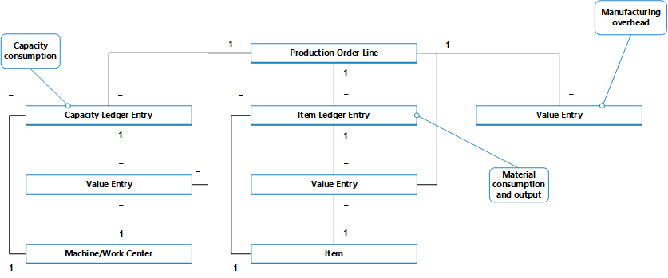

# Ontwerpdetails: Productieorderboeking
Net als bij assemblageorderboeking worden de verbruikte materialen en de gebruikte computertijd omgezet en uitgevoerd als het geproduceerde artikel wanneer de productieorder is voltooid. Zie [Ontwerpdetails: assemblageorderboeking](design-details-assembly-order-posting.md) voor meer informatie. De kostenstroom voor assemblageorders is echter minder complex, met name omdat de assemblagekostenboeking slechts eenmaal plaatsvindt en daarom geen OHW-voorraad genereert.

Transacties die optreden tijdens het productieproces, kunnen worden gevolgd door de volgende fasen:  

1.  Inkoop van materialen en andere productie-input.  
2.  Omzetting in onderhanden werk.  
3.  Omzetting in eindproductvoorraad.  
4.  Verkoop van eindproducten.  

Afgezien van reguliere voorraadrekeningen moet een productiebedrijf daarom drie afzonderlijke voorraadrekeningen instellen om transacties vast te leggen op verschillende productiemomenten.  

|Voorraadrekening|Description|  
|-----------------------|---------------------------------------|  
|**Grondstoffenrekening**|Bevat de kosten van grondstoffen die zijn ingekocht maar nog niet zijn overgebracht naar productie. Het saldo in de grondstoffenrekening geeft de kosten aan van de grondstoffen op voorraad.   Wanneer grondstoffen naar de productieafdeling worden verplaatst, worden de kosten van de materialen uit de grondstoffenrekening overgenomen naar de OHW-rekening.|  
|**OHW-rekening (onderhanden werk)**|Telt de kosten tijdens de productie in de boekhoudperiode op. De OHW-rekening wordt gedebiteerd voor de kostprijs van grondstoffen die worden overgebracht van het magazijn met grondstoffen, de kosten van directe lonen en de opgelopen productieoverheadkosten.   De OHW-rekening wordt gecrediteerd voor de totale productiekosten van de eenheden die zijn voltooid in de fabriek en overgebracht naar het magazijn met eindproducten.|  
|**Eindproductrekening**|Deze rekening bevat de totale productiekosten van de eenheden die zijn voltooid maar nog niet zijn verkocht. Op het moment van verkoop worden de kosten van verkochte eenheden overgebracht van de eindproductrekening naar de KPV-kostenrekening.|  

De voorraadwaarde wordt berekend door de kosten van alle toenames en afnames te volgen, zoals wordt uitgedrukt door de volgende vergelijking:  

* voorraadwaarde = beginsaldo van voorraad + waarde van alle toenames - waarde van alle afnames  

Afhankelijk van de soort voorraad, worden toenames en afnames aangeduid door verschillende transacties.  

||Verhogen|Verlagen|  
|-|---------------|---------------|  
|**Voorraad grondstoffen**|-   Netto-inkopen van materiaal -   Output van subassemblages -   Negatief verbruik|Materiaalverbruik|  
|**OHW-voorraad**|-   Materiaalverbruik -   Capaciteitverbruik -   Productieoverhead|Output van eindproducten (kostprijs van vervaardigde goederen)|  
|**Voorraad eindproducten**|Output van eindproducten (kostprijs van vervaardigde goederen)|-   Verkoop (kosten van verkochte goederen) -   Negatieve output|  
|**Voorraad grondstoffen**|-   Netto-inkopen van materiaal -   Output van subassemblages -   Negatief verbruik|Materiaalverbruik|  

De waarden van toenames en afnames worden in de verschillende soorten geproduceerde voorraad op dezelfde manier vastgelegd als voor aangeschafte voorraad. Elke keer dat er een transactie van positieve of negatieve voorraadmutatie plaatsvindt, worden een artikelpost en een corresponderende grootboekpost gemaakt voor de hoeveelheid. Zie [Ontwerpdetails: Voorraadboeking](design-details-inventory-posting.md) voor meer informatie.  

Hoewel de waarden van transacties die zijn gerelateerd aan aangeschafte goederen, alleen worden geboekt als artikelposten met gerelateerde waardeposten, worden transacties die gerelateerd zijn aan geproduceerde artikelen, geboekt als capaciteitsposten met gerelateerde waardeposten, naast de artikelposten.  

## Boekingsstructuur  
Het boeken van productieorders naar OHW-voorraad betreft output, verbruik en capaciteit.  

Het volgende diagram bevat de betrokken boekingsroutines in codeunit 22.  

  

Het volgende diagram bevat de koppelingen tussen de resulterende posten en de kostenobjecten.  

  

De capaciteitspost beschrijft het capaciteitsverbruik in termen van tijdseenheden, terwijl de gerelateerde waardepost de waarde van het specifieke capaciteitsverbruik omschrijft.  

In de artikelpost wordt het materiaalverbruik of de output op basis van aantallen beschreven, terwijl de gerelateerde waardepost de waarde van dit specifieke materiaalverbruik of output beschrijft.  

Een waardepost die OHW-voorraadwaarde beschrijft, kan worden gekoppeld aan een van de volgende combinaties van kostenobjecten:  

-   Een productieorderregel, een afdeling of bewerkingsplaats, en een capaciteitspost.  
-   Een productieorderregel, een artikel en een artikelpost.  
-   Alleen een productieorderregel  

Voor meer informatie over hoe kosten van productie en assemblage worden geboekt naar het grootboek raadpleegt u [Ontwerpdetails: voorraadboeking](design-details-inventory-posting.md).  

## Capaciteitsboeking  
Output boeken vanuit de laatste productieorderbewerkingsplanregel leidt tot een capaciteitspost voor het eindartikel, naast de voorraadtoename ervan.  

 De capaciteitspost is een record van de tijd die is besteed om het artikel te produceren. De gerelateerde waardepost beschrijft de toename van de OHW-voorraadwaarde, hetgeen de waarde van de conversiekosten is. Zie voor meer informatie “Van het capaciteitsgrootboek” in [Ontwerpdetails: Rekeningen in het grootboek](design-details-accounts-in-the-general-ledger.md).  

## Kostprijsberekening voor productieorder  
 Voor het beheer van voorraad- en productiekosten moet een productiebedrijf de kosten van productieorders meten, omdat de vooraf bepaalde vaste verrekenprijs van elk geproduceerd artikel wordt gekapitaliseerd in de balans. Voor informatie over waarom geproduceerde artikelen de standaardwaarderingsmethode gebruiken raadpleegt u [Ontwerpdetails: waarderingsmethoden](design-details-costing-methods.md).  

> [!NOTE]  
>  In omgevingen die niet de standaardwaarderingsmethode gebruiken, worden de werkelijke kosten in plaats van de standaardkosten van geproduceerde artikelen gekapitaliseerd op de balans.  

De werkelijke kosten van een productieorder bestaan uit de volgende kostenonderdelen:  

-   Werkelijke materiaalkosten  
-   Werkelijke capaciteitskosten of uitbestedingskosten  
-   Productieoverhead  

Deze werkelijke kosten worden naar de productieorder geboekt en met de vaste verrekenprijs vergeleken om verschillen te berekenen. Verschillen worden berekend voor alle onderdelen van artikelkosten: grondstoffen, capaciteit, toeleverancier, capaciteitsoverhead en productieoverhead. De verschillen kunnen worden geanalyseerd om problemen, zoals bovenmatig afval bij verwerking, te bepalen.  

In standaardkostenomgevingen is de kostprijsberekening van een productieorder gebaseerd op het volgende mechanisme:  

1.  Wanneer het laatste bewerkingsplan wordt geboekt, worden de productieorderkosten naar de artikelpost geboekt en ingesteld op de verwachte kosten.  

    Deze kosten zijn gelijk aan het outputaantal dat wordt geboekt in het outputdagboek, vermenigvuldigd met de vaste verrekenprijs die van de artikelkaart wordt gekopieerd. De kosten worden behandeld als verwachte kosten tot de productieorder is voltooid. Zie [Ontwerpdetails: verwachte-kostenboeking](design-details-expected-cost-posting.md) voor meer informatie.  

    > [!NOTE]  
    >  Dit verschilt van assemblageorderboeking, waarbij altijd werkelijke kosten worden geboekt. Zie [Ontwerpdetails: assemblageorderboeking](design-details-assembly-order-posting.md) voor meer informatie.  
2.  Wanneer de productieorder is ingesteld op **Gereedgemeld**, wordt de order gefactureerd door de batchverwerking **Kostprijs herwaarderen - Artikelposten**. Hierdoor worden de totale kosten van de order berekend op basis van de standaardkosten van de verbruikte materialen en de capaciteit. De verschillen tussen de berekende vaste verrekenprijs en de werkelijke productiekosten worden berekend en geboekt.  

## Zie ook  
 [Ontwerpdetails: Voorraadwaardering](design-details-inventory-costing.md)   
 [Ontwerpdetails: Assemblageorderboeking](design-details-assembly-order-posting.md)  
 [Voorraadkosten beheren](finance-manage-inventory-costs.md) [Financiën](finance.md)  
 [Werken met Dynamics NAV](ui-work-product.md)

