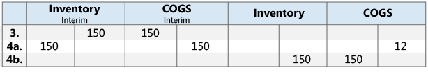
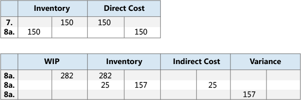
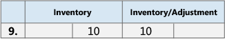

# Ontwerpdetails: Reconciliatie met het grootboek
Als u voorraadtransacties, zoals verkoopverzendingen, productie-output, of negatieve herwaarderingen boekt, worden de gewijzigde aantallen en waarden van de voorraad vastgelegd in de artikel- en waardeposten. Vervolgens boekt u de voorraadwaarden naar de voorraadrekeningen in het grootboek.  

Er zijn twee manieren om het voorraadgrootboek met het grootboek te reconciliëren:  

* Handmatig, door de batchverwerking **Voorraadwaarde boeken** uit te voeren.  
* Automatisch, telkens wanneer u een voorraadtransactie boekt.  

## Batchverwerking Voorraadwaarde boeken naar GB  
Wanneer u de batchverwerking **Voorraadwaarde boeken** uitvoert, worden de grootboekposten gemaakt op basis van waardeposten. U hebt de mogelijkheid grootboekposten samen te vatten voor elke waardepost, of grootboekposten te maken voor elke combinatie van boekingsdatum, vestigingscode, voorraadboekingsgroep, algemene bedrijfsboekingsgroep en algemene productboekingsgroep.  

De boekingsdatums van de grootboekposten worden ingesteld op de boekingsdatum van de bijbehorende waardepost, behalve wanneer de waardepost in een afgesloten boekhoudperiode valt. In dit geval wordt de waardepost overgeslagen en moet u de algemene grootboekinstelling of de gebruikersinstelling wijzigen om boeking in het datumbereik mogelijk te maken.  

Wanneer u de batchverwerking **Voorraadwaarde boeken** uitvoert, treden mogelijk fouten op met betrekking tot ontbrekende instellingen of incompatibele dimensie-instellingen. Als de batchverwerking fouten aantreft in de dimensie-instellingen, worden deze fouten overschreven en worden de dimensies van de waardepost gebruikt. De batchverwerking boekt geen waardeposten voor alle andere fouten en vermeldt deze aan het einde van de lijst in de sectie **Overgeslagen posten**. U dient de fouten te corrigeren om deze posten te kunnen boeken. Als u een lijst met fouten wilt weergeven voordat u de batchverwerking uitvoert, kunt u het rapport **Voorraadkosten naar GB boeken - Controle** uitvoeren. In deze lijst worden alle fouten vermeld die zijn opgetreden tijdens een controleboeking. U kunt de fouten corrigeren en dan de batchverwerking voor het boeken van voorraadkosten uitvoeren zonder posten over te slaan.  

## Autom. voorraadwaarde boeken  
Als u kostenboeking naar het grootboek wilt instellen die automatisch wordt uitgevoerd wanneer u een voorraadtransactie boekt, schakelt u het selectievakje **Autom. voorraadwaarde boeken** in het venster **Voorraadinstelling** in. De boekingsdatum van de grootboekpost is gelijk aan de boekingsdatum van de artikelpost.  

## Rekeningsoorten  
Tijdens reconciliatie worden voorraadwaarden geboekt naar de voorraadrekening in de balans. Hetzelfde bedrag, maar met het tegengestelde teken, wordt naar de relevante tegenrekening geboekt. Gewoonlijk is de tegenrekening een resultatenrekening. Wanneer u echter directe kosten boekt in verband met verbruik of output, is de tegenrekening een balansrekening. Het soort van de artikelpost en de waardepost bepaalt naar welke grootboekrekening wordt geboekt.  

Het boekingssoort geeft aan naar welke grootboekrekening moet worden geboekt. Dit wordt bepaald door of het teken van het aantal op de artikelpost of het gewaardeerde aantal op de waardepost, aangezien de aantallen altijd hetzelfde teken hebben. Een verkooppost met een positief aantal beschrijft bijvoorbeeld een negatieve voorraadmutatie als gevolg van een verkoop en een verkooppost met een negatief aantal beschrijft een positieve voorraadmutatie als gevolg van een verkoopretour.  

### Opmerking  
In het volgende voorbeeld wordt een fietsketting getoond die wordt geproduceerd van aangeschafte schakels. Dit voorbeeld geeft aan hoe de diverse grootboekrekeningsoorten in een typisch scenario worden gebruikt.  

Het selectievakje **Verw. kostprijs naar GB boeken** in het venster **Voorraadinstelling** is ingeschakeld en de volgende instelling is gedefinieerd.  

De volgende tabel toont hoe de koppeling op de artikelkaart is ingesteld.  

|Veld instellen|Waarde|  
|-----------------|-----------|  
|**Waarderingsmethode**|Standaard|  
|**Vaste verrekenprijs**|LV 1,00|  
|**Overheadtarief**|LV 0,02|  

De volgende tabel toont hoe de ketting op de artikelkaart is ingesteld.  

|Veld instellen|Waarde|  
|-----------------|-----------|  
|**Waarderingsmethode**|Standaard|  
|**Vaste verrekenprijs**|LV 150,00|  
|**Overheadtarief**|LV 25,00|  

De volgende tabel toont hoe de afdeling op de afdelingskaart is ingesteld.  

|Veld instellen|Waarde|  
|-----------------|-----------|  
|**Directe kostprijs**|LV 2,00|  
|**Indirecte kosten als percentage**|10|  

##### Scenario  
1. De gebruiker koopt 150 schakels en boekt de inkooporder als ontvangen. (Inkoop)  
2. De gebruiker boekt de inkooporder als gefactureerd. Hierdoor ontstaat een overheadbedrag van LV 3,00 dat moet worden toegewezen en een verschilbedrag van LV 18,00. (Inkoop)  

    1. De tussenrekeningen worden leeg gemaakt. (Inkoop)  
    2. De directe kosten worden geboekt. (Inkoop)  
    3. De indirecte kosten worden berekend en geboekt. (Inkoop)  
    4. Het inkoopverschil wordt berekend en geboekt (alleen voor artikelen met een vaste verrekenprijs). (Inkoop)  
3. De gebruiker verkoopt één ketting en boekt de verkooporder als verzonden. (Verkoop)  
4. De gebruiker boekt de verkooporder als gefactureerd. (Verkoop)  

    1. De tussenrekeningen worden leeg gemaakt. (Verkoop)  
    2. Kosten van verkochte goederen (KPV) worden geboekt. (Verkoop)  

          
5. De gebruiker boekt het verbruik van 150 schakels, wat het aantal schakels is dat wordt gebruikt om één ketting te genereren. (Verbruik, materiaal)  

      
6. De afdeling gebruikt 60 minuten om de ketting te genereren. De gebruiker boekt de conversiekosten. (Verbruik, Capaciteit)  

    1. De directe kosten worden geboekt. (Verbruik, Capaciteit)  
    2. De indirecte kosten worden berekend en geboekt. (Verbruik, Capaciteit)  

          
7. De gebruiker boekt de verwachte kosten van één ketting. (Output)  
8. De gebruiker eindigt de productieorder en voert de batchverwerking **Kostprijs herwaarderen - Artikelposten** uit. (Output)  

    1. De tussenrekeningen worden leeg gemaakt. (Output)  
    2. De directe kosten worden van de OHW-rekening overgemaakt naar de voorraadrekening. (Output)  
    3. De indirecte kosten (overhead) worden overgemaakt van de rekening voor indirecte kosten naar de voorraadrekening. (Output)  
    4. Dit resulteert in een verschilbedrag van LV 157,00. Verschillen worden alleen berekend voor artikelen met een vaste verrekenprijs. (Output)  

          

        > [!NOTE]  
        >  Omwille van de eenvoud wordt slechts één verschilrekening weergegeven. In werkelijkheid bestaan er vijf verschillende rekeningen:  
        >   
        >  * Materiaalverschil  
        >  * Capaciteitsverschil  
        >  * Verschillen cap.-overhead  
        >  * Uitbestedingsverschil  
        >  * Productieoverheadverschil  

9. De gebruiker herwaardeert de ketting van LV 150,00 naar LV 140,00. (Correctie/Herwaardering/Afronding/Transfer)  

      

Voor meer informatie over de relatie tussen de rekeningsoorten en de verschillende typen waardeposten raadpleegt u [Ontwerpdetails: rekeningen in het grootboek](design-details-accounts-in-the-general-ledger.md)  

## Zie ook  
[Ontwerpdetails: Voorraadwaardering](design-details-inventory-costing.md)   
[Ontwerpdetails: Verwachte kostenboeking](design-details-expected-cost-posting.md)   
[Ontwerpdetails: Kostenwaardering](design-details-cost-adjustment.md)
[Voorraadkosten beheren](finance-manage-inventory-costs.md)  
[Financiën](finance.md)  
[Werken met [!INCLUDE[d365fin](includes/d365fin_md.md)]](ui-work-product.md)

