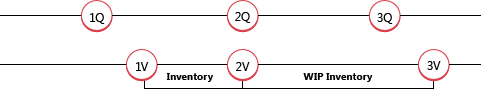

# Ontwerpdetails: Herwaardering
U kunt de voorraad herwaarderen op basis van de waarderingsbasis die de voorraadwaarde het nauwkeurigst weergeeft. U kunt een herwaardering ook antedateren , zodat de kostprijs van verkochte goederen (KPV) correct wordt bijgewerkt voor artikelen die al zijn verkocht. Artikelen die de waarderingsmethode Standaard gebruiken en die niet volledig zijn gefactureerd, kunnen ook worden geherwaardeerd.  

In [!INCLUDE[d365fin](includes/d365fin_md.md)] wordt de volgende flexibiliteit ondersteund met betrekking tot herwaardering:  

-   Het herwaardeerbare aantal kan voor elke datum opnieuw worden berekend, ook terug in de tijd.  
-   Voor artikelen waarvoor de standaardwaarderingsmethode wordt gebruikt, worden verwachte kosten opgenomen in de herwaardering.  
-   Negatieve voorraadmutaties die worden beïnvloed door herwaardering, worden gedetecteerd.  

## Het herwaardeerbare aantal berekenen  
 Het herwaardeerbare aantal is het resterende aantal op voorraad dat beschikbaar is voor herwaardering op een bepaald moment. Het wordt berekend als het totaal van de aantallen van volledig gefactureerde artikelposten met een boekingsdatum die gelijk is aan of eerder ligt dan de boekingsdatum van de herwaardering.  

> [!NOTE]  
>  Artikelen die de waarderingsmethode Standaard gebruiken, worden anders behandeld wanneer het herwaardeerbare aantal wordt berekend per artikel, vestiging en variant. De hoeveelheden en waarden van artikelposten die nog niet volledig zijn gefactureerd, worden opgenomen in het herwaardeerbare aantal.  

Nadat een herwaardering is geboekt, kunt u een positieve of een negatieve voorraadmutatie boeken met een boekingsdatum die vóór de herwaarderingboekingsdatum ligt. Dit aantal wordt echter niet beïnvloed door de herwaardering. Om de voorraad in evenwicht te brengen, wordt alleen rekening gehouden met het oorspronkelijke herwaardeerbare aantal.  

Omdat de herwaardering op elke datum kan worden uitgevoerd, moet u conventies hebben voor wanneer een artikel wordt beschouwd als deel van voorraad vanuit een financieel oogpunt. Wanneer het artikel bijvoorbeeld in voorraad is en wanneer het artikel onderhanden werk (WIP) is.  

### Opmerking  
In het volgende voorbeeld ziet u wanneer een OHW-artikel evolueert om deel van de voorraad te worden. Het voorbeeld is gebaseerd op de productie van een ketting met 150 schakels.  

  

**1A**: De gebruiker boekt de ingekochte schakels als ontvangen. De volgende tabel toont de resulterende artikelpost.  

|Boekingsdatum|Artikel|Boekingssoort|Aantal|Volgnummer|  
|------------------|----------|----------------|--------------|---------------|  
|01-01-20|KOPPELING|Inkoop|150|1|  

> [!NOTE]  
>  Nu is een artikel dat de waarderingsmethode Standaard gebruikt, beschikbaar voor herwaardering.  

**1W**: De gebruiker boekt de ingekochte schakels als gefactureerd en de schakels worden onderdeel van de voorraad, vanuit een financieel oogpunt. De volgende tabel toont de twee soorten resulterende waardeposten.  

|Boekingsdatum|Boekingssoort|Waarderingsdatum|Tot. werk. kosten|Artikelpostnr.|Volgnummer|  
|------------------|----------------|--------------------|----------------------------|---------------------------|---------------|  
|15-01-20|Directe kosten|01-01-20|150,00|1|1|  

 **2A + 2W**: De gebruiker boekt de ingekochte schakels als verbruikt voor de productie van de ijzeren ketting. Vanuit een financieel oogpunt worden de koppelingen een deel van OHW-voorraad.  De volgende tabel toont de resulterende artikelpost.  

|Boekingsdatum|Artikel|Boekingssoort|Aantal|Volgnummer|  
|------------------|----------|----------------|--------------|---------------|  
|01-02-20|KOPPELING|Verbruik|-150|1|  

De volgende tabel toont de resulterende waardepost.  

|Boekingsdatum|Boekingssoort|Waarderingsdatum|Tot. werk. kosten|Artikelpostnr.|Volgnummer|  
|------------------|----------------|--------------------|----------------------------|---------------------------|---------------|  
|01-02-20|Directe kosten|01-02-20|-150,00|2|2|  

De waarderingsdatum wordt ingesteld op de datum van de verbruikboeking (01-02-20), als reguliere negatieve voorraadmutatie.  

**3A**: De gebruiker boekt de ketting als output en beëindigt de productieorder. De volgende tabel toont de resulterende artikelpost.  

|Boekingsdatum|Artikel|Boekingssoort|Aantal|Postnr.|  
|------------------|----------|----------------|--------------|---------------|  
|15-02-20|KETTING|Output|0|3|  

**3W:** de gebruiker voert de batchverwerking **Kostprijs herwaarderen - Artikelposten** uit, waarmee de keten wordt geboekt als gefactureerd om aan te geven dat alle materiaalverbruik volledig is gefactureerd. Vanuit een financieel oogpunt zijn de koppelingen niet langer deel van OHW-voorraad wanneer de output volledig is gefactureerd en geherwaardeerd. De volgende tabel toont de twee soorten resulterende waardeposten.  

|Boekingsdatum|Boekingssoort|Waarderingsdatum|Tot. werk. kosten|Artikelpostnr.|Volgnummer|  
|------------------|----------------|--------------------|----------------------------|---------------------------|---------------|  
|15-01-20|Directe kosten|01-01-20|150,00|2|2|  
|01-02-20|Directe kosten|01-02-20|-150,00|2|2|  
|15-02-20|Directe kosten|15-02-20|150.00|3|3|  

## Verwachte kosten in herwaardering  
Het herwaardeerbare aantal XE "Herwaardeerbaar aantal" XE "Aantal;Herwaardeerbaar" wordt berekend als de som van aantal XE "aantal" voor compleet gefactureerde XE "Factuur" artikelposten XE "Artikelpost" met een boekingsdatum die gelijk is aan of eerder ligt dan de herwaarderingsdatum XE "Herwaardering". Dit betekent dat wanneer sommige artikelen zijn ontvangen/verzonden maar nog niet gefactureerd, hun voorraadwaarde niet kan worden berekend XE "Voorraadwaarde". Artikelen die de waarderingsmethode Standaard gebruiken, zijn in dit opzicht niet beperkt. XE "Waarde"  

> [!NOTE]  
>  Een ander soort verwachte kosten dat kan worden geherwaardeerd is OHW-voorraad, binnen bepaalde regels. Zie het onderdeel “OHW-voorraadherwaardering” in dit onderwerp voor meer informatie.  

Bij de berekening van het herwaardeerbare aantal voor artikelen met de waarderingsmethode Standaard, worden artikelposten die nog niet volledig zijn gefactureerd, meegenomen in de berekening. Deze posten worden vervolgens bijgewerkt wanneer u de herwaardering boekt. Wanneer u de geherwaardeerde post factureert, worden de volgende waardeposten gemaakt:  

-   De gebruikelijke gefactureerde waardepost met de boekingssoort **Directe kosten**. Het kostenbedrag van deze post is de directe kosten van de bronregel.  
-   Een waardepost met de boekingssoort **Verschil**. Met deze post wordt het verschil tussen de gefactureerde kosten en de geherwaardeerde vaste verrekenprijs vastgelegd.  
-   Een waardepost met de boekingssoort **Herwaardering**. Met deze post wordt de tegenboeking van de herwaardering van de verwachte kosten vastgelegd.  

### Opmerking  
Het volgende voorbeeld, dat is gebaseerd op de productie van de ketting in het vorige voorbeeld, laat zien hoe de drie soorten posten worden gemaakt. Het is gebaseerd op het volgende scenario:  

1.  De gebruiker boekt de ingekochte schakels als ontvangen met een kostprijs van LV 2,00.  
2.  De gebruiker boekt vervolgens een herwaardering van de schakels met een nieuwe kostprijs van LV 3,00, waarmee de vaste verrekenprijs wordt bijgewerkt naar LV 3,00.  
3.  De gebruiker boekt de oorspronkelijke inkoop van de schakels als gefactureerd. Dit levert dan het volgende op:  

    1.  Een gefactureerde waardepost met de boekingssoort **Directe kosten**.  
    2.  Een waardepost met de boekingssoort **Herwaardering** om de tegenboeking vast te leggen van de herwaardering van de verwachte kosten.  
    3.  Een waardepost met de boekingssoort Verschil, waarmee het verschil wordt vastgelegd tussen de gefactureerde kosten en de geherwaardeerde standaardkosten.  
De volgende tabel toont de twee soorten resulterende waardeposten.  

|Stap|Boekingsdatum|Boekingssoort|Waarderingsdatum|Tot. verw. kosten|Tot. werk. kosten|Artikelpostnr.|Volgnummer|  
|----------|------------------|----------------|--------------------|------------------------------|----------------------------|---------------------------|---------------|  
|1.|15-01-20|Directe kosten|15-01-20|300,00|  0.00|1|1|  
|2.|20-01-20|Herwaardering|20-01-20|150,00|  0.00|1|2|  
|3.a.|15-01-20|Directe kosten|15-01-20|-300,00|  0.00|1|3|  
|3.b.|15-01-20|Herwaardering|20-01-20|-150,00|  0.00|1|4|  
|3.c.|15-01-20|Verschil|15-01-20|  0.00|450,00|1|5|  

## Bepalen of een negatieve voorraadmutatie wordt beïnvloed door herwaardering  
De datum van de boeking of de herwaardering wordt gebruikt om te bepalen of een negatieve voorraadmutatie wordt beïnvloed door een herwaardering.  

De volgende tabel toont de criteria die worden gebruikt voor een artikel die de waarderingsmethode Gemiddeld niet gebruikt.  

|Scenario|Volgnummer|Tijd|Beïnvloed door herwaardering|  
|--------------|---------------|------------|-----------------------------|  
|A|Eerder dan herwaarderingpostnummer|Eerder dan herwaarderingboekingsdatum|Nee|  
|B|Eerder dan herwaarderingspost nr.|Gelijk aan herwaarderingboekingsdatum|Nee|  
|L|Eerder dan herwaarderingspost nr.|Later dan herwaarderingboekingsdatum|Ja|  
|D|Later dan herwaarderingspost nr.|Eerder dan herwaarderingboekingsdatum|Ja|  
|O|Later dan herwaarderingspost nr.|Gelijk aan herwaarderingboekingsdatum|Ja|  
|V|Later dan herwaarderingspost nr.|Later dan herwaarderingboekingsdatum|Ja|  

### Opmerking  
Het volgende voorbeeld, dat herwaardering toont van een artikel dat de waarderingsmethode FIFO gebruikt, is gebaseerd op het volgende scenario:  

1.  Op 01-01-20 boekt de gebruiker een verkoop van 6 eenheden.  
2.  Op 02-01-20 boekt de gebruiker een verkoop van 1 eenheid.  
3.  Op 01-03-20 boekt de gebruiker een verkoop van 1 eenheid.  
4.  Op 01-04-20 boekt de gebruiker een verkoop van 1 eenheid.  
5.  Op 03-01-20 berekent de gebruiker de voorraadwaarde van het artikel en boekt deze een herwaardering van de kostprijs van het artikel van LV 10,00 naar LV 8,00.  
6.  Op 02-01-20 boekt de gebruiker een verkoop van 1 eenheid.  
7.  Op 01-03-20 boekt de gebruiker een verkoop van 1 eenheid.  
8.  Op 01-04-20 boekt de gebruiker een verkoop van 1 eenheid.  
9. De gebruiker voert de batchverwerking **Kostprijs herwaarderen - Artikelposten** uit.  

De volgende tabel toont de twee soorten resulterende waardeposten.  

|Scenario|Boekingsdatum|Boekingssoort|Waarderingsdatum|Gewaardeerd aantal|Tot. werk. kosten|Artikelpostnr.|Volgnummer|  
|--------------|------------------|----------------|--------------------|---------------------|----------------------------|---------------------------|---------------|  
||01-01-20|Inkoop|01-01-20|6|60.00|1|1|  
||01-03-20|Herwaardering|01-03-20|4|-8,00|1|5|  
|A|01-02-20|Verkoop|01-02-20|-1|-10,00|2|2|  
|B|01-03-20|Verkoop|01-03-20|-1|-10,00|3|3|  
|L|01-04-20|Verkoop|01-04-20|-1|-10,00|4|4|  
||01-04-20|Verkoop|01-04-20|-1|2.00|4|9|  
|D|01-02-20|Verkoop|01-03-20|-1|-10,00|5|6|  
||01-02-20|Verkoop|01-03-20|-1|2.00|5|10|  
|O|01-03-20|Verkoop|01-03-20|-1|-10,00|6|7|  
||01-03-20|Verkoop|01-03-20|-1|2.00|6|11|  
|V|01-04-20|Verkoop|01-04-20|-1|-10,00|7|8|  
||01-04-20|Verkoop|01-04-20|-1|2.00|7|12|  

## OHW-voorraadherwaardering  
Herwaardering van OHW-voorraad impliceert het herwaarderen van onderdelen die zijn geregistreerd als deel van OHW-voorraad op het moment van de herwaardering.  

Het is daarom belangrijk om conventies te definiëren over wanneer een artikel als deel van de OHW-voorraad wordt beschouwd vanuit een financieel oogpunt. In [!INCLUDE[d365fin](includes/d365fin_md.md)], bestaan de volgende conventies:  

-   Een ingekocht onderdeel wordt een deel van de grondstoffenvoorraad vanaf het moment dat een inkoop als gefactureerd wordt geboekt.  
-   Een ingekocht onderdeel of onderdeel via subassemblage wordt een deel van de OHW-voorraad vanaf het moment van boeking van het verbruik in verband met een productieorder.  
-   Een ingekocht onderdeel of onderdeel via subassemblage blijft deel van de OHW-voorraad totdat een productieorder (geproduceerd artikel) wordt gefactureerd.  

De manier waarop de herwaarderingsdatum van de waardepost van verbruik is ingesteld, volgt dezelfde regels als bij niet-OHW-voorraad. Zie meer informatie het onderwerp "Bepalen of een negatieve voorraadmutatie wordt beïnvloed door herwaardering" in dit onderwerp.  

OHW-voorraad kan worden geherwaardeerd zolang de herwaarderingsdatum niet na de boekingsdatum van de bijbehorende artikelposten van het soort Verbruik valt, en zolang de betreffende productieorder nog niet is gefactureerd.  

> [!CAUTION]  
>  De lijst **Voorraadwaardering - OHW** toont de waarde van de geboekte productieorderposten en kan daarom een beetje verwarrend zijn voor OHW-artikelen die opnieuw zijn gewaardeerd.  

## Zie ook  
 [Ontwerpdetails: Voorraadwaardering](design-details-inventory-costing.md)   
 [Ontwerpdetails: Waarderingsmethoden](design-details-costing-methods.md)   
 [Ontwerpdetails: Voorraadwaardering](design-details-inventory-valuation.md) [Voorraadkosten beheren](finance-manage-inventory-costs.md)  
 [Financiën](finance.md)  
 [Werken met [!INCLUDE[d365fin](includes/d365fin_md.md)]](ui-work-product.md)

