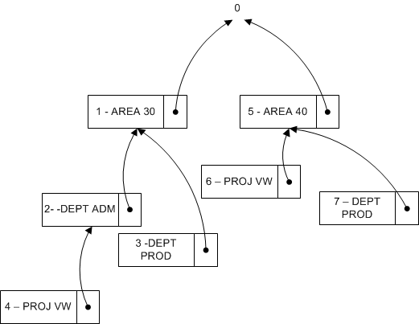

# <a name="design-details-searching-for-dimension-combinations"></a>Ontwerpdetails: Dimensiecombinaties zoeken
Wanneer u een venster sluit nadat u een dimensieset hebt bewerkt, evalueert [!INCLUDE[d365fin](includes/d365fin_md.md)] of de bewerkte dimensieset bestaat. Als de verzameling niet bestaat, wordt een nieuwe verzameling gemaakt en wordt de dimensiecombinatie-id geretourneerd.  

## <a name="building-search-tree"></a>Zoekactiestructuur opzetten  
 Tabel 481 **Boomstructuurpunt dimensieset** wordt gebruikt wanneer [!INCLUDE[d365fin](includes/d365fin_md.md)] evalueert of een set dimensies al bestaat in tabel 480 **Dimensiesetpost**. De evaluatie wordt uitgevoerd doordat de zoekstructuur recursief wordt doorlopen vanaf het hoogste niveau met nummer 0. Hoogste niveau 0 staat voor een dimensieset zonder dimensiesetposten. De onderliggende elementen van deze dimensieset vertegenwoordigen dimensiesets met slechts één dimensiesetpost. De onderliggende elementen van deze dimensiesets vertegenwoordigen dimensiesets met twee onderliggende elementen, enzovoort.  

### <a name="example-1"></a>Voorbeeld 1  
 Het volgende diagram vertegenwoordigt een zoekactiestructuur met zes dimensiesets. Alleen de onderscheidende dimensiesetpost wordt weergegeven in het diagram.  

   

 In de volgende tabel wordt een volledig overzicht beschreven van dimensiesetposten waaruit elke dimensieset bestaan.  

|Dimensiesets|Dimensiesetposten|  
|--------------------|---------------------------|  
|Set 0|Geen|  
|Set 1|AREA 30|  
|Set 2|AREA 30, DEPT ADM|  
|Set 3|AREA 30, DEPT PROD|  
|Set 4|AREA 30, DEPT ADM, PROJ VW|  
|Set 5|AREA 40|  
|Set 6|AREA 40, PROJ VW|  

### <a name="example-2"></a>Voorbeeld 2  
 Dit voorbeeld geeft aan hoe [!INCLUDE[d365fin](includes/d365fin_md.md)] evalueert of een dimensieset die bestaat uit de dimensiesetposten AREA 40, DEPT PROD bestaat.  

 Eerst werkt [!INCLUDE[d365fin](includes/d365fin_md.md)] ook de tabel **Boomstructuurpunt dimensieset** bij om ervoor te zorgen dat de zoekstructuur lijkt op het volgende diagram. Zodoende wordt dimensieset 7 een onderliggend niveau van dimensieset 5.  

   

### <a name="finding-dimension-set-id"></a>Dimensieset-id zoeken  
 Op conceptueel niveau zijn **Hoofd-id**, **Dimensie** en **Dimensiewaarde** in de zoekstructuur gecombineerd en gebruikt als de primaire sleutel omdat [!INCLUDE[d365fin](includes/d365fin_md.md)] de structuur doorloopt in dezelfde volgorde als de dimensieposten. De functie GET (record) wordt gebruikt om te zoeken naar dimensieset-id. In het volgende codevoorbeeld wordt aangegeven hoe u de dimensieset-id kunt vinden als er drie dimensiewaarden zijn.  

```  
DimSet."Parent ID" := 0;  // 'root'  
IF UserDim.FINDSET THEN  
  REPEAT  
      DimSet.GET(DimSet."Parent ID",UserDim.DimCode,UserDim.DimValueCode);  
  UNTIL UserDim.NEXT = 0;  
EXIT(DimSet.ID);  

```  

 Om het vermogen van [!INCLUDE[d365fin](includes/d365fin_md.md)] te behouden om een dimensie en dimensiewaarde te kunnen hernoemen wordt tabel 348 **Dimensiewaarde** uitgebreid met een geheelgetalveld genaamd **Dimensiewaarde-id**. In deze tabel wordt het veldpaar **Dimensie** en **Dimensiewaarde** omgezet in een geheel getal. Wanneer u de naam van de dimensie en dimensiewaarde wijzigt, wordt de waarde voor het gehele getal niet gewijzigd.  

```  
DimSet."Parent ID" := 0;  // 'root'  
IF UserDim.FINDSET THEN  
  REPEAT  
      DimSet.GET(DimSet.ParentID,UserDim."Dimension Value ID");  
  UNTIL UserDim.NEXT = 0;  
EXIT(DimSet.ID);  

```  

## <a name="see-also"></a>Zie ook  
 [GET-functie (record)](https://msdn.microsoft.com/en-us/library/dd301056.aspx)    
 [Ontwerpdetails: Dimensiesetposten](design-details-dimension-set-entries.md)   
 [Dimensiesetposten - overzicht](design-details-dimension-set-entries-overview.md)   
 [Ontwerpdetails: Tabelstructuur](design-details-table-structure.md)   
 [Ontwerpdetails: Codeunit 408 Dimensiebeheer](design-details-codeunit-408-dimension-management.md)   
 [Ontwerpdetails: Codevoorbeelden van gewijzigde patronen in wijzigingen](design-details-code-examples-of-changed-patterns-in-modifications.md)

