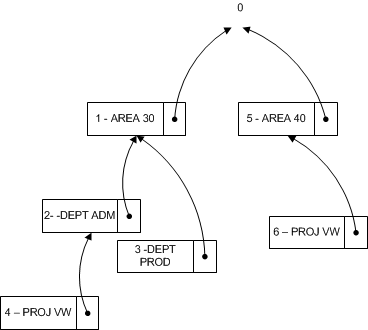

# <a name="design-details-searching-for-dimension-combinations"></a><span data-ttu-id="78d0c-104">Ontwerpdetails: Dimensiecombinaties zoeken</span><span class="sxs-lookup"><span data-stu-id="78d0c-104">Design Details: Searching for Dimension Combinations</span></span>
<span data-ttu-id="78d0c-105">Wanneer u een venster sluit nadat u een dimensieset hebt bewerkt, evalueert [!INCLUDE[d365fin](includes/d365fin_md.md)] of de bewerkte dimensieset bestaat.</span><span class="sxs-lookup"><span data-stu-id="78d0c-105">When you close a window after you edit a set of dimensions, [!INCLUDE[d365fin](includes/d365fin_md.md)] evaluates whether the edited set of dimensions exists.</span></span> <span data-ttu-id="78d0c-106">Als de verzameling niet bestaat, wordt een nieuwe verzameling gemaakt en wordt de dimensiecombinatie-id geretourneerd.</span><span class="sxs-lookup"><span data-stu-id="78d0c-106">If the set does not exist, a new set is created and the dimension combination ID is returned.</span></span>  

## <a name="building-search-tree"></a><span data-ttu-id="78d0c-107">Zoekactiestructuur opzetten</span><span class="sxs-lookup"><span data-stu-id="78d0c-107">Building Search Tree</span></span>  
 <span data-ttu-id="78d0c-108">Tabel 481 **Boomstructuurpunt dimensieset** wordt gebruikt wanneer [!INCLUDE[d365fin](includes/d365fin_md.md)] evalueert of een set dimensies al bestaat in tabel 480 **Dimensiesetpost**.</span><span class="sxs-lookup"><span data-stu-id="78d0c-108">Table 481 **Dimension Set Tree Node** is used when [!INCLUDE[d365fin](includes/d365fin_md.md)] evaluates whether a set of dimensions already exists in table 480 **Dimension Set Entry** table.</span></span> <span data-ttu-id="78d0c-109">De evaluatie wordt uitgevoerd doordat de zoekstructuur recursief wordt doorlopen vanaf het hoogste niveau met nummer 0.</span><span class="sxs-lookup"><span data-stu-id="78d0c-109">The evaluation is performed by recursively traversing the search tree starting at the top level numbered 0.</span></span> <span data-ttu-id="78d0c-110">Hoogste niveau 0 staat voor een dimensieset zonder dimensiesetposten.</span><span class="sxs-lookup"><span data-stu-id="78d0c-110">The top level 0 represents a dimension set with no dimension set entries.</span></span> <span data-ttu-id="78d0c-111">De onderliggende elementen van deze dimensieset vertegenwoordigen dimensiesets met slechts één dimensiesetpost.</span><span class="sxs-lookup"><span data-stu-id="78d0c-111">The children of this dimension set represent dimension sets with only one dimension set entry.</span></span> <span data-ttu-id="78d0c-112">De onderliggende elementen van deze dimensiesets vertegenwoordigen dimensiesets met twee onderliggende elementen, enzovoort.</span><span class="sxs-lookup"><span data-stu-id="78d0c-112">The children of these dimension sets represent dimension sets with two children, and so on.</span></span>  

### <a name="example-1"></a><span data-ttu-id="78d0c-113">Voorbeeld 1</span><span class="sxs-lookup"><span data-stu-id="78d0c-113">Example 1</span></span>  
 <span data-ttu-id="78d0c-114">Het volgende diagram vertegenwoordigt een zoekactiestructuur met zes dimensiesets.</span><span class="sxs-lookup"><span data-stu-id="78d0c-114">The following diagram represents a search tree with six dimension sets.</span></span> <span data-ttu-id="78d0c-115">Alleen de onderscheidende dimensiesetpost wordt weergegeven in het diagram.</span><span class="sxs-lookup"><span data-stu-id="78d0c-115">Only the distinguishing dimension set entry is displayed in the diagram.</span></span>  

 <span data-ttu-id="78d0c-116"></span><span class="sxs-lookup"><span data-stu-id="78d0c-116"></span></span>  

 <span data-ttu-id="78d0c-117">In de volgende tabel wordt een volledig overzicht beschreven van dimensiesetposten waaruit elke dimensieset bestaan.</span><span class="sxs-lookup"><span data-stu-id="78d0c-117">The following table describes a complete list of dimension set entries that make up each dimension set.</span></span>  

|<span data-ttu-id="78d0c-118">Dimensiesets</span><span class="sxs-lookup"><span data-stu-id="78d0c-118">Dimension Sets</span></span>|<span data-ttu-id="78d0c-119">Dimensiesetposten</span><span class="sxs-lookup"><span data-stu-id="78d0c-119">Dimension Set Entries</span></span>|  
|--------------------|---------------------------|  
|<span data-ttu-id="78d0c-120">Set 0</span><span class="sxs-lookup"><span data-stu-id="78d0c-120">Set 0</span></span>|<span data-ttu-id="78d0c-121">Geen</span><span class="sxs-lookup"><span data-stu-id="78d0c-121">None</span></span>|  
|<span data-ttu-id="78d0c-122">Set 1</span><span class="sxs-lookup"><span data-stu-id="78d0c-122">Set 1</span></span>|<span data-ttu-id="78d0c-123">AREA 30</span><span class="sxs-lookup"><span data-stu-id="78d0c-123">AREA 30</span></span>|  
|<span data-ttu-id="78d0c-124">Set 2</span><span class="sxs-lookup"><span data-stu-id="78d0c-124">Set 2</span></span>|<span data-ttu-id="78d0c-125">AREA 30, DEPT ADM</span><span class="sxs-lookup"><span data-stu-id="78d0c-125">AREA 30, DEPT ADM</span></span>|  
|<span data-ttu-id="78d0c-126">Set 3</span><span class="sxs-lookup"><span data-stu-id="78d0c-126">Set 3</span></span>|<span data-ttu-id="78d0c-127">AREA 30, DEPT PROD</span><span class="sxs-lookup"><span data-stu-id="78d0c-127">AREA 30, DEPT PROD</span></span>|  
|<span data-ttu-id="78d0c-128">Set 4</span><span class="sxs-lookup"><span data-stu-id="78d0c-128">Set 4</span></span>|<span data-ttu-id="78d0c-129">AREA 30, DEPT ADM, PROJ VW</span><span class="sxs-lookup"><span data-stu-id="78d0c-129">AREA 30, DEPT ADM, PROJ VW</span></span>|  
|<span data-ttu-id="78d0c-130">Set 5</span><span class="sxs-lookup"><span data-stu-id="78d0c-130">Set 5</span></span>|<span data-ttu-id="78d0c-131">AREA 40</span><span class="sxs-lookup"><span data-stu-id="78d0c-131">AREA 40</span></span>|  
|<span data-ttu-id="78d0c-132">Set 6</span><span class="sxs-lookup"><span data-stu-id="78d0c-132">Set 6</span></span>|<span data-ttu-id="78d0c-133">AREA 40, PROJ VW</span><span class="sxs-lookup"><span data-stu-id="78d0c-133">AREA 40, PROJ VW</span></span>|  

### <a name="example-2"></a><span data-ttu-id="78d0c-134">Voorbeeld 2</span><span class="sxs-lookup"><span data-stu-id="78d0c-134">Example 2</span></span>  
 <span data-ttu-id="78d0c-135">Dit voorbeeld geeft aan hoe [!INCLUDE[d365fin](includes/d365fin_md.md)] evalueert of een dimensieset die bestaat uit de dimensiesetposten AREA 40, DEPT PROD bestaat.</span><span class="sxs-lookup"><span data-stu-id="78d0c-135">This example shows how [!INCLUDE[d365fin](includes/d365fin_md.md)] evaluates whether a dimension set that consists of the dimension set entries AREA 40, DEPT PROD exists.</span></span>  

 <span data-ttu-id="78d0c-136">Eerst werkt [!INCLUDE[d365fin](includes/d365fin_md.md)] ook de tabel **Boomstructuurpunt dimensieset** bij om ervoor te zorgen dat de zoekstructuur lijkt op het volgende diagram.</span><span class="sxs-lookup"><span data-stu-id="78d0c-136">First, [!INCLUDE[d365fin](includes/d365fin_md.md)] also updates the **Dimension Set Tree Node** table to make sure that the search tree looks like the following diagram.</span></span> <span data-ttu-id="78d0c-137">Zodoende wordt dimensieset 7 een onderliggend niveau van dimensieset 5.</span><span class="sxs-lookup"><span data-stu-id="78d0c-137">Thus dimension set 7 becomes a child of the dimension set 5.</span></span>  

 <span data-ttu-id="78d0c-138"></span><span class="sxs-lookup"><span data-stu-id="78d0c-138"></span></span>  

### <a name="finding-dimension-set-id"></a><span data-ttu-id="78d0c-139">Dimensieset-id zoeken</span><span class="sxs-lookup"><span data-stu-id="78d0c-139">Finding Dimension Set ID</span></span>  
 <span data-ttu-id="78d0c-140">Op conceptueel niveau zijn **Hoofd-id**, **Dimensie** en **Dimensiewaarde** in de zoekstructuur gecombineerd en gebruikt als de primaire sleutel omdat [!INCLUDE[d365fin](includes/d365fin_md.md)] de structuur doorloopt in dezelfde volgorde als de dimensieposten.</span><span class="sxs-lookup"><span data-stu-id="78d0c-140">At a conceptual level, **Parent ID**, **Dimension**, and **Dimension Value**, in the search tree, are combined and used as the primary key because [!INCLUDE[d365fin](includes/d365fin_md.md)] traverses the tree in the same order as the dimension entries.</span></span> <span data-ttu-id="78d0c-141">De functie GET (record) wordt gebruikt om te zoeken naar dimensieset-id.</span><span class="sxs-lookup"><span data-stu-id="78d0c-141">The GET function (record) is used to search for dimension set ID.</span></span> <span data-ttu-id="78d0c-142">In het volgende codevoorbeeld wordt aangegeven hoe u de dimensieset-id kunt vinden als er drie dimensiewaarden zijn.</span><span class="sxs-lookup"><span data-stu-id="78d0c-142">The following code example shows how to find the dimension set ID when there are three dimension values.</span></span>  

```  
DimSet."Parent ID" := 0;  // 'root'  
IF UserDim.FINDSET THEN  
  REPEAT  
      DimSet.GET(DimSet."Parent ID",UserDim.DimCode,UserDim.DimValueCode);  
  UNTIL UserDim.NEXT = 0;  
EXIT(DimSet.ID);  

```  

 <span data-ttu-id="78d0c-143">Om het vermogen van [!INCLUDE[d365fin](includes/d365fin_md.md)] te behouden om een dimensie en dimensiewaarde te kunnen hernoemen wordt tabel 348 **Dimensiewaarde** uitgebreid met een geheelgetalveld genaamd **Dimensiewaarde-id**.</span><span class="sxs-lookup"><span data-stu-id="78d0c-143">However, to preserve the ability of [!INCLUDE[d365fin](includes/d365fin_md.md)] to rename a dimension and dimension value, table 348 **Dimension Value** is extended with an integer field of **Dimension Value ID**.</span></span> <span data-ttu-id="78d0c-144">In deze tabel wordt het veldpaar **Dimensie** en **Dimensiewaarde** omgezet in een geheel getal.</span><span class="sxs-lookup"><span data-stu-id="78d0c-144">This table converts the field pair **Dimension** and **Dimension Value** to an integer value.</span></span> <span data-ttu-id="78d0c-145">Wanneer u de naam van de dimensie en dimensiewaarde wijzigt, wordt de waarde voor het gehele getal niet gewijzigd.</span><span class="sxs-lookup"><span data-stu-id="78d0c-145">When you rename the dimension and dimension value, the integer value is not changed.</span></span>  

```  
DimSet."Parent ID" := 0;  // 'root'  
IF UserDim.FINDSET THEN  
  REPEAT  
      DimSet.GET(DimSet.ParentID,UserDim."Dimension Value ID");  
  UNTIL UserDim.NEXT = 0;  
EXIT(DimSet.ID);  

```  

## <a name="see-also"></a><span data-ttu-id="78d0c-146">Zie ook</span><span class="sxs-lookup"><span data-stu-id="78d0c-146">See Also</span></span>  
 <span data-ttu-id="78d0c-147">[GET-functie (record)](https://msdn.microsoft.com/en-us/library/dd301056.aspx)  </span><span class="sxs-lookup"><span data-stu-id="78d0c-147">[GET Function (Record)](https://msdn.microsoft.com/en-us/library/dd301056.aspx)  </span></span>  
 <span data-ttu-id="78d0c-148">[Ontwerpdetails: Dimensiesetposten](design-details-dimension-set-entries.md) </span><span class="sxs-lookup"><span data-stu-id="78d0c-148">[Design Details: Dimension Set Entries](design-details-dimension-set-entries.md) </span></span>  
 <span data-ttu-id="78d0c-149">[Dimensiesetposten - overzicht](design-details-dimension-set-entries-overview.md) </span><span class="sxs-lookup"><span data-stu-id="78d0c-149">[Dimension Set Entries Overview](design-details-dimension-set-entries-overview.md) </span></span>  
 <span data-ttu-id="78d0c-150">[Ontwerpdetails: Tabelstructuur](design-details-table-structure.md) </span><span class="sxs-lookup"><span data-stu-id="78d0c-150">[Design Details: Table Structure](design-details-table-structure.md) </span></span>  
 <span data-ttu-id="78d0c-151">[Ontwerpdetails: Codeunit 408 Dimensiebeheer](design-details-codeunit-408-dimension-management.md) </span><span class="sxs-lookup"><span data-stu-id="78d0c-151">[Design Details: Codeunit 408 Dimension Management](design-details-codeunit-408-dimension-management.md) </span></span>  
 [<span data-ttu-id="78d0c-152">Ontwerpdetails: Codevoorbeelden van gewijzigde patronen in wijzigingen</span><span class="sxs-lookup"><span data-stu-id="78d0c-152">Design Details: Code Examples of Changed Patterns in Modifications</span></span>](design-details-code-examples-of-changed-patterns-in-modifications.md)

