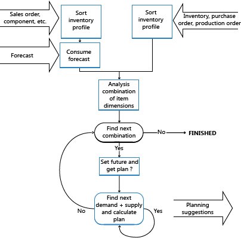

# Ontwerpdetails: Het concept sluitend maken in het kortDesign Details: The Concept of Balancing in Brief
Vraag is afkomstig van klanten van een bedrijf.Demand is given by a company’s customers. Voorziening is wat het bedrijf kan maken of verwijderen om te zorgen voor balans.Supply is what the company can create and remove to establish balance. Het planningssysteem begint met de onafhankelijke vraag en werkt vervolgens achterwaarts naar de voorziening.The planning system starts with the independent demand and then tracks backwards to the supply.  
  
 De voorraadprofielen worden gebruikt om gegevens te bevatten over de vraag en voorzieningen, aantallen en tijd.The inventory profiles are used to contain information about the demands and supplies, quantities, and timing. Deze profielen vormen in principe de twee zijden van de vereffeningsschaal.These profiles essentially make up the two sides of the balancing scale.  
  
 Het doel van het planningsmechanisme is om vraag en voorziening van een artikel op elkaar af te stemmen om te zorgen dat de voorziening voldoet aan de vraag op een haalbare manier zoals wordt bepaald door de planningsparameters en -regels.The objective of the planning mechanism is to counterbalance the demand and supply of an item to ensure that supply will match demand in a feasible way as defined by the planning parameters and rules.  
  
   
  
## Zie ookSee Also  
 [Ontwerpdetails: Vraag en aanbod afstemmen](design-details-balancing-demand-and-supply.md) [Design Details: Balancing Demand and Supply](design-details-balancing-demand-and-supply.md)   
 [Ontwerpdetails: Centrale begrippen van het planningssysteem](design-details-central-concepts-of-the-planning-system.md) [Design Details: Central Concepts of the Planning System](design-details-central-concepts-of-the-planning-system.md)   
 [Ontwerpdetails: VoorraadplanningDesign Details: Supply Planning](design-details-supply-planning.md)
