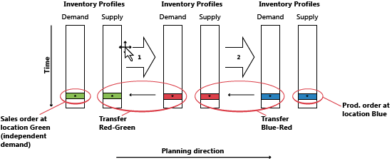
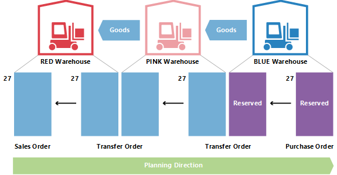

# Ontwerpdetails: Transfers in planningDesign Details: Transfers in Planning
Transferorders zijn ook een voorzieningenbron bij het werken op SKU-niveau.Transfer orders are also a source of supply when working at the SKU level. Als meerdere vestigingen (magazijnen) worden gebruikt, kan de SKU-aanvullingsmethode worden ingesteld op Transfer, wat aangeeft dat de vestiging wordt aangevuld door goederen van een andere vestiging over te brengen.When using multiple locations (warehouses), the SKU replenishment system can be set to Transfer, implying that the location is replenished by transferring goods from another location. In een situatie met meerdere magazijnen hebben bedrijven mogelijk een transferketen waarbij voorziening aan de GROENE vestiging wordt overgebracht vanuit GEEL, voorziening aan GEEL wordt overgebracht vanuit ROOD, enzovoort.In a situation with more warehouses, companies might have a chain of transfers where supply to GREEN location is transferred from YELLOW, and supply to YELLOW is transferred from RED and so on. Aan het begin van de keten is er een aanvullingssysteem Prod.-order of Inkoop.In the beginning of the chain, there is a replenishment system of Prod. Order or Purchase.  
  
  
  
Bij vergelijking van een situatie waarin een voorzieningenorder rechtstreeks betrekking heeft op een vraagorder, en een situatie waarin de verkooporder door een keten van SKU-transfers wordt geleverd, is het duidelijk dat de planningstaak in de laatste situatie erg complex kan worden.When comparing the situation where a supply order is directly facing a demand order to a situation where the sales order is supplied through a chain of SKU transfers, it is obvious that the planning task in the latter situation can become very complex. Als de vraag verandert, kan er een rimpelingseffect door de keten optreden, omdat alle transferorders plus de inkoop/productie-order aan het andere einde van de keten moet worden gemanipuleerd om weer evenwicht te krijgen tussen vraag en aanbod.If demand changes, it might cause a ripple effect through the chain, because all transfer orders plus the purchase/production order in the opposite end of the chain will have to be manipulated to reestablish balance between demand and supply.  
  
  
  
## Waarom is transfer een speciaal geval?Why is Transfer a Special Case?  
Een transferorder lijkt veel op andere orders in het programma.A transfer order looks much like any other order in the program. Achter de schermen ligt het echter heel anders.However, behind the scene it is very different.  
  
Eén belangrijk aspect waardoor transfers in planning verschillen van inkoop- en productieorders is dat een transferregel tegelijkertijd vraag en aanbod vertegenwoordigt.One fundamental aspect that makes transfers in planning different from purchase and production orders is that a transfer line represents demand and supply at the same time. Het uitgaande deel dat wordt verzonden vanuit de oude vestiging, is de vraag.The outbound part, which is shipped from the old location, is demand. Het inkomende deel, dat moet worden ontvangen bij de nieuwe vestiging, is voorziening op die vestiging.The inbound part, which is to be received at the new location, is supply at that location.  
  
  
  
Dit betekent dat wanneer het systeem de voorzieningenzijde van de transfer manipuleert, een vergelijkbare wijziging aan de vraagkant moet worden gemaakt.This means that when the system manipulates the supply side of the transfer, it must make a similar change on the demand side.  
  
## Transfers zijn afhankelijke vraagTransfers are Dependent Demand  
De gerelateerde vraag en voorziening komen overeen met onderdelen van een productieorderregel, maar het verschil is dat de onderdelen op het volgende planningsniveau staan en met een ander artikel, terwijl de twee delen van de transfer zich op hetzelfde niveau bevinden, voor hetzelfde artikel.The related demand and supply has some resemblance with components of a production order line, but the difference is that components will be on the next planning level and with a different item, whereas the two parts of the transfer is situated on the same level, for the same item.  
  
Een belangrijke overeenkomst is dat transfervraag net als onderdelen afhankelijk is van vraag.An important similarity is that just as components are dependent demand, so is the transfer demand. De vraag van een transferregel wordt bepaald door de voorzieningenzijde van de transfer: wanneer de voorziening wordt gewijzigd, wordt de vraag direct beïnvloed.The demand from a transfer line is dictated by the supply side of the transfer in the sense that if the supply is changed, the demand is directly affected.  
  
Een transferregel moet nooit worden verwerkt als onafhankelijke vraag in de planning, tenzij de planningsflexibiliteit Geen is.Unless the planning flexibility is None, a transfer line should never be treated as independent demand in planning.  
  
In de planningsprocedure moet alleen met transfervraag rekening worden gehouden nadat de aanbodzijde is verwerkt door het planningssysteem.In the planning procedure, the transfer demand should only be taken into account after the supply side has been processed by the planning system. Hiervoor is de werkelijke vraag niet bekend.Before this, the actual demand is not known. De volgorde van de aangebrachte wijzigingen is daarom erg belangrijk voor transferorders.The sequence of the changes made is therefore very important when it comes to transfer orders.  
  
## PlanningsvolgordePlanning Sequence  
De volgende illustratie toont hoe een reeks transfers eruit kan zien.The following illustration shows what a string of transfers could look like.  
  
  
  
In dit voorbeeld bestelt een klant het artikel op vestiging GROEN.In this example, a customer orders the item at location GREEN. Vestiging GROEN wordt voorzien via transfer uit het centrale magazijn ROOD.Location GREEN is supplied through transfer from the central warehouse RED. Het centrale magazijn ROOD wordt bevoorraad door transfer uit productie op vestiging BLAUW.The central warehouse RED is supplied by transfer from production on location BLUE.  
  
In dit voorbeeld start het planningssysteem de klantvraag en wordt achterwaarts door de keten gewerkt.In this example, the planning system will start at the customer demand and work its way backwards through the chain. De vragen en voorzieningen worden per vestiging verwerkt.The demands and supplies will be processed one location at a time.  
  
  
  
## TransferniveaucodeTransfer Level Code  
De volgorde waarin de vestigingen worden verwerkt in het planningssysteem, wordt bepaald door de transferniveaucode van de SKU.The sequence in which the locations are processed in the planning system is determined by the transfer level code of the SKU.  
  
De transferniveaucode is een intern veld dat automatisch wordt berekend en opgeslagen op de SKU wanneer de SKU wordt gemaakt of gewijzigd.The transfer level code is an internal field which is automatically calculated and stored on the SKU when SKU is created or modified. De berekening wordt uitgevoerd voor alle SKU's voor een bepaalde combinatie van artikelen/varianten en gebruikt de vestigingscode en transfercode (uit) om de route te bepalen die de planning moet gebruiken bij het doorlopen van de SKU's om te zorgen dat alle vragen worden verwerkt.The calculation runs across all SKUs for a given combination of Item/Variant and uses the location code and the transfer-from code to determine the route the planning will have to use when traversing through the SKUs to ensure that all demands are processed.  
  
De transferniveaucode is 0 voor SKU's met de aanvullingsmethode Inkoop of Productieorder, -1 voor het eerste transferniveau, -2 voor het tweede, enzovoort.The transfer level code will be 0 for SKUs with replenishment system Purchase or Prod. Order and will be -1 for the first transfer level, -2 for the second and so on. In de hierboven beschreven transferketen zouden de niveaus daarom zijn -1 voor ROOD en -2 voor GROEN, zoals aangegeven in de volgende illustratie.In the transfer chain described above, the levels would therefore be -1 for RED and -2 for GREEN, as shown in the following illustration.  
  
  
  
Tijdens het bijwerken van een SKU detecteert het planningssysteem of SKU's met de aanvullingsmethode Transfer zijn ingesteld met kringverwijzingen.When updating a SKU, the planning system will detect if SKUs with replenishment system Transfer are set up with circular references.  
  
## Planningstransfers zonder SKUPlanning Transfers without SKU  
  
Ook als de SKU-functie niet wordt gebruikt, is het mogelijk vestigingen te gebruiken en handmatige transfers tussen vestigingen uit te voeren.Even if the SKU feature is not used, it is possible to use locations and make manual transfers between locations. Voor bedrijven met minder geavanceerde magazijninstellingen ondersteunt het planningssysteem scenario's waarbij bestaande voorraad handmatig naar een andere vestiging wordt verplaatst, bijvoorbeeld voor een verkooporder in die vestiging.For companies with less advanced warehouse setup, the planning system supports scenarios where existing inventory is transferred manually to another location, for example to cover a sales order at that location. Tegelijkertijd moet het planningssysteem reageren op wijzigingen in de vraag.At the same time, the planning system should react to changes in the demand.  
  
Om handmatige transfers te ondersteunen, analyseert de planning bestaande transferorders en plant vervolgens de volgorde waarin de vestigingen moeten worden verwerkt.To support manual transfers, the planning will analyze existing transfer orders and then plan the order in which the locations should be processed. Intern zal het planningssysteem werken met tijdelijke SKU's met transferniveaucodes.Internally, the planning system will operate with temporary SKUs carrying transfer level codes.  
  
  
  
Als op een bepaalde vestiging meerdere transfers bestaan, definieert de eerste transferorder de planningsrichting.If more transfers to a given location exist, the first transfer order will define the planning direction. Transfers die in de tegengestelde richting lopen, worden geannuleerd.Transfers running in the opposite direction will be canceled.  
  
## Aantal met reserveringen wijzigenChanging Quantity with Reservations  
Bij het wijzigen van aantallen voor bestaande voorzieningen wordt in het planningssysteem in zoverre rekening gehouden met reserveringen dat het gereserveerde aantal de ondergrens aangeeft voor hoeveel de voorziening kan worden verminderd.When changing quantities on existing supply, the planning system takes reservations into account in the sense that the reserved quantity represents the lower limit for how much the supply can be reduced.  
  
Bij het wijzigen van het aantal op een bestaande transferorderregel moet u in gedachten houden dat de ondergrens wordt gedefinieerd als het hoogste gereserveerde aantal van de uitgaande en inkomende transferregel.When changing the quantity on an existing transfer order line, keep in mind that the lower limit will be defined as the highest reserved quantity of the outbound and inbound transfer line.  
  
Als een transferorderregel van 117 stuks bijvoorbeeld wordt gereserveerd op basis van een verkoopregel van 46 en een inkoopregel van 24, is het niet mogelijk de transferregel onder 46 stuks te verminderen, hoewel dit bovenmatig aanbod inhoudt aan de inkomende zijde.For example, if a transfer order line of 117 pieces is reserved against a sales line of 46 and a purchase line of 24, it is not possible to reduce the transfer line below 46 pieces even though this might represent excess supply on the inbound side.  
  
  
  
## Aantal in een transferketen wijzigenChanging Quantity in a Transfer Chain  
In het volgende voorbeeld is het beginpunt een evenwichtige situatie met een transferketen die een verkooporder van 27 levert op vestiging ROOD, met een corresponderende inkooporder op vestiging BLAUW, overgedragen via vestiging ROZE.In the following example, the starting point is a balanced situation with a transfer chain supplying a sales order of 27 on location RED with a corresponding purchase order on location BLUE, transferred via location PINK. Behalve verkoop en inkoop zijn er daarom twee transferorders: BLAUW-ROZE en ROZE-ROOD.Therefore, apart from sales and purchase, there are two transfer orders: BLUE-PINK and PINK-RED.  
  
  
  
Nu maakt de planner op de ROZE vestiging een reservering voor de inkoop.Now the planner at PINK location chooses to reserve against the purchase.  
  
  
  
Dit betekent doorgaans dat het planningssysteem de inkooporder en de transfervraag negeert.This usually means that the planning system will ignore the purchase order and the transfer demand. Zolang er saldo is, is er geen probleem.As long as there is balance, there is no problem. Maar wat gebeurt er wanneer de klant op de RODE vestiging zijn of haar order gedeeltelijk betreurt en wijzigt in 22?But what happens when the customer at RED location partly regrets his order and changes it to 22?  
  
  
  
Wanneer het planningssysteem opnieuw wordt uitgevoerd, moeten overtollige voorzieningen worden gewist.When the planning system runs again, it should get rid of excess supply. De reservering vergrendelt echter de inkoop en de transfer op een aantal van 27.However, the reservation will lock the purchase and the transfer to a quantity of 27.  
  
  
  
De ROZE-RODE transfer is gereduceerd tot 22.The PINK-RED transfer has been reduced to 22. Het inkomende deel van de BLAUW-ROZE transfer is niet gereserveerd, maar omdat het uitgaande deel wel gereserveerd is, is het niet mogelijk het aantal onder 27 te verminderen.The inbound part of the BLUE-PINK transfer is not reserved, but because the outbound part is reserved it is not possible to reduce the quantity below 27.  
  
## LevertermijnLead Time Calculation  
Bij de berekening van de vervaldatum van een transferorder wordt rekening gehouden met verschillende soorten doorlooptijd.When calculating the due date of a transfer order different kinds of lead time will be taken into account.  
  
De doorlooptijden die actief zijn bij het plannen van een transferorder zijn:The lead times that are active when planning a transfer order are:  
  
* Uitgaande magazijnverwerkingstijdOutbound Warehouse Handling Time  
* VerzendtijdShipping Time  
* Inkomende magazijnverwerkingstijdInbound Warehouse Handling Time  
* Op de planningsregel worden de volgende velden gebruikt om informatie over de berekening te geven.On the planning line, the following fields are used to provide information about the calculation.  
* TransferverzenddatumTransfer Shipment Date  
* BegindatumStarting Date  
* EinddatumEnding Date  
* VervaldatumDue Date  
  
De verzenddatum van de transferregel wordt in het veld Transferverzenddatum weergegeven, en de ontvangstdatum van de transferregel wordt in het veld Vervaldatum weergegeven.The shipment date of the transfer line will be shown in the Transfer Shipment Date field, and the receipt date of the transfer line will be shown in the Due Date field.  
  
De begin- en einddatum worden gebruikt om de werkelijke vervoersperiode te omschrijven.The starting and ending dates will be used to describe the actual transportation period.  
  
De volgende illustratie toont de interpretatie van de begindatum/-tijd en einddatum/-tijd op planningsregels die betrekking hebben op transferorders.The following illustration shows the interpretation of the starting date-time and ending date-time on planning lines related to transfer orders.  
  
  
  
In dit voorbeeld betekent dit het volgende:In this example, it means that:  
  
* Verzenddatum + Uitgaande verwerking = BegindatumShipment date + Outbound handling = Starting Date  
* Begindatum + Verzendtijd = EinddatumStarting Date + Shipping time = Ending Date  
* Einddatum + Inslagtijd = OntvangstdatumEnding Date + Inbound Handling = Receipt Date  
  
## VeiligheidstijdSafety Lead Time  
Het veld Std. veiligheidstijd in het venster Productie-instellingen en het gerelateerde veld Veiligheidstijd op de artikelkaart worden niet meegenomen in de berekening van een transferorder.The Default Safety Lead Time field in the Manufacturing Setup window and the related Safety Lead Time field on the item card will not be taken into account in the calculation of a transfer order. De veiligheidstijd beïnvloedt echter de totale planning zoals deze de aanvullingsorder (inkoop of productie) beïnvloedt aan het begin van de transferketen, wanneer de artikelen worden geplaatst in de vestiging van waaruit ze zullen worden overgedragen.However, the safety lead time will still influence the total plan like it will affect the replenishment order (purchase or production) in the beginning of the transfer chain when the items are put on the location from which they will be transferred.  
  
  
  
Op de productieorderregel: Einddatum + Veiligheidstijd + Inkomende magazijnverwerkingstijd = Vervaldatum.On the production order line, the Ending Date + Safety Lead Time + Inbound Warehouse Handling Time = Due Date.  
  
Op de inkooporderregel: Geplande ontvangstdatum + Veiligheidstijd + Inkomende magazijnverwerkingstijd = Verwachte ontvangstdatum.On the purchase order line, the Planned Receipt Date + Safety Lead Time + Inbound Warehouse Handling Time = Expected Receipt Date.  
  
## HerplannenReschedule  
Bij het opnieuw plannen van een bestaande transferregel moet het planningssysteem het uitgaande deel opzoeken en de datum-tijdwaarde ervan wijzigen.When rescheduling an existing transfer line, the planning system must look up the outbound part and change the date-time on this. Het is belangrijk te weten dat als doorlooptijd is gedefinieerd, er een periode zit tussen de verzending en de ontvangst.It is important to note that if lead time has been defined, there will be a gap between the shipment and the receipt. Zoals gezegd, kan de looptijd bestaan uit meer elementen, zoals de transporttijd en de magazijnverwerkingstijd.As mentioned, the lead time can consist of more elements, such as transportation time and warehouse handling time. Op een tijdpad zal het planningssysteem terug in de tijd gaan terwijl de elementen worden afgestemd.On a time line, the planning system will move back in time while it balances the elements.  
  
  
  
Wanneer de vervaldatum op een transferregel wordt gewijzigd, moet daarom de doorlooptijd worden berekend om de uitgaande kant van de transfer bij te werken.Therefore, when changing the due date on a transfer line, the lead time must be calculated in order to update the outbound side of the transfer.  
  
## Serie-/lotnummers in transferketensSerial/Lot Numbers in Transfer Chains  
Als de vraag serie-/lotnummers heeft en de planningengine wordt uitgevoerd, leidt dit tot enkele directe gemaakte transferorders.If the demand carries serial/lot numbers, and the planning engine is run, it will give rise to some directly created transfer orders. Voor meer informatie over dit concept raadpleegt u Artikelkenmerken.For more information about this concept, see Item Attributes. Als echter serie-/lotnummers worden verwijderd uit de vraag, hebben de aangemaakte transferorders in de keten nog steeds serie-/lotnummers en worden ze dus genegeerd door de planning (niet verwijderd).If, however, serial/lot numbers are removed from the demand, the created transfer orders in the chain will still carry the serial/lot numbers and will therefore be ignored by planning (not deleted).  
  
## Order-naar-order koppelingenOrder-to-Order Links  
In dit voorbeeld wordt de BLAUWE SKU ingesteld met het bestelbeleid Order terwijl ROZE en ROOD lot-voor-lot gebruiken.In this example, BLUE SKU is set up with the Order reordering policy, while PINK and RED use Lot-for-Lot. Wanneer een verkooporder van 27 op vestiging ROOD wordt gemaakt, leidt dit tot een keten transfers waarbij de laatste verbinding op vestiging BLAUW met binding is gereserveerd.When a sales order of 27 is created on location RED, it will lead to a chain of transfers with the last joint at location BLUE being reserved with binding. In dit voorbeeld zijn de reserveringen geen harde reserveringen die door de planner worden gemaakt op de ROZE vestiging, maar bindingen die worden gemaakt door het planningssysteem.In this example, the reservations are not hard reservations created by the planner at PINK location, but bindings created by the planning system. Het belangrijkste verschil is dat het planningssysteem laatstgenoemde kan wijzigen.The important difference is that the planning system can change the latter.  
  
  
  
Als de vraag van 27 verandert in 22, verlaagt het systeem het aantal automatisch lager in de keten en wordt de bindingsreservering ook gereduceerd.If demand is changed from 27 to 22, the system will lower the quantity down through the chain, with the binding reservation also being reduced.  
  
## Zie ookSee Also  
[Ontwerpdetails: Planningsparameters](design-details-planning-parameters.md) [Design Details: Planning Parameters](design-details-planning-parameters.md)   
[Ontwerpdetails: Tabel Planningstoewijzing](design-details-planning-assignment-table.md) [Design Details: Planning Assignment Table](design-details-planning-assignment-table.md)   
[Ontwerpdetails: Bestelbeleid verwerken](design-details-handling-reordering-policies.md) [Design Details: Handling Reordering Policies](design-details-handling-reordering-policies.md)   
[Ontwerpdetails: Vraag op lege vestiging](design-details-demand-at-blank-location.md) [Design Details: Demand at Blank Location](design-details-demand-at-blank-location.md)   
[Ontwerpdetails: Centrale begrippen van het planningssysteem](design-details-central-concepts-of-the-planning-system.md) [Design Details: Central Concepts of the Planning System](design-details-central-concepts-of-the-planning-system.md)   
[Ontwerpdetails: Vraag en aanbod afstemmen](design-details-balancing-demand-and-supply.md) [Design Details: Balancing Demand and Supply](design-details-balancing-demand-and-supply.md)   
[Ontwerpdetails: VoorraadplanningDesign Details: Supply Planning](design-details-supply-planning.md)
