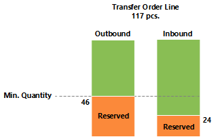
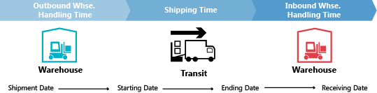

# Ontwerpdetails: Transfers in planning
Transferorders zijn ook een voorzieningenbron bij het werken op SKU-niveau. Als meerdere vestigingen (magazijnen) worden gebruikt, kan de SKU-aanvullingsmethode worden ingesteld op Transfer, wat aangeeft dat de vestiging wordt aangevuld door goederen van een andere vestiging over te brengen. In een situatie met meerdere magazijnen hebben bedrijven mogelijk een transferketen waarbij voorziening aan de GROENE vestiging wordt overgebracht vanuit GEEL, voorziening aan GEEL wordt overgebracht vanuit ROOD, enzovoort. Aan het begin van de keten is er een aanvullingssysteem Prod.-order of Inkoop.  
  
  
  
Bij vergelijking van een situatie waarin een voorzieningenorder rechtstreeks betrekking heeft op een vraagorder, en een situatie waarin de verkooporder door een keten van SKU-transfers wordt geleverd, is het duidelijk dat de planningstaak in de laatste situatie erg complex kan worden. Als de vraag verandert, kan er een rimpelingseffect door de keten optreden, omdat alle transferorders plus de inkoop/productie-order aan het andere einde van de keten moet worden gemanipuleerd om weer evenwicht te krijgen tussen vraag en aanbod.  
  
  
  
## Waarom is transfer een speciaal geval?  
Een transferorder lijkt veel op andere orders in het programma. Achter de schermen ligt het echter heel anders.  
  
Eén belangrijk aspect waardoor transfers in planning verschillen van inkoop- en productieorders is dat een transferregel tegelijkertijd vraag en aanbod vertegenwoordigt. Het uitgaande deel dat wordt verzonden vanuit de oude vestiging, is de vraag. Het inkomende deel, dat moet worden ontvangen bij de nieuwe vestiging, is voorziening op die vestiging.  
  
  
  
Dit betekent dat wanneer het systeem de voorzieningenzijde van de transfer manipuleert, een vergelijkbare wijziging aan de vraagkant moet worden gemaakt.  
  
## Transfers zijn afhankelijke vraag  
De gerelateerde vraag en voorziening komen overeen met onderdelen van een productieorderregel, maar het verschil is dat de onderdelen op het volgende planningsniveau staan en met een ander artikel, terwijl de twee delen van de transfer zich op hetzelfde niveau bevinden, voor hetzelfde artikel.  
  
Een belangrijke overeenkomst is dat transfervraag net als onderdelen afhankelijk is van vraag. De vraag van een transferregel wordt bepaald door de voorzieningenzijde van de transfer: wanneer de voorziening wordt gewijzigd, wordt de vraag direct beïnvloed.  
  
Een transferregel moet nooit worden verwerkt als onafhankelijke vraag in de planning, tenzij de planningsflexibiliteit Geen is.  
  
In de planningsprocedure moet alleen met transfervraag rekening worden gehouden nadat de aanbodzijde is verwerkt door het planningssysteem. Hiervoor is de werkelijke vraag niet bekend. De volgorde van de aangebrachte wijzigingen is daarom erg belangrijk voor transferorders.  
  
## Planningsvolgorde  
De volgende illustratie toont hoe een reeks transfers eruit kan zien.  
  
  
  
In dit voorbeeld bestelt een klant het artikel op vestiging GROEN. Vestiging GROEN wordt voorzien via transfer uit het centrale magazijn ROOD. Het centrale magazijn ROOD wordt bevoorraad door transfer uit productie op vestiging BLAUW.  
  
In dit voorbeeld start het planningssysteem de klantvraag en wordt achterwaarts door de keten gewerkt. De vragen en voorzieningen worden per vestiging verwerkt.  
  
  
  
## Transferniveaucode  
De volgorde waarin de vestigingen worden verwerkt in het planningssysteem, wordt bepaald door de transferniveaucode van de SKU.  
  
De transferniveaucode is een intern veld dat automatisch wordt berekend en opgeslagen op de SKU wanneer de SKU wordt gemaakt of gewijzigd. De berekening wordt uitgevoerd voor alle SKU's voor een bepaalde combinatie van artikelen/varianten en gebruikt de vestigingscode en transfercode (uit) om de route te bepalen die de planning moet gebruiken bij het doorlopen van de SKU's om te zorgen dat alle vragen worden verwerkt.  
  
De transferniveaucode is 0 voor SKU's met de aanvullingsmethode Inkoop of Productieorder, -1 voor het eerste transferniveau, -2 voor het tweede, enzovoort. In de hierboven beschreven transferketen zouden de niveaus daarom zijn -1 voor ROOD en -2 voor GROEN, zoals aangegeven in de volgende illustratie.  
  
  
  
Tijdens het bijwerken van een SKU detecteert het planningssysteem of SKU's met de aanvullingsmethode Transfer zijn ingesteld met kringverwijzingen.  
  
## Planningstransfers zonder SKU  
  
Ook als de SKU-functie niet wordt gebruikt, is het mogelijk vestigingen te gebruiken en handmatige transfers tussen vestigingen uit te voeren. Voor bedrijven met minder geavanceerde magazijninstellingen ondersteunt het planningssysteem scenario's waarbij bestaande voorraad handmatig naar een andere vestiging wordt verplaatst, bijvoorbeeld voor een verkooporder in die vestiging. Tegelijkertijd moet het planningssysteem reageren op wijzigingen in de vraag.  
  
Om handmatige transfers te ondersteunen, analyseert de planning bestaande transferorders en plant vervolgens de volgorde waarin de vestigingen moeten worden verwerkt. Intern zal het planningssysteem werken met tijdelijke SKU's met transferniveaucodes.  
  
  
  
Als op een bepaalde vestiging meerdere transfers bestaan, definieert de eerste transferorder de planningsrichting. Transfers die in de tegengestelde richting lopen, worden geannuleerd.  
  
## Aantal met reserveringen wijzigen  
Bij het wijzigen van aantallen voor bestaande voorzieningen wordt in het planningssysteem in zoverre rekening gehouden met reserveringen dat het gereserveerde aantal de ondergrens aangeeft voor hoeveel de voorziening kan worden verminderd.  
  
Bij het wijzigen van het aantal op een bestaande transferorderregel moet u in gedachten houden dat de ondergrens wordt gedefinieerd als het hoogste gereserveerde aantal van de uitgaande en inkomende transferregel.  
  
Als een transferorderregel van 117 stuks bijvoorbeeld wordt gereserveerd op basis van een verkoopregel van 46 en een inkoopregel van 24, is het niet mogelijk de transferregel onder 46 stuks te verminderen, hoewel dit bovenmatig aanbod inhoudt aan de inkomende zijde.  
  
  
  
## Aantal in een transferketen wijzigen  
In het volgende voorbeeld is het beginpunt een evenwichtige situatie met een transferketen die een verkooporder van 27 levert op vestiging ROOD, met een corresponderende inkooporder op vestiging BLAUW, overgedragen via vestiging ROZE. Behalve verkoop en inkoop zijn er daarom twee transferorders: BLAUW-ROZE en ROZE-ROOD.  
  
  
  
Nu maakt de planner op de ROZE vestiging een reservering voor de inkoop.  
  
  
  
Dit betekent doorgaans dat het planningssysteem de inkooporder en de transfervraag negeert. Zolang er saldo is, is er geen probleem. Maar wat gebeurt er wanneer de klant op de RODE vestiging zijn of haar order gedeeltelijk betreurt en wijzigt in 22?  
  
  
  
Wanneer het planningssysteem opnieuw wordt uitgevoerd, moeten overtollige voorzieningen worden gewist. De reservering vergrendelt echter de inkoop en de transfer op een aantal van 27.  
  
  
  
De ROZE-RODE transfer is gereduceerd tot 22. Het inkomende deel van de BLAUW-ROZE transfer is niet gereserveerd, maar omdat het uitgaande deel wel gereserveerd is, is het niet mogelijk het aantal onder 27 te verminderen.  
  
## Levertermijn  
Bij de berekening van de vervaldatum van een transferorder wordt rekening gehouden met verschillende soorten doorlooptijd.  
  
De doorlooptijden die actief zijn bij het plannen van een transferorder zijn:  
  
* Uitgaande magazijnverwerkingstijd  
* Verzendtijd  
* Inkomende magazijnverwerkingstijd  
* Op de planningsregel worden de volgende velden gebruikt om informatie over de berekening te geven.  
* Transferverzenddatum  
* Begindatum  
* Einddatum  
* Vervaldatum  
  
De verzenddatum van de transferregel wordt in het veld Transferverzenddatum weergegeven, en de ontvangstdatum van de transferregel wordt in het veld Vervaldatum weergegeven.  
  
De begin- en einddatum worden gebruikt om de werkelijke vervoersperiode te omschrijven.  
  
De volgende illustratie toont de interpretatie van de begindatum/-tijd en einddatum/-tijd op planningsregels die betrekking hebben op transferorders.  
  
  
  
In dit voorbeeld betekent dit het volgende:  
  
* Verzenddatum + Uitgaande verwerking = Begindatum  
* Begindatum + Verzendtijd = Einddatum  
* Einddatum + Inslagtijd = Ontvangstdatum  
  
## Veiligheidstijd  
Het veld Std. veiligheidstijd in het venster Productie-instellingen en het gerelateerde veld Veiligheidstijd op de artikelkaart worden niet meegenomen in de berekening van een transferorder. De veiligheidstijd beïnvloedt echter de totale planning zoals deze de aanvullingsorder (inkoop of productie) beïnvloedt aan het begin van de transferketen, wanneer de artikelen worden geplaatst in de vestiging van waaruit ze zullen worden overgedragen.  
  
  
  
Op de productieorderregel: Einddatum + Veiligheidstijd + Inkomende magazijnverwerkingstijd = Vervaldatum.  
  
Op de inkooporderregel: Geplande ontvangstdatum + Veiligheidstijd + Inkomende magazijnverwerkingstijd = Verwachte ontvangstdatum.  
  
## Herplannen  
Bij het opnieuw plannen van een bestaande transferregel moet het planningssysteem het uitgaande deel opzoeken en de datum-tijdwaarde ervan wijzigen. Het is belangrijk te weten dat als doorlooptijd is gedefinieerd, er een periode zit tussen de verzending en de ontvangst. Zoals gezegd, kan de looptijd bestaan uit meer elementen, zoals de transporttijd en de magazijnverwerkingstijd. Op een tijdpad zal het planningssysteem terug in de tijd gaan terwijl de elementen worden afgestemd.  
  
  
  
Wanneer de vervaldatum op een transferregel wordt gewijzigd, moet daarom de doorlooptijd worden berekend om de uitgaande kant van de transfer bij te werken.  
  
## Serie-/lotnummers in transferketens  
Als de vraag serie-/lotnummers heeft en de planningengine wordt uitgevoerd, leidt dit tot enkele directe gemaakte transferorders. Voor meer informatie over dit concept raadpleegt u Artikelkenmerken. Als echter serie-/lotnummers worden verwijderd uit de vraag, hebben de aangemaakte transferorders in de keten nog steeds serie-/lotnummers en worden ze dus genegeerd door de planning (niet verwijderd).  
  
## Order-naar-order koppelingen  
In dit voorbeeld wordt de BLAUWE SKU ingesteld met het bestelbeleid Order terwijl ROZE en ROOD lot-voor-lot gebruiken. Wanneer een verkooporder van 27 op vestiging ROOD wordt gemaakt, leidt dit tot een keten transfers waarbij de laatste verbinding op vestiging BLAUW met binding is gereserveerd. In dit voorbeeld zijn de reserveringen geen harde reserveringen die door de planner worden gemaakt op de ROZE vestiging, maar bindingen die worden gemaakt door het planningssysteem. Het belangrijkste verschil is dat het planningssysteem laatstgenoemde kan wijzigen.  
  
  
  
Als de vraag van 27 verandert in 22, verlaagt het systeem het aantal automatisch lager in de keten en wordt de bindingsreservering ook gereduceerd.  
  
## Zie ook  
[Ontwerpdetails: Planningsparameters](design-details-planning-parameters.md)   
[Ontwerpdetails: Tabel Planningstoewijzing](design-details-planning-assignment-table.md)   
[Ontwerpdetails: Bestelbeleid verwerken](design-details-handling-reordering-policies.md)   
[Ontwerpdetails: Vraag op lege vestiging](design-details-demand-at-blank-location.md)   
[Ontwerpdetails: Centrale begrippen van het planningssysteem](design-details-central-concepts-of-the-planning-system.md)   
[Ontwerpdetails: Vraag en aanbod afstemmen](design-details-balancing-demand-and-supply.md)   
[Ontwerpdetails: Voorraadplanning](design-details-supply-planning.md)
