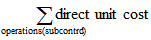

# Ontwerpdetails: Verschil
Verschil wordt gedefinieerd als het verschil tussen de werkelijke kosten en de vaste verrekenprijs, zoals in de volgende formule wordt beschreven.  

 werkelijke kosten – standaardkosten = verschil  

 Als de werkelijke kosten veranderen, bijvoorbeeld omdat u een artikeltoeslag boekt op een latere datum, wordt het verschil overeenkomstig bijgewerkt.  

> [!NOTE]  
>  Herwaardering heeft geen invloed op de verschilberekening, omdat herwaardering alleen de voorraadwaarde wijzigt.  

## Opmerking  
 In het volgende voorbeeld ziet u hoe het verschil wordt berekend voor aangeschafte artikelen. Het is gebaseerd op het volgende scenario:  

1.  De gebruiker koopt een artikel tegen LV 90,00, maar de vaste verrekenprijs is LV 100,00. Het inkoopverschil is dus LV -10,00.  
2.  LV 10,00 wordt gecrediteerd naar de inkoopverschillenrekening.  
3.  De gebruiker boekt een artikeltoeslag van LV 20,00. De werkelijke kosten worden verhoogd tot LV 110,00 en de waarde van het inkoopverschil wordt LV 10,00.  
4.  LV 20,00 wordt gedebiteerd naar de inkoopverschillenrekening. Het netto-inkoopverschil wordt LV 10,00.  
5.  De gebruiker herwaardeert het artikel van LV 100,00 naar LV 70,00. Dit heeft geen invloed op de verschilberekening, alleen op de voorraadwaarde.  

 De volgende tabel toont de twee soorten resulterende waardeposten.  

   

## De standaardkosten bepalen  
 De vaste verrekenprijs wordt gebruikt bij het berekenen van het te kapitaliseren verschil en aantal. Aangezien de vaste verrekenprijs na verloop van tijd kan worden gewijzigd als gevolg van handmatige updateberekeningen, hebt u een tijdstip nodig waarop de vaste verrekenprijs wordt vastgesteld voor verschilberekening. Dit punt is wanneer de voorraadtoename wordt gefactureerd. Voor geproduceerde of geassembleerde artikelen worden standaardkosten bepaald wanneer de kosten worden gewaardeerd.  

 De volgende tabel toont hoe verschillende kostenaandelen worden gegenereerd voor geproduceerde en geassembleerde artikelen als u de functie Vaste verrekenprijs berekenen gebruikt.  

|Aandeel kosten|Ingekocht artikel|Geproduceerd/geassembleerd artikel|  
|----------------|--------------------|------------------------------|  
|**Vaste verrekenprijs**||Materiaalkosten (één niveau) + Capaciteitskosten (één niveau) + Uitbestedingskosten (één niveau) + Cap.-overheadkosten (één niveau) + Prod.-overheadkosten (één niveau)|  
|**Materiaalkosten (Eén niv.)**|Kostprijs||  
|**Capaciteitskosten (Eén niv.)**|Niet van toepassing||  
|**Uitbestedingskosten (Eén niv.)**|Niet van toepassing||  
|**Cap.-overheadkosten (Eén niv.)**|Niet van toepassing||  
|**Prod.-overheadkosten. (Eén niv.)**|Niet van toepassing|(Materiaalkosten (één niveau) + Capaciteitskosten (één niveau) + Uitbestedingskosten (één niveau)) * Indirecte kosten % / 100 + Overheadtarief|  
|**Materiaalkosten (Alle niv.)**|Kostprijs||  
|**Capaciteitskosten (Alle niv.)**|Niet van toepassing||  
|**Uitbestedingskosten (Alle niv.)**|Niet van toepassing||  
|**Samengevouwen capaciteitsoverheadkosten**|Niet van toepassing||  
|**Prod.-overheadkosten (Alle niv.)**|Niet van toepassing||  

## Zie ook  
 [Ontwerpdetails: Voorraadwaardering](design-details-inventory-costing.md)   
 [Ontwerpdetails: Waarderingsmethoden](design-details-costing-methods.md) [Voorraadkosten beheren](finance-manage-inventory-costs.md)  
 [Financiën](finance.md)  
 [Werken met [!INCLUDE[d365fin](includes/d365fin_md.md)]](ui-work-product.md)

