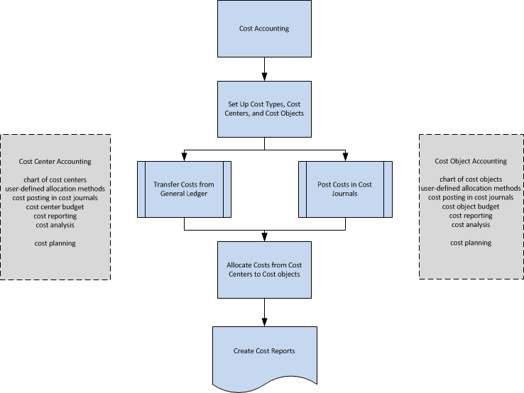

# Kostprijsboekhouding
Kostprijsboekhouding kan u helpen begrijpen welke kosten er verbonden zijn aan het runnen van een bedrijf. Gegevens van de kostprijsboekhouding zijn gemaakt om het volgende te analyseren:  

-   Welke soorten kosten worden er gemaakt bij het runnen van een bedrijf?  
-   Waar worden de kosten gemaakt?  
-   Wie draagt de kosten?  

In kostprijsboekhouding wijst u werkelijke en gebudgetteerde kosten van activiteiten, afdelingen, producten en projecten toe om de winstgevendheid van uw bedrijf te analyseren.  

## Werkstroom in kostprijsboekhouding  
kostprijsboekhouding heeft de volgende hoofdonderdelen:  

-   Kostensoorten, kostenplaatsen en kostenobjecten  
-   Kostenposten en kostendagboeken  
-   Kostenverdelingen  
-   Kostenbudgetten
-   Rapportage van kosten  

Het volgende diagram toont de werkstroom in kostprijsboekhouding.  

  

## Kostensoorten, kostenplaatsen en kostenobjecten  
U definieert kostensoorten, kostenplaatsen en kostenobjecten als u wilt analyseren wat de kosten zijn, waar de kosten vandaan en wie de kosten moet dragen.  

U definieert een kostensoortschema met een structuur en functies die lijken op het grootboekrekeningschema. U kunt de resultatenrekening van het grootboek overbrengen of uw eigen kostensoortschema maken.  

Kostenplaatsen zijn afdelingen en resultatencentra die verantwoordelijk zijn voor de kosten en opbrengsten. Vaak zijn er meer kostenplaatsen ingesteld in de kostprijsboekhouding dan in elk van de dimensies die zijn ingesteld in het grootboek. In het grootboek worden meestal alleen de kostenplaatsen van het eerste niveau voor directe kosten en de initiële kosten gebruikt. In kostprijsboekhouding worden extra kostenplaatsen gemaakt voor extra toewijzingniveaus.  

Kostenobjecten zijn producten, productgroepen of services van een bedrijf. Dit zijn gereed producten van een bedrijf dat de kosten draagt.  

U kunt kostenplaatsen koppelen aan afdelingen en kostenobjecten aan projecten in uw bedrijf. U kunt echter kostenplaatsen en kostenobjecten koppelen aan eventuele dimensies in het grootboek en deze aanvullen met subtotalen en titels.  

## Kostenposten en kostendagboeken  
Operationele kosten kunnen worden overgedragen van het grootboek. U kunt automatisch met elke boeking de kostenposten uit het grootboek overbrengen naar kostenposten. U kunt ook een batchtaak gebruiken om grootboekposten over te brengen naar kostenposten op basis van het dagelijkse of maandelijkse boekingsoverzicht.  

In kostendagboeken kunt u kosten en activiteiten boeken die niet afkomstig zijn uit het grootboek, noch automatisch worden gegenereerd door verdelingen. U kunt bijvoorbeeld zuivere operationele kosten, interne heffingen, verdelingen en correctieposten boeken tussen kostensoorten, kostenplaatsen en kostenobjecten, afzonderlijk of periodiek.  

## Kostenverdelingen  
Tijdens verdelingen worden kosten en opbrengsten verplaatst tussen kostensoorten , kostenplaatsen en kostenobjecten. Overheadkosten worden eerst op kostenplaatsen geboekt en later aan kostenobjecten toegerekend. Dit kan bijvoorbeeld worden gedaan op een verkoopafdeling die verschillende producten tegelijkertijd verkoopt. Directe kosten zijn de kosten die rechtstreeks toegerekend kunnen worden aan een kostenobject, zoals materiaal dat voor een specifiek product is ingekocht.  

De verdelingsbasis die wordt gebruikt en de juistheid van de definitie van de toewijzing zijn van invloed op de resultaten van de kostenverdeling. De verdelingdefinitie wordt gebruikt om eerst kosten vanuit zogenaamde pre-kostenplaatsen toe te wijzen aan hoofdkostenplaatsen en vervolgens van kostenplaatsen naar kostenobjecten.  

Elke toewijzing bestaat uit een verdelingsbron en een of meer verdeeldoelen. U kunt werkelijke of gebudgetteerde waarden toewijzen met behulp van de de statische toewijzingsmethode die is gebaseerd op een vaste waarde, zoals oppervlak of een vastgestelde verdeelsleutel 5:2:4. U kunt ook werkelijke of gebudgetteerde waarden toewijzen met behulp van de methode voor dynamische toewijzing met negen vooraf gedefinieerde toewijzingsgrondslagen en 12 dynamische datumbereiken.  

## Kostenbudgetten  
U kunt zoveel kostenbudgetten instellen als u nodig hebt. U kunt de kostenbudget naar het grootboekbudget en vice versa kopiëren. U kunt gebudgetteerde kosten als werkelijke kosten overbrengen.  

## Rapportage van kosten  
De meeste lijsten en statistieken zijn gebaseerd op de geboekte kostenposten. U kunt het sorteren van resultaten instellen en filters gebruiken om te bepalen welke gegevens moeten worden weergegeven. U kunt lijsten voor de analyse van de kostenverdeling maken. Bovendien kunt u het standaardrapportageschema gebruiken om te definiëren hoe uw rapporten voor het schema van kostentypen worden weergegeven.  

## Zie ook  
 [Kosten verantwoorden](finance-manage-cost-accounting.md)  
 [Financiën](finance.md)   
 [Terminologie in kostprijsboekhouding](finance-terminology-in-cost-accounting.md)  
 [Werken met [!INCLUDE[d365fin](includes/d365fin_md.md)]](ui-work-product.md)

