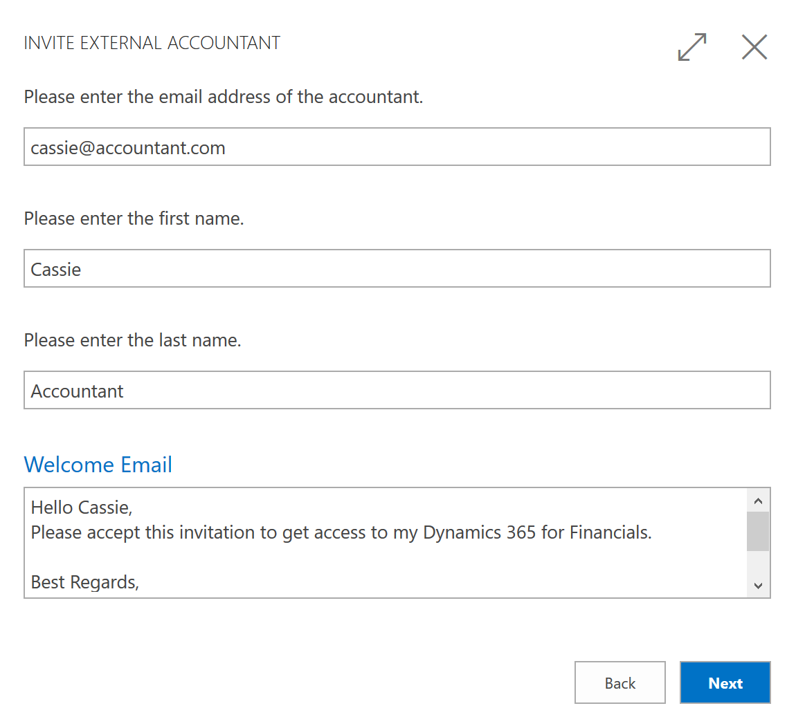

# Uw externe accountant uitnodigen voor uw [!INCLUDE[d365fin](includes/d365fin_md.md)]Inviting Your External Accountant to Your [!INCLUDE[d365fin](includes/d365fin_md.md)]
Als u een externe auditor gebruikt om uw boeken en financiële rapportage beheren, kunt u deze uitnodigen voor uw [!INCLUDE[d365fin](includes/d365fin_md.md)], zodat hij of zij met u kan werken aan uw fiscale gegevens.If you use an external accountant to manage your books and financial reporting, you can invite them to your [!INCLUDE[d365fin](includes/d365fin_md.md)] so they can work with you on your fiscal data.

Als de accountant toegang heeft gekregen tot uw [!INCLUDE[d365fin](includes/d365fin_md.md)], kan hij of zij het rolcentrum **Accountant** gebruiken, dat eenvoudig toegang tot de meest relevante vensters voor hun werk biedt.Once your accountant has gained access to your [!INCLUDE[d365fin](includes/d365fin_md.md)], they can use the **Accountant** Role Center that gives easy access to the most relevant windows for their work.  

## Uw accountant uitnodigen voor uw [!INCLUDE[d365fin](includes/d365fin_md.md)]Invite Your Accountant to Your [!INCLUDE[d365fin](includes/d365fin_md.md)]
In de laatste versie van [!INCLUDE[d365fin](includes/d365fin_md.md)] hebben we het voor u eenvoudig gemaakt om uw externe accountant uit te nodigen.In the latest version of [!INCLUDE[d365fin](includes/d365fin_md.md)], we have made it easy for you to invite your external accountant. Open gewoon het venster **Gebruikers** en kies de actie **Externe accountant uitnodigen** op het lint.Simply open the **Users** window, and then choose the **Invite External Accountant** action in the ribbon. Er wordt een e-mail voor u gemaakt. Voeg het werke-mailadres van uw accountant eraan toe en verzend de uitnodiging.An email is made ready for you, just add your accountant's work email, and send the invitation.  

> [!TIP]  
>  Dit vereist dat u SMTP-e-mail hebt ingesteld.This requires that you have set up SMTP email. U kunt dit zelf doen of uw [!INCLUDE[d365fin](includes/d365fin_md.md)]-partner vragen.You can do this yourself or ask your [!INCLUDE[d365fin](includes/d365fin_md.md)] partner. Daarnaast moet u als gebruikersbeheerder zijn aangemeld bij [!INCLUDE[d365fin](includes/d365fin_md.md)], niet als bedrijfeigenaar of een andere gebruiker.Also, you must be logged in to [!INCLUDE[d365fin](includes/d365fin_md.md)] as a user administrator, not as the business owner or other users.  

### Afzonderlijke licentieSeparate License
Achter de schermen wordt de accountant toegevoegd aan uw Active Directory-tenant.Behind the scenes, the accountant is added to your Active Directory tenant. Uw beheerder kan controleren of de accountant de uitnodiging accepteert en de juiste licentie toegewezen krijgt.Your administrator can verify that the accountant accepts the invitation and is assigned the correct license. De stappen hiervoor zijn afhankelijk van het soort rekening in dat u hebt gebruikt toen u zich aanmeldde bij [!INCLUDE[d365fin](includes/d365fin_md.md)].The steps for doing this depends on the type of account that you used when you signed up for [!INCLUDE[d365fin](includes/d365fin_md.md)]. Dit onderwerp is gebaseerd op het gebruik van een Office 365-account dat Microsoft Azure Active Directory gebruikt.This topic is based on the use of an Office 365 account, which uses Microsoft Azure Active Directory.  

Als u uw abonnement op [!INCLUDE[d365fin](includes/d365fin_md.md)] hebt geactiveerd en het evaluatiebedrijf niet meer gebruikt, hebt u een Azure Active Directory-tenant.If you have activated your subscription of [!INCLUDE[d365fin](includes/d365fin_md.md)] and are no longer using the evaluation company, you have an Azure Active Directory tenant. De beheerder of [!INCLUDE[d365fin](includes/d365fin_md.md)]-partner beheert deze tenant in de [Azure-portal](https://portal.azure.com).Your administrator or [!INCLUDE[d365fin](includes/d365fin_md.md)] partner manages this tenant in the [Azure portal](https://portal.azure.com). Hier worden nieuwe gebruikers en toegevoegd en licenties toegepast en verwijderd.This is where new users are added and licenses are applied and removed. Zie voor meer informatie het [Microsoft Azure-portal - overzicht](https://docs.microsoft.com/en-us/azure/azure-portal-overview).For more information, see the [Microsoft Azure portal overview](https://docs.microsoft.com/en-us/azure/azure-portal-overview).  

Een van de licentiesoorten voor [!INCLUDE[d365fin](includes/d365fin_md.md)] is de *Externe accountant*-licentie.One of the license types for [!INCLUDE[d365fin](includes/d365fin_md.md)] is the *External Accountant* license. Dit licentiesoort is bedoeld voor gebruik door gebruikers zoals externe accountants.This license type is intended for use by users such as external accountants. Dit betekent dat u geen extra seat in uw huidige Active Directory hoeft te kopen of een van uw bestaande [!INCLUDE[d365fin](includes/d365fin_md.md)]-gebruikersaccounts voor uw externe accountant hoeft te gebruiken.This means that you do not have to buy an extra seat in your current Active Directory or use one of your existing [!INCLUDE[d365fin](includes/d365fin_md.md)] user accounts on your external accountant. Als uw huidige Office 365-abonnement bijvoorbeeld 10 gebruikers bevat voor [!INCLUDE[d365fin](includes/d365fin_md.md)] en u momenteel 10 *Volwaardige gebruiker*-licenties gebruikt, kan uw beheerder gewoon uw externe accountant als gastgebruiker toevoegen in de Azure-portal en aan deze gebruiker zonder extra kosten de *Externe accountant*-licentie toewijzen.For example, if your current Office 365 subscription includes 10 users for [!INCLUDE[d365fin](includes/d365fin_md.md)], and you are currently using 10 *Full User* licenses, your administrator can simply add your external accountant as a guest user in the Azure portal and assign this user the *External Accountant* license at no additional cost. U kunt echter maar één gebruiker met de *Externe accountant*-licentie hebben.However, you can only have one user with the *External Accountant* license. Als u meer gebruikers wilt toevoegen, moet u uw Office 365-abonnement bijwerken.If you want to add more users, you must update your Office 365 subscription accordingly.  

## Zie ookSee Also
[FinanciënFinance](finance.md)  
[Procedure: E-mail handmatig instellen of de begeleide instelling gebruikenHow to: Set Up Email Manually or Using the Assisted Setup](madeira-how-setup-email.md)  
[Accountantervaringen binnen Dynamics NAVAccountant Experiences in Dynamics NAV](finance-accounting.md)  
[Dynamics NAV for Accountants op Microsoft.comDynamics NAV for Accountants on Microsoft.com](https://www.microsoft.com/en-us/dynamics365/financial-insights-for-accountants)  

