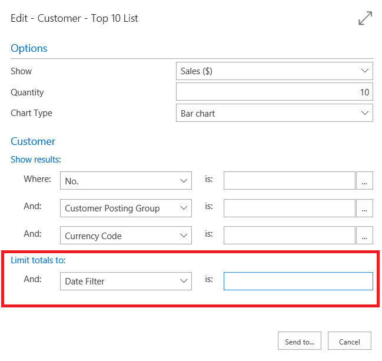

# Datumbereiken invoeren in Dynamics NAVEntering Date Ranges in Dynamics NAV
U kunt filters met een begin- en einddatum instellen om alleen de gegevens in dat datumbereik of tijdsinterval in te stellen.You can set filters containing a start date and an end date to display only the data contained in that date range or time interval. Voor het instellen van een datumbereik gelden speciale regels.Special rules apply to the way you set date ranges. Neem als voorbeeld de **Klanten top 10**:Let's take the **Customer Top 10** as an example:

Hier kunt u de lijst tot een datumbereik beperken, zoals de afgelopen 2 weken of een totaal van 6 weken, of wat voor bereik u ook nodig hebt.Here you can limit the report to a date range such as the past 2 weeks, or a total of 6 weeks, or whatever range you want. Als u datumbereiken wilt invoeren, voert u datums in en gebruikt u **..**To set date ranges, you enter dates and then use either **..** of **|** om het bereik in te stellen.or **|** to set the range. Als u in ons voorbeeld de top 10 klanten voor de eerste twee weken van mei wilt invoeren, stelt u het datumfilter in op *05 01 17..05 14 17*.In our example, to show the top 10 customers for the first two weeks of May, you would set the date filter to *05 01 17..05 14 17*.
Hier volgen enkele andere voorbeelden:Here are a couple of other examples:

| BetekenisMeaning | OpmerkingExample | Opgenomen postenEntries included |
|---|---|---|
|Gelijk aanEqual to| 12 15 1612 15 16 |Alleen posten die zijn geboekt op 15 december 2016.Only those posted on December 15 2016.|
|IntervalInterval| 12 15 16..01 15 1712 15 16..01 15 17  ..12 15 16..12 15 16|Posten die zijn geboekt in de periode tussen en tot en met 15 december 2016 en 15 januari 2017.Those posted on dates between and including December 15 2016 and January 15 2017.  Posten die zijn geboekt op 15 december 2016 of eerder.Those posted on December 15 2016 or earlier.|
|Of/ofEither/or|12 15 16&#124;12 16 1612 15 16&#124;12 16 16|Posten die zijn geboekt op 15 december of 16 december 2016.Those posted on either December 15 or December 16 2016. Als deze posten zijn geboekt op beide dagen, worden ze allebei weergegeven.If there are entries posted on both days, they will all be displayed.|

U kunt de verschillende notatiesoorten ook combineren.You can also combine the various format types.

| OpmerkingExample | Opgenomen postenEntries included |
|---|---|
|12 15 16&#124;12 01 16..05 31 1712 15 16&#124;12 01 16..05 31 17 | Posten die zijn geboekt op 15 december 2016 of op datums tussen en tot en met 1 december 2016 en 31 mei 2017.Entries posted either on December 15 2016 or on dates between and including December 01 2016 and May 31 2017. |
|..12 14 16&#124;12 30 16....12 14 16&#124;12 30 16.. | Posten die zijn geboekt op 14 december of eerder, of posten die zijn geboekt op 30 december of later. Dit wil zeggen, alle posten behalve die zijn geboekt tussen 15 december en 29 december tot en met.Entries posted on December 14 or earlier, or entries posted on December 30 or later - that is, all entries except those posted on dates between and including December 15 and 29. |

U ziet dat we hier de Amerikaanse datumnotatie MMDDYY hebben gebruikt.Note that we have used the US date format MMDDYY here. Zodra [!INCLUDE[d365fin](includes/d365fin_md.md)] beschikbaar wordt in andere markten, zult u de indelingen kunnen gebruiken die u gewend bent.As [!INCLUDE[d365fin](includes/d365fin_md.md)] becomes available in other markets, you'll be able to use the formats that you are used to.

## Zie ookSee Also
[Werken met [!INCLUDE[d365fin](includes/d365fin_long_md.md)]](ui-work-product.md)[Working with [!INCLUDE[d365fin](includes/d365fin_long_md.md)]](ui-work-product.md)  
[Criteria in filters invoerenEntering Criteria in Filters ](ui-enter-criteria-filters.md)  
[Algemene bedrijfsfunctionaliteitGeneral Business Functionality](ui-across-business-areas.md)

