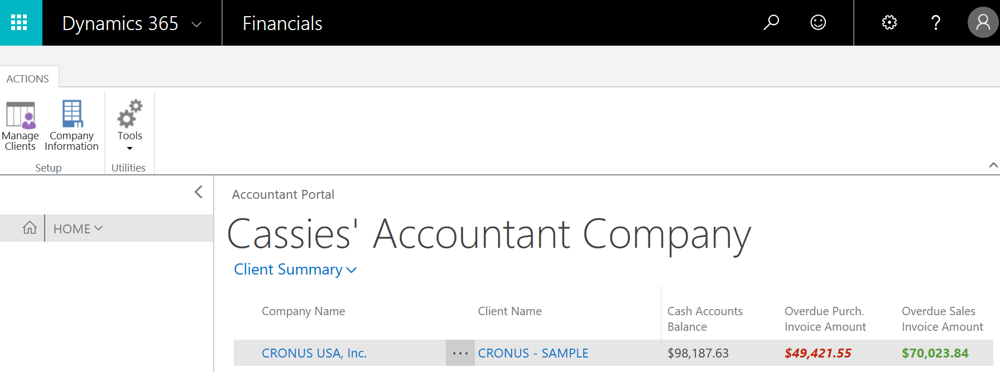

# Accountantportal voor Dynamics NAVAccountant Portal for Dynamics NAV
Deze toepassing biedt een dashboard met overzichtsgegevens van elke cliënt van een accountant.This application provides a dashboard with summary data for each client of an accountant. De portal toont financiële KPI's en een directe koppeling met de financiële toepassing van de cliënt.The portal displays financial KPIs as well as a direct link to the client’s financial application.  

Het dashboard bevat een zeer gespecialiseerd rolcentrum voor een beter overzicht van uw cliënten.The dashboard is a highly specialized Role Center for a better overview of your clients.  

Wanneer u de extensie voor het eerst installeert, helpt een voorbeeldbedrijf u aan de slag.When you first install the extension, a sample company helps you get started. U kunt het voorbeeldbedrijf op elk moment verwijderen.You can delete the sample company at any time.  

## De extensie installerenInstalling the Extension
Wanneer u de extensie in uw [!INCLUDE[d365fin](includes/d365fin_md.md)] installeert, wordt u gevraagd of u deze nu wilt gebruiken.When you install the extension in your [!INCLUDE[d365fin](includes/d365fin_md.md)], you will be asked if you want to use it now. Zo ja, dan moet u zich afmelden en opnieuw aanmelden, omdat de extensie uw huidige rolcentrum vervangt en machtigingen toevoegt aan uw gebruikersprofiel.If you do, then you must sign out and sign in again, because the extension replaces your current Role Center and adds permissions to your user profile.  

Zie [Accountantervaringen binnen Dynamics NAV voor meer informatie](finance-accounting.md).For more information, see [Accountant Experiences in Dynamics NAV](finance-accounting.md).  

> [!NOTE]  
>  De huidige versie van de extensie vereist dat uw cliënten [!INCLUDE[d365fin](includes/d365fin_md.md)] gebruiken.The current version of the extension requires that your clients use [!INCLUDE[d365fin](includes/d365fin_md.md)].  

## De extensie gebruikenUsing the extension
De extensie wordt gebruikt wanneer u zich aanmeldt bij [Dynamics NAV for Accountants op Microsoft.com](https://www.microsoft.com/en-us/dynamics365/financial-insights-for-accountants). Als u de extensie in uw [!INCLUDE[d365fin](includes/d365fin_md.md)] installeert, wordt uw huidige rolcentrum vervangen.This extension is used when you sign up at [Dynamics NAV for Accountants on Microsoft.com](https://www.microsoft.com/en-us/dynamics365/financial-insights-for-accountants). If you install the extension in your [!INCLUDE[d365fin](includes/d365fin_md.md)], it will replace your current Role Center. Als u vervolgens naar een ander rolcentrum wilt terugkeren, kunt u dat doen in Mijn Instellingen.If you then want to return to the other Role Center, then you can do that in My Settings. Zie [Procedure: Het rolcentrum wijzigen](change-role.md) voor meer informatie.For more information, see [How to: Change the Role Center](change-role.md).  

## Zie ookSee Also
[Accountantervaringen binnen Dynamics NAVAccountant Experiences in Dynamics NAV](finance-accounting.md)  
[FinanciënFinance](finance.md)  

