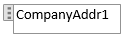

# Procedure: Een aangepaste lay-out voor een rapport of document maken en wijzigen
Standaard heeft een rapport een ingebouwde rapportlay-out die een RDLC-rapportlay-out, een Word-rapportlay-out of beide kan zijn. U kunt geen ingebouwde lay-outs wijzigen. U kunt echter uw eigen aangepaste lay-outs maken waarmee u de weergave van een rapport kunt wijzigen wanneer het wordt weergegeven, afgedrukt of opgeslagen. U kunt meerdere aangepaste lay-outs voor hetzelfde rapport maken en vervolgens indien nodig de lay-out wijzigen die door het rapport wordt gebruikt.

> [!NOTE]  
>   In [!INCLUDE[d365fin](includes/d365fin_md.md)] omvat de term 'rapport' ook documenten die extern worden verspreid, zoals verkoopfacturen en orderbevestigingen die u aan klanten als pdf-bestanden verzendt.

Als u een aangepaste lay-out wilt maken, kunt u een kopie van een bestaande lay-out maken of een nieuwe aangepaste lay-out toevoegen, die in de meeste gevallen is gebaseerd op een ingebouwde lay-out. Wanneer u een nieuwe aangepaste lay-out toevoegt, kunt u een RDLC-rapportlay-out, een Word-rapportlay-out of beide kiezen. De nieuwe aangepaste lay-out wordt automatisch gebaseerd op de ingebouwde lay-out voor het rapport, als er een is. Als er geen ingebouwde lay-out is voor het soort, wordt een nieuwe, lege lay-out gemaakt die u nog helemaal moet wijzigen en ontwerpen. Zie [Rapportlay-outs beheren](ui-manage-report-layouts.md) voor meer informatie over RDLC- en Word-rapportlay-outs, ingebouwde en aangepaste lay-outs.  

## Een aangepaste lay-out maken
1. Klik op het pictogram , voer **Selectie van rapportlay-out** in en klik vervolgens op de gerelateerde koppeling.  
   Het venster **Selectie rapportlay-out** bevat een overzicht van alle rapporten die beschikbaar zijn in het bedrijf dat in het veld Bedrijf boven aan het venster wordt opgegeven.
2. Stel het veld **Bedrijf** in op het bedrijf waarin u de rapportlay-out wilt maken.
3. Selecteer de rij voor het rapport waarvoor u de lay-out wilt maken en kies vervolgens de actie **Aangepaste lay-outs**.  
   In het venster **Aangepaste rapportlay-outs** worden alle aangepaste lay-outs weergegeven die beschikbaar zijn voor het geselecteerde rapport.
4. Als u een kopie van een bestaande aangepaste lay-out wilt maken, selecteert u de bestaande aangepaste lay-out in de lijst en kiest u de actie **Kopiëren**.  
   De kopie van de aangepaste lay-out wordt in het venster **Aangepaste rapportlay-outs** weergegeven en bevat de woorden *Kopie van* in het veld **Beschrijving**.
5. Als u een nieuwe aangepaste lay-out wilt toevoegen die op een ingebouwde lay-out is gebaseerd, doet u het volgende:  
   1. Kies de actie **Nieuw**. Het venster **Ingebouwde lay-out voor een rapport invoegen** verschijnt. De velden **Id** en **Naam** worden automatisch ingevuld.
   2. Als u een aangepaste Word-rapportlay-out wilt toevoegen, schakelt u het selectievakje **Word-lay-out invoegen** in.
   3. Als u een aangepaste RDLC-rapportlay-out wilt toevoegen, schakelt u het selectievakje **RDLC-lay-out invoegen** in.
   4. Kies de knop **Ok**.  
      De nieuwe aangepaste lay-outs worden weergegeven in het venster **Aangepaste rapportlay-outs**. Als een nieuwe lay-out wordt gebaseerd op een ingebouwde lay-out, bevat deze de woorden **Kopie van een ingebouwde lay-out** in het veld **Beschrijving**. Als er geen ingebouwde lay-out voor het rapport was, bevat de nieuwe lay-out de woorden **Nieuwe lay-out** in het veld **Beschrijving**, wat aangeeft dat de aangepaste lay-out leeg is.
6. Standaard is het veld **Bedrijfsnaam** leeg, wat betekent dat de aangepaste lay-out beschikbaar voor het rapport is in alle bedrijven. Als u de aangepaste lay-out alleen beschikbaar wilt maken voor een specifiek bedrijf, kiest u **Bewerken** en stelt u het veld **Bedrijfsnaam** in op het gewenste bedrijf.

De aangepaste lay-out is gemaakt. U kunt nu indien nodig de aangepaste lay-out wijzigen.

## Een aangepaste lay-out wijzigen
Als u een rapportlay-out wilt wijzigen, moet u de rapportlay-out eerst als een bestand exporteren naar een locatie op uw computer of in uw netwerk. Vervolgens opent u het geëxporteerde bestand en brengt u de wijzigingen aan. Wanneer u klaar bent met het aanbrengen van de wijzigingen, importeert u de rapportlay-out.

### Een aangepaste lay-out wijzigen
1.  U exporteert een aangepaste lay-out vanuit het venster **Aangepaste rapportlay-outs**. Als dit venster nog niet is geopend, zoekt en opent u het venster **Selectie van rapportlay-out**, selecteert u het rapport met de lay-out die u wilt wijzigen en kiest u de actie **Aangepaste lay-outs**.  
2.  In het venster **Aangepaste rapportlay-outs** selecteert u de lay-out die u wilt wijzigen. Vervolgens kiest u de actie **Lay-out exporteren** en **Opslaan** of **Opslaan als** om de rapportlay-out op te slaan op uw computer of netwerk.  
  
3.  Open de rapportlay-out die u net hebt opgeslagen en breng vervolgens wijzigingen aan.

      Als u een Word-lay-out wijzigt, wordt het lay-outdocument in Word geopend. Zie voor het bewerken van gegevens de volgende sectie [Wijzigingen aanbrengen in de rapportlay-out](ui-how-create-custom-report-layout.md#MakeChangesToLayout). 

      RDLC-rapportlay-outs zijn geavanceerder dan Word-RDLC-rapportlay-outs. Zie voor meer informatie over het aanpassen van een RDLC-rapportlay-out [RDLC-rapportlay-outs ontwerpen](https://msdn.microsoft.com/en-us/dynamics-nav/designing-rdlc-report-layouts).

      Sla uw wijzigingen op wanneer u klaar bent.
  
4.  Keer terug naar het venster **Aangepaste rapportlay-outs**, selecteer de geëxporteerde en gewijzigde rapportlay-out en kies vervolgens de actie **Lay-out importeren**.  
  
5. Selecteer in het dialoogvenster **Importeren** de optie **Kiezen** om het rapportlay-outdocument te vinden en selecteren, en kies vervolgens **Openen**.

##   Wijzigingen aanbrengen in een Word-rapportlay-out  
U kunt algemene opmaak- en lay-outwijzigingen aanbrengen, zoals het lettertype wijzigen, een tabel toevoegen en aanpassen of een gegevensveld verwijderen, door de basisfuncties voor bewerking van Word te gebruiken, net als in elk ander Word-document.

Als u een nieuwe Word-rapportlay-out ontwerpt of nieuwe gegevensvelden toevoegt, begint u door een tabel te maken die rijen en kolommen bevat die uiteindelijk de gegevensvelden zullen bevatten. 
  
> [!TIP]  
>  Geef de tabelrasterlijnen weer zodat u de grenzen van tabelcellen ziet. Verberg de rasterlijnen als u klaar bent met bewerken. Als u tabelrasterlijnen wilt weergeven of verbergen, selecteert u de tabel en kiest u onder **Lay-out** op het tabblad **Tabel** de optie **Rasterlijnen weergeven**.  
  
###   Label- en gegevensvelden verwijderen uit Word-lay-outs  
 Label- en gegevensvelden van een rapport bevinden zich in inhoudsbesturingselementen in Word. De volgende afbeelding is een voorbeeld van een inhoudsbesturingselement wanneer het in een Word-document is geselecteerd.  
  
   
  
 De naam van het label- of gegevensveld wordt weergegeven in het inhoudsbesturingselement. In het voorbeeld is de veldnaam CompanyAddr1.  
  
### Een label- of gegevensveld verwijderen  
  
1.  Klik met de rechtermuisknop op het veld dat u wilt verwijderen, en kies vervolgens **Inhoudsbesturingselement verwijderen**.  
  
     Het inhoudsbesturingselement wordt verwijderd, maar de veldnaam blijft als tekst.  
  
2.  Verwijder de resterende tekst indien nodig.  

### Gegevensvelden toevoegen
Gegevensvelden uit een rapportgegevensset toevoegen is een geavanceerdere methode en vereist enige kennis van de rapportgegevensset. Zie [Procedure: Velden toevoegen aan een Word-rapportlay-out](ui-how-add-fields-word-report-layout.md) voor informatie over het toevoegen van velden voor gegevens, labels en afbeeldingen.  
  

## Zie ook
[Rapportlay-outs beheren](ui-manage-report-layouts.md)  
[Procedure: Wijzigen welke lay-out momenteel in een rapport wordt gebruikt](ui-how-change-layout-currently-used-report.md)  
[Procedure: Een aangepaste lay-out voor een rapport of document importeren en exporteren](ui-how-import-and-export-report-layout.md)  
[Werken met rapporten](ui-work-report.md)  
[Werken met [!INCLUDE[d365fin](includes/d365fin_md.md)]](ui-work-product.md)  

