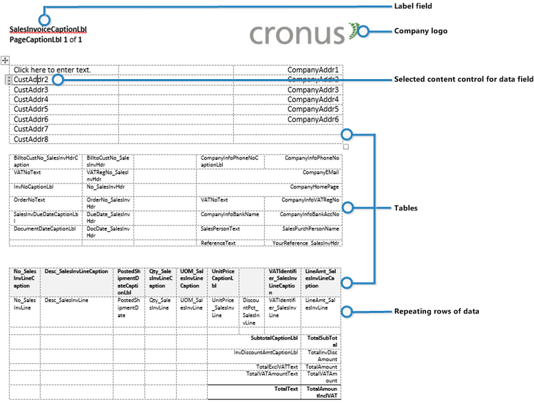

# Lay-outs van rapporten en documenten beherenManaging Report and Document Layouts
Een rapportlay-out bepaalt de inhoud en de indeling van het rapport, inclusief welke gegevensvelden van een rapportgegevensset in het rapport worden weergegeven, hoe ze worden gerangschikt, welke tekststijl en afbeeldingen worden gebruikt, enzovoort.A report layout controls content and format of the report, including which data fields of a report dataset appear on the report and how they are arranged, text style, images, and more. Vanuit [!INCLUDE[d365fin](includes/d365fin_md.md)] kunt u bepalen welke lay-out wordt gebruikt in een rapport, een nieuwe lay-out maken of de huidige lay-outs wijzigen.From [!INCLUDE[d365fin](includes/d365fin_md.md)], you can change which layout is used on a report, create new layout, or modify the existing layouts.

> [!NOTE]  
>   In [!INCLUDE[d365fin](includes/d365fin_md.md)] omvat de term 'rapport' ook documenten die extern worden verspreid, zoals verkoopfacturen en orderbevestigingen die u aan klanten als pdf-bestanden verzendt.In [!INCLUDE[d365fin](includes/d365fin_md.md)], the term "report" also covers externally-facing documents, such as sales invoices and order confirmations that you send to customers as PDF files.

Met een rapportlay-out wordt met name het volgende ingesteld:In particular, a report layout sets up the following:

* De label- en gegevensvelden die moeten worden opgenomen uit de gegevensset van het [!INCLUDE[d365fin](includes/d365fin_md.md)]-rapport.The label and data fields to include from the dataset of the [!INCLUDE[d365fin](includes/d365fin_md.md)] report.
* De tekstindeling, bijvoorbeeld lettertype, -grootte en -kleur.The text format, such as font type, size, and color.
* Het bedrijfslogo en de positie ervan.The company logo and its position.
* Algemene pagina-instellingen, zoals marges en achtergrondafbeeldingen.General page settings, such as margins and background images.

Een [!INCLUDE[d365fin](includes/d365fin_md.md)]-rapport kan worden ingesteld met meerdere rapportlay-outs, waartussen u indien nodig kunt schakelen.A [!INCLUDE[d365fin](includes/d365fin_md.md)] can be set up with multiple report layouts, which you can switch among as required. U kunt een van de ingebouwde rapportlay-outs gebruiken of u kunt aangepaste rapportlay-outs maken en ze indien nodig aan uw rapporten toewijzen.You can use one of the built-in report layouts or you can create custom report layouts and assign them to your reports as needed. Zie voor meer informatie [Procedure: Een aangepaste lay-out voor een rapport of document maken](ui-how-create-custom-report-layout.md).For more information, see [How to: Create a Custom Report or Document Layout](ui-how-create-custom-report-layout.md).

Er zijn twee soorten rapportlay-outs die u in rapporten kunt gebruiken: Word en RDLC.There are two types of report layouts that you can use on reports; Word and RDLC.

## Overzicht van de Word-rapportlay-outWord report layout overview
Een Word-rapportlay-out wordt gebaseerd op een Word-document (.docx-bestandstype).A Word report layout is a based on Word document (.docx file type). Met Word-rapportlay-outs kunt u rapportlay-outs ontwerpen door Microsoft Word 2013 of later te gebruiken.Word report layouts enable you to design report layouts by using Microsoft Word 2013 or later. Een Word-rapportlay-out bepaalt de inhoud van het rapport: hoe de inhoudelementen worden gerangschikt en hoe ze eruit zien.A Word report layout determines the report's content - controlling how that content elements are arranged and how they look. Een Word-document met een rapportlay-out gebruikt meestal tabellen om inhoud te rangschikken. De cellen kunnen gegevensvelden, tekst of afbeeldingen bevatten.A Word report layout document will typically use tables to arrange content, where the cells can contain data fields, text, or pictures.

   

## Overzicht van de RDLC-lay-outRDLC layout overview
RDLC-lay-outs zijn gebaseerd op clientrapportdefinitielay-outs (.rdlc- of .rdl-bestandstypen).RDLC layouts are based on client report definition layouts (.rdlc or .rdl file types). Deze lay-outs worden gemaakt en gewijzigd vanuit SQL Server Report Builder.These layouts are created and modified by using SQL Server Report Builder. Het ontwerpconcept voor RDLC-lay-outs lijkt op Word-lay-outs, waarbij de lay-out de algemene indeling van het rapport definieert en bepaalt welke velden uit de database worden opgenomen.The design concept for RDLC layouts is similar to Word layouts, where the layout defines the general format of the report and determines the fields from the dataset to include. RDLC-lay-outs ontwerpen is geavanceerder dan Word-lay-outs ontwerpen.Designing RDLC layouts is more advanced than Word layouts. Zie voor meer informatie [RDLC-rapportlay-outs ontwerpen](https://msdn.microsoft.com/en-us/dynamics-nav/designing-rdlc-report-layouts).For more information, see [Designing RDLC Report Layouts](https://msdn.microsoft.com/en-us/dynamics-nav/designing-rdlc-report-layouts).

## Ingebouwde en aangepaste rapportlay-outsBuilt-in and custom report layouts
[!INCLUDE[d365fin](includes/d365fin_md.md)] bevat verschillende geïntegreerde lay-outs. includes several built-in layouts. Ingebouwde lay-outs zijn vooraf gedefinieerde lay-outs die voor bepaalde rapporten zijn ontworpen.Built-in layouts are predefined layouts that are designed for specific reports. Rapporten in [!INCLUDE[d365fin](includes/d365fin_md.md)] hebben een geïntegreerde lay-out zoals een RDLC-rapportlay-out, Word-rapportlay-outs of in bepaalde gevallen beide.[!INCLUDE[d365fin](includes/d365fin_md.md)] reports will have a built-in layout as either an RDLC report layout, Word report layout, or in some cases both. U kunt een geïntegreerde rapportlay-out niet vanuit [!INCLUDE[d365fin](includes/d365fin_md.md)] wijzigen, maar u gebruikt deze als uitgangspunt voor het maken van uw eigen aangepaste rapportlay-outs.You cannot modify a built-in report layout from [!INCLUDE[d365fin](includes/d365fin_md.md)] but you use them as a starting point for building your own custom report layouts.

Aangepaste lay-outs zijn rapportlay-outs die u ontwerpt om de weergave van een rapport te wijzigen.Custom layouts are report layouts that you design to change the appearance of a report. U maakt meestal een aangepaste lay-out op basis van een ingebouwde lay-out, maar u kunt ze ook nieuw maken of op basis van een kopie van een bestaande aangepaste lay-out.You typically create a custom layout based on a built-in layout, but you can create them from scratch or from a copy of an existing custom layout. Met aangepaste lay-outs kunt u meerdere lay-outs voor hetzelfde rapport hebben waartussen u indien nodig kunt schakelen.Custom layouts enable you to have multiple layouts for the same report, which you switch among as needed. U kunt bijvoorbeeld verschillende lay-outs voor elk [!INCLUDE[d365fin](includes/d365fin_md.md)]-bedrijf hebben of u kunt verschillende lay-outs voor hetzelfde bedrijf hebben voor bepaalde situaties of gebeurtenissen, zoals een speciale campagne of feestdagen.For example, you can have different layouts for each [!INCLUDE[d365fin](includes/d365fin_md.md)] company, or you can have different layouts for the same company for specific occasions or events, like a special campaign or holiday season.

## Besluiten of u een Word- of een RDLC-rapportlay-out wilt gebruikenDeciding whether to use a Word or RDLC report layout
Een rapportlay-out kan worden gebaseerd op een Word-document of op een RDLC-bestand.A report layout can be based on either a Word document or RDLC file. Het besluit om een Word-rapportlay-out of een RDLC-rapportlay-out te gebruiken is afhankelijk van hoe u wilt dat het gegenereerde rapport eruitziet en van uw kennis van Word en SQL Server Report Builder.Deciding on whether to use a Word report layout or RDLC report layout type will depend on how you want the generated report to look and your knowledge of Word and SQL Server Report Builder.

De algemene ontwerpconcepten voor Word- en RDLC-lay-outs lijken erg op elkaar.The general design concepts for Word and RDLC layouts are very similar. Elk type heeft echter bepaalde ontwerpfuncties die bepalen hoe het gegenereerde rapport eruitziet in [!INCLUDE[d365fin](includes/d365fin_md.md)].However each type has certain design features that affect how the generated report is appears in [!INCLUDE[d365fin](includes/d365fin_md.md)]. Dit houdt in dat hetzelfde rapport er anders uit kan zien wanneer u de Word-rapportlay-out gebruikt dan wanneer u de RDLC-rapportlay-out gebruikt.This means that the same report might look different when using the Word report layout compared to the RDLC report layout.

Het proces voor het instellen van Word-rapportlay-outs en RDLC-rapportlay-outs in rapporten is hetzelfde.The process for setting up Word report layouts and RDLC report layouts on reports is the same. Het belangrijkste verschil is de manier waarop u de lay-outs wijzigt.The main difference is in the way you modify the layouts. Word-rapportlay-outs zijn in het algemeen gemakkelijker te maken en te wijzigen dan RDLC-rapportlay-outs, omdat u Word kunt gebruiken.Word report layouts are typically easier to create and modify than RDLC report layouts because you can use Word. RDLC-rapportlay-outs worden gewijzigd met SQL Server Report Builder, dat voor geavanceerdere gebruikers is bedoeld.RDLC report layouts are modified by using SQL Server Report builder which targets more advanced users.

Zie [Procedure: Wijzigen welke lay-out momenteel in een rapport wordt gebruikt](ui-how-change-layout-currently-used-report.md) voor informatie over het wijzigen van de te gebruiken lay-out.For information on how to change which layout to use, see [How to: Change Which Layout is Currently Used on a Report](ui-how-change-layout-currently-used-report.md).

## Zie ookSee Also
[Rapport- of documentlay-outs bijwerkenUpdating Report or Document Layouts](ui-update-report-layouts.md)  
[Werken met [!INCLUDE[d365fin](includes/d365fin_md.md)]](ui-work-product.md)[Working with [!INCLUDE[d365fin](includes/d365fin_md.md)]](ui-work-product.md)  
[Procedure: Een aangepaste lay-out voor een rapport of document maken en wijzigenHow to: Create and Modify a Custom Report or Document Layout](ui-how-create-custom-report-layout.md)  
[Procedure: Een aangepaste lay-out voor een rapport of document importeren en exporterenHow to: Import and Export a Custom Report or Document Layout](ui-how-import-and-export-report-layout.md)  
[Procedure: Documenten per e-mail verzendenHow to: Send Documents by Email](ui-how-send-documents-email.md)  
[Werken met rapportenWorking with Reports](ui-work-report.md)  

