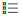

# Uw werkruimte personaliseren met behulp van de Dynamics NAV-webclient
<!--NAV in the Web client-->
U kunt uw werkruimte aanpassen aan uw werk- en *persoonlijke voorkeuren*, door pagina's te wijzigen zodat deze alleen de gegevens weergeven die u nodig hebt en waar u die nodig hebt. De personalisatiewijzigingen die u maakt, hebben alleen effect op wat u ziet, niet wat andere gebruikers kunnen zien.

Afhankelijk van het soort pagina en wat deze bevat, kunt u het volgende doen:

-   Velden toevoegen, verplaatsen en verwijderen.
-   Kolommen in een lijst toevoegen, verplaatsen en verwijderen.
-   De bevroren deelvensters voor kolommen in een lijst wijzigen. Het bevroren deelvenster vergrendelt een of meer kolommen aan de linkerzijde van een lijst zodat deze altijd aanwezig zijn, zelfs als u horizontaal schuift.
-   Indicatiestapels (tegels) verplaatsen en verwijderen.
-   Onderdelen verplaatsen en verwijderen. De onderdelen zijn onderverdelingen of gebieden op een pagina met objecten als meerdere velden, een andere pagina, een grafiek of tegels.  

## Een pagina personaliseren

1. In de rechterbovenhoek selecteert u  en vervolgens **Personaliseren**.

    De banner **Personaliseren** verschijnt bovenin, waarmee wordt aangegeven dat u deze wijzigingen kunt gaan aanbrengen.

    

2.  Open de pagina die u wilt personaliseren.

    Als u een vergrendelingspictogram in de banner ziet, moet u [Waarom is de pagina vergrendeld](ui-personalization-locked.md) raadplegen voor meer informatie.

3.  Wijs naar een gebied dat u wilt personaliseren, zoals een veld of kolomkop in een lijst. Alls wat u kunt personaliseren wordt onmiddellijk gemarkeerd met een pijl of rand.
<!--
    -  If a component can be personalized, an arrow head ( or ) appears.
    -   If the component is a part, the extent of the part is indicated by a border.
    -   The freeze pane in a list is indicated by a vertical line along the entire right-side of the last column of the freeze pane.
    -->

4.  Deze tabel kunt u gebruiken bij het maken van wijzigingen:     <table>
        <tr><th>Wat u wilt doen?</td><th>Hoe kunt u het doen?</th></tr>
        <tr><td>Iets verplaatsen, zoals een veld, een kolom in lijst, een tegel of onderdeel</td><td> Wijs naar alles wat u wilt verplaatsen en sleep dit naar de nieuwe locatie. De locatie wordt aangegeven door een dikke horizontale of verticale lijn.</td></tr>
        <tr><td>Iets verwijderen</td><td>Selecteer de pijlpunt en kies <b>Verwijderen</b>. </td></tr>
        <tr><td>Een kolom of veld toevoegen</td><td>In de banner <b>Personaliseren</b> kiest u <b>Meer</b> en kiest u <b>Veld</b>.  Het deelvenster <b>Veld toevoegen aan pagina</b> wordt aan de rechterkant weergegeven. Hier staan de velden die u aan de pagina kunt toevoegen. Velden die zijn gemarkeerd als <b>Geplaatst</b> bevinden zich al op de pagina. Velden die zijn gemarkeerd als <b>Gereed</b> bevinden zich momenteel niet op de pagina.  Als u een veld wilt toevoegen, moet u het uit het deelvenster slepen naar de locatie waar u het hebben wilt. De locatie wordt aangegeven door een dikke horizontale of verticale lijn.</td></tr>
        <tr><td>Het bevroren deelvenster in een lijst naar een andere kolom wijzigen.</td><td>Selecteer de pijlpunt van de kolom die u als laatste van het bevroren deelvenster hebben wilt, en kies vervolgens <b>Bevroren deelvenster instellen</b>.  Als u het bevroren deelvenster terug wilt verplaatsen naar de oorspronkelijke locatie waarvoor het bestemd was, selecteert u de pijlpunt voor de kolom met het huidige bevroren deelvenster en kiest u <b>Bevroren deelvenster wissen</b>. Opmerking: u kunt het oorspronkelijke bevroren deelvenster niet verwijderen. Er zal altijd een bevroren deelvenster zijn dat minimaal één kolom bevat.</td></tr>
      </table>

    > [!IMPORTANT]  
    >   U kunt een lijst niet meer wijzigen als deze als tegels wordt weergegeven. U moet de pagina eerst in de lijstweergave weergeven door het pictogram  te selecteren.

5.  U kunt doorgaan met het aanbrengen van wijzigingen op dezelfde pagina of naar een andere pagina gaan. Uw wijzigingen worden automatisch opgeslagen terwijl u ze aanbrengt. Als u klaar bent in de banner **Personaliseren** kiest u **Gereed**.

## Personalisatie wissen om een pagina terug naar de oorspronkelijke opmaak te wijzigen
Op een bepaald moment wilt u misschien alle personalisatiewijzigingen wissen die u in de loop van de tijd op deze pagina hebt aangebracht, zodat de pagina weer de oorspronkelijke weergave krijgt. Als u dit wilt doen, kiest u in het deelvenster **Personaliseren** de optie **Meer** en **Personalisatie wissen**.

## Personalisatie in detail
Er zijn een aantal punten die u in gedachten moet houden als u beter wilt begrijpen hoe personaliseren in zijn werk gaat.  
-   Als u wijzigingen aanbrengt in een kaartpagina die u kunt openen vanuit een lijst, worden de wijzingen doorgevoerd voor alle records die vanuit die lijst worden geopend. Als u bijvoorbeeld vanuit de lijstpagina Klanten een bepaalde klant opent en vervolgens de pagina personaliseert door een veld toe te voegen. Als u andere klanten vanuit die lijst opent, wordt het veld dat u hebt toegevoegd ook weergegeven.
-   De wijzigingen die u aanbrengt worden op al uw rolcentra toegepast. Als u bijvoorbeeld een wijziging in de lijst Klant aanbrengt wanneer het rolcentrum op Bedrijfsleider is ingesteld, kunt u de wijzigingen in de lijst Klant ook zien wanneer het rolcentrum op Verkooporderverwerker wordt ingesteld.
-   Wijzigingen in een deelvenster van een pagina worden op de pagina toegepast overal waar deze wordt weergegeven.  
-   U kunt alleen velden en kolommen toevoegen uit een vooraf gedefinieerde lijst die op de pagina is gebaseerd. U kunt geen nieuwe maken.

## Zie ook
[Overzicht personalisatie](ui-personalization-overview.md)  
[Personalisatie beheren](ui-personalization-manage.md)  
[Werken met [!INCLUDE[navnow_md](includes/navnow_md.md)]](ui-work-product.md)  
[Procedure: Het rolcentrum wijzigen](change-role.md)  

