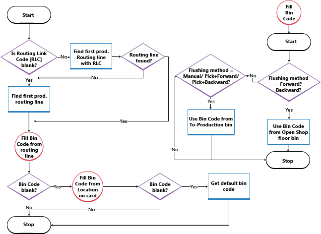

# Procedure: standaard magazijnen met bewerkingsgebieden instellen
Als interne bewerkingsgebieden zoals productie of assemblage deel uitmaken van standaard magazijnconfiguraties waarin locaties het instellingsveld **Opslaglocatie verplicht** en eventueel de instellingsvelden **Pick vereist** en **Opslag vereist** gebruiken, kunt u de volgende standaard magazijndocumenten gebruiken om uw magazijnactiviteiten voor interne bewerkingsgebieden te registreren:  

- Het venster **Voorraadverplaatsing**.  
- venster **voorraadpick**.  
- venster **voorraadopslag**.

> [!NOTE]
> Hoewel de instellingen **Pick vereist** en **Opslag vereist** worden genoemd, kunt u nog wel ontvangsten en verzendingen rechtstreeks vanuit de bronbedrijfsdocumenten boeken voor vestigingen waarvoor u deze selectievakjes inschakelt.  

Als u deze vensters met interne bewerkingen, zoals picken en het naar productie verplaatsen van componenten, wilt gebruiken, moet u een aantal van de volgende instellingstappen of alle volgende instellingsstappen volgen, afhankelijk van hoeveel controle u nodig hebt:  

- De voorraadpick, verplaatsings- en opslagdocumenten inschakelen.  
- De standaard opslaglocatiestructuren definiëren voor componenten en eindartikelen die van en naar bewerkingsbronnen stromen.  
- Maak Naar- en Van-opslaglocaties die aan specifieke bewerkingsbronnen worden toegewezen om te voorkomen dat de artikelen worden gepickt voor uitgaande documenten.

Opslaglocatiecodes die zijn ingesteld op de vestigingskaarten definiëren alleen een standaard magazijnwerkstroom voor bepaalde activiteiten, zoals de componenten in een montageafdeling. Er is extra functionaliteit die ervoor zorgt dat artikelen niet door andere activiteiten kunnen worden verplaatst of gepickt, wanneer deze in een bepaalde opslaglocatie worden geplaatst. Zie de sectie Specifieke componentopslaglocaties maken voor meer informatie.

De volgende procedures zijn gebaseerd op het instellen van standaard magazijnactiviteiten rond een productiegebied. De stappen zijn vergelijkbaar voor andere bewerkingsgebieden, zoals assemblage, servicebeheer en taken.  

> [!NOTE]  
>  In de volgende procedure wordt het veld **Opslaglocatie verplicht** op vestigingskaarten ingeschakeld omdat dit wordt beschouwd als een basisvereiste met betrekking tot welk niveau aan magazijnbeheer dan ook.  

## Voorraaddocumenten inschakelen voor interne bewerkingsactiviteiten  
1.  Klik op het pictogram , voer **Vestigingen** in en klik vervolgens op de gerelateerde koppeling.
2. Open de vestigingskaart die u wilt instellen.  
3.  Schakel op het sneltabblad **Magazijn** het selectievakje **Opslag vereist** in om aan te geven dat, wanneer een inkomend of intern brondocument met een opslaglocatiecode wordt vrijgegeven, er een voorraadopslag- of een voorraadverplaatsingdocument kan worden gemaakt.  
4.  Schakel het selectievakje **Pick vereist** in om aan te geven dat, wanneer een uitgaand of intern brondocument met een opslaglocatiecode wordt gemaakt, er een voorraadpick- of een voorraadverplaatsingdocument moet worden gemaakt.  

## Een standaard opslaglocatiestructuur in het productiegebied definiëren  
1.  Klik op het pictogram , voer **Vestigingen** in en klik vervolgens op de gerelateerde koppeling.
2. Open de locatie die u wilt instellen.  
3.  Voer op het sneltabblad **Opslaglocaties** in het veld **Open shopflooropslaglocatie** de code in van de opslaglocatie in het productiegebied met genoeg componenten die de machine-operator kan verbruiken, zonder dat er een magazijnactiviteit moet worden aangevraagd om deze naar de opslaglocatie te brengen. Artikelen die in deze opslaglocatie worden geplaatst, zijn doorgaans ingesteld op automatische boeking of afboeking. Dit betekent dat het veld **Afboekingsmethode** de waarde **Voorwaarts** of **Achterwaarts** bevat.  
4. Voer in het veld **naar-opslagplaatslocatie voor productie** de code in van de opslaglocatie in het productiegebied waar onderdelen die zijn gepickt voor productie op deze vestiging standaard worden geplaatst voordat ze kunnen worden verbruikt. Artikelen die in deze opslaglocatie worden geplaatst, zijn doorgaans ingesteld op handmatige verbruiksboeking. Dit betekent dat het veld **Afboekingsmethode** de waarde **Handmatig** of **Pick + Voorwaarts** of **Pick + Achterwaarts** bevat voor magazijnpicks en voorraadverplaatsingen.  

    > [!NOTE]  
    >  Bij gebruik van voorraadpicks definieert het veld **Bin Code** op de materiaalregel op een productieorder de opslaglocatie *nemen* waar materialen in mindering worden gebracht wanneer het verbruik wordt geboekt. Bij gebruik van voorraadpicks definieert het veld **Opslaglocatie** op materiaalregels op de productieorder de opslaglocatie *plaats* in het bewerkingsgebied waarin de magazijnmedewerker de materialen moet plaatsen.  

5. Voer op het sneltabblad **Opslaglocaties** in het veld **Van productieopslaglocatie** de code in van de opslaglocatie in het productiegebied waaruit standaard voltooide eindartikelen worden gehaald wanneer het proces een magazijnactiviteit omvat. De activiteit wordt bij standaard magazijnconfiguraties geregistreerd als een voorraadopslag of een voorraadverplaatsing.  

Productieordermateriaalregels met de standaard opslaglocatie eisen dat voorwaarts afgeboekte materialen daar worden geplaatst. Echter, totdat de materialen uit de opslaglocatie worden verbruikt, kunnen andere eisen materialen uit die opslaglocatie picken of verbruiken omdat ze nog steeds worden beschouwd als beschikbare opslaglocatie-inhoud. Om ervoor te zorgen dat de opslaglocatie-inhoud alleen beschikbaar is voor de materialenvragen die deze specifieke opslaglocatie voor productie gebruiken, moet u het veld **Speciaal** kiezen op de regel voor de opslaglocatie in het venster **Opslaglocaties** dat u vanuit de vestigingskaart.

In dit stroomdiagram is weergegeven hoe het veld **Opslaglocatie** op de productieordercomponentregels wordt ingevuld op basis van uw instellingen.  

    

## Een standaard opslaglocatiestructuur in het assemblagegebied definiëren
Materialen voor assemblageorders kunnen niet worden gepickt of geboekt met voorraadpicks. Gebruik in plaats daarvan het venster **Voorraadverplaatsing**. Zie voor meer informatie [Procedure: Onderdelen verplaatsen naar een bewerkingsgebied bij standaard magazijnbeheer](warehouse-how-to-move-components-to-an-operation-area-in-basic-warehousing.md)

Als u verkoopregelaantallen pickt en verzendt die worden geassembleerd voor de order, moet u bepaalde regels volgen wanneer u de voorraadpickregels maakt. Zie voor meer informatie de sectie Op-order-assembleren-artikelen in voorraadpicks afhandelen in [Procedure: artikelen picken met een voorraadpick](warehouse-how-to-pick-items-with-inventory-picks.md).

Zie voor meer informatie [Assemblagebeheer](assembly-assemble-items.md).

### Instellen dat automatisch een voorraadverplaatsing wordt gemaakt wanneer de voorraadpick voor het assemblageartikel wordt gemaakt
1. Klik op het pictogram , voer **Assemblage-instelling** in en klik vervolgens op de gerelateerde koppeling.
2. Schakel het selectievakje **Verplaatsingen automatisch aanmaken** in.

### De opslaglocatie in het assemblagegebied instellen waarin onderdelen standaard worden geplaatst voordat ze kunnen worden gebruikt bij het assembleren
De waarde in dit veld wordt automatisch ingevoegd in het veld **Opslaglocatie** op assemblageorderregels wanneer deze locatie is ingevoerd in het veld **Vestiging** op de assemblageorderregel.

1. Klik op het pictogram , voer **Vestigingen** in en klik vervolgens op de gerelateerde koppeling.
2. Open de locatie die u wilt instellen.
3. Vul het veld **Opslaglocatie Naar-assemblage** in.

### De opslaglocatie in het assemblagegebied instellen waarnaar gereedgemelde componenten worden geboekt wanneer ze op voorraad worden geassembleerd
De waarde in dit veld wordt automatisch ingevoegd in het veld **Opslaglocatie** in assemblageorderkoppen wanneer deze locatie is ingevoerd in het veld **Vestiging** in de assemblageorderkop.

Opslaglocatiecodes die zijn ingesteld op de vestigingskaarten definiëren alleen een standaard magazijnwerkstroom voor bepaalde magazijnactiviteiten, zoals het materiaalverbruik in een assemblagegebied. Er is extra functionaliteit die ervoor zorgt dat artikelen niet door andere activiteiten kunnen worden verplaatst of gepickt, wanneer deze in een standaard opslaglocatie worden geplaatst.

> [!NOTE]
> Dit is alleen mogelijk voor vestigingen waar het veld Opslaglocatie verplicht is ingeschakeld.

1. Klik op het pictogram , voer **Vestigingen** in en klik vervolgens op de gerelateerde koppeling.
2. Open de locatie die u wilt instellen.
3. Vul het veld **Opslagloc.code Vanuit-assembl.** in.

### Instellen naar welke opslaglocatie gereedgemelde componenten worden geboekt wanneer ze worden geassembleerd met een gekoppelde verkooporder
De assemblageartikelen worden via een voorraadpick direct uit deze opslaglocatie verzonden om te voldoen aan de verkooporder.

> [!NOTE]
> Dit veld kan niet worden gebruikt als in de vestiging gestuurde opslag en pick worden gebruikt.

De opslaglocatie wordt uit de verkooporderregel overgenomen naar de assemblageorderkop om aan assemblagemedewerkers door te geven waar de uitvoer moet worden geplaatst om deze gereed te maken voor verzending. Het wordt ook naar de voorraadpickregel gekopieerd om aan magazijnmedewerkers door te geven waar ze de uitvoer kunnen vinden voor verzending.

> [!NOTE]
> De op-order-assembleren-verzendopslaglocatie is altijd leeg. Wanneer u een op-order-assembleren-verkoopregel boekt, wordt de opslaglocatie-inhoud eerst positief aangepast met de assemblage-uitvoer. Direct hierna wordt het negatief aangepast met het verzonden aantal.

De waarde in dit veld wordt automatisch in het veld Opslaglocatie ingevoegd op verkooporderregels die een hoeveelheid in het veld **Aant. op order assembleren** bevatten of als het te verkopen artikel **Op order assembleren** in het veld **Aanvullingsmethode** bevat.

Als **Opslagloc. verz. asm.-op-order** leeg is, wordt het veld **Opslagloc.code Vanuit-assembl.** gebruikt. Als beide instellingsvelden leeg zijn, wordt de laatst gebruikte opslaglocatie met inhoud gebruikt in het veld **Opslaglocatie** op verkooporderregels.

Dezelfde opslaglocatie wordt vervolgens naar het veld **Opslaglocatie** gekopieerd op de voorraadpickregel die de verzending van het op-order-assembleren-aantal beheert. Zie voor meer informatie de sectie Op-order-assembleren-artikelen in voorraadpicks afhandelen in [Procedure: artikelen picken met een voorraadpick](warehouse-how-to-pick-items-with-inventory-picks.md).

1. Klik op het pictogram , voer **Vestigingen** in en klik vervolgens op de gerelateerde koppeling.
2. Open de locatie die u wilt instellen.
3. Vul het veld **Opslagloc. verz. asm.-op-order** in.

## Specifieke componentopslaglocaties maken
U kunt opgeven dat hoeveelheden in een opslaglocatie niet mogen worden gepickt voor andere vraag dan het huidige doel.

Hoeveelheden in specifieke opslaglocaties kunnen nog steeds worden gereserveerd. De hoeveelheden in specifieke opslaglocaties kunnen dus worden opgenomen in het veld **Totaal beschikbaar aantal** in het venster **Reservering**.

Een voorbeeld is een afdeling die is ingesteld met een opslaglocatie in het veld **Code verbruikslocatie**. Productieordermateriaalregels met deze opslaglocatie eisen dat voorwaarts afgeboekte materialen daar worden geplaatst. Echter, totdat de materialen uit de opslaglocatie worden verbruikt, kunnen andere eisen materialen uit die opslaglocatie picken of verbruiken omdat ze nog steeds worden beschouwd als beschikbare opslaglocatie-inhoud. Om ervoor te zorgen dat de opslaglocatie-inhoud alleen beschikbaar is voor de materialenvragen die deze specifieke opslaglocatie voor productie gebruiken, moet u het veld **Speciaal** kiezen op de regel voor de opslaglocatie in het venster **Opslaglocaties** dat u vanuit de vestigingskaart opent.

Een specifieke opslaglocatie maken biedt vergelijkbare functies als voor het gebruik van opslaglocaties, die alleen beschikbaar zijn in geavanceerde magazijnbeheer. Zie [Procedure: Opslaglocatiesoorten instellen](warehouse-how-to-set-up-bin-types.md) voor meer informatie.

> [!Caution]
> Artikelen in specifieke opslaglocaties worden niet beveiligd wanneer ze zijn gepickt en worden verbruikt als onderdelen van de productie met het venster Voorraadpick.

1.  Klik op het pictogram , voer **Vestigingen** in en klik vervolgens op de gerelateerde koppeling. Selecteer de vestiging die u wilt bijwerken.  
2.  Kies de actie **Opslaglocaties**.  
3.  Selecteer het veld **Speciaal** voor elke opslaglocatie die u uitsluitend voor bepaalde interne bewerkingen wilt gebruiken en waarin u aantallen voor de desbetreffende interne bewerking wilt reserveren zodra deze daar zijn geplaatst.  

> [!NOTE]  
>  De opslaglocatie moet leeg zijn voordat u het veld **Speciaal** kunt selecteren of wissen.

## Zie ook  
[Magazijnbeheer](warehouse-manage-warehouse.md)  
[Voorraad](inventory-manage-inventory.md)  
[Magazijnbeheer instellen](warehouse-setup-warehouse.md)     
[Assemblagebeheer](assembly-assemble-items.md)    
[Ontwerpdetails: Magazijnbeheer](design-details-warehouse-management.md)  
[Werken met [!INCLUDE[d365fin](includes/d365fin_md.md)]](ui-work-product.md)  

